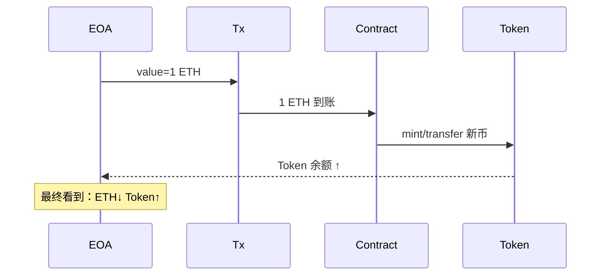

# 1、原生币与合约交互，为什么要把ETH转成WETH？WETH是什么？

一句话先答：  
**原生币 ETH 不是 ERC-20，合约无法把它当作普通代币去“扣款、记账、组合”，所以先 1:1 铸成 ERC-20 的 WETH，才能被任何 DeFi 乐高无缝调用。**

---

### 1. WETH 是什么？
- **全称**：Wrapped Ether  
- **本质**：一个极简的 ERC-20 包装合约，**1 WETH ≡ 1 ETH**，随时可逆。  
- **地址**（以太坊主网唯一）：`0xC02aaA39b223FE8D0A0e5C4F27eAD9083C756Cc2`  
- **核心函数**：
  ```
  deposit()   payable   // 存 ETH → 得 WETH
  withdraw(wad)         // 销毁 WETH → 取回 ETH
  ```

---

### 2. 为什么“原生币 ↔ 合约”一定要转 WETH？

| 场景                                  | 直接用 ETH 行不行？ | 问题点                                         | 用了 WETH 后                                |
| ------------------------------------- | ------------------- | ---------------------------------------------- | ------------------------------------------- |
| **Uniswap 池子**把 ETH 当计价币       | ❌                   | 池子只认 ERC-20 接口（balanceOf/transferFrom） | 把 ETH 铸成 WETH 即可像 USDC 一样被池子调用 |
| **借贷协议**抵押 ETH 借 DAI           | ❌                   | 合约无法“扣留”ETH，也无法在账本里记 balance    | 用户先铸 WETH → 再 transfer 进合约          |
| **一次交易里**批量发 100 份工资       | ❌                   | ETH 每次转账都要独立 tx，21000 gas ×100        | WETH 可一次性 approve→循环 transferFrom     |
| **避免 receive()/fallback()**重入风险 | ❌                   | 发送 ETH 会触发目标合约代码                    | WETH 转账就是普通 ERC-20，不执行目标代码    |

---

### 3. 一句话总结
> **ETH 是现金，WETH 是现金支票**；  
> 现金能花，但**自动柜员机（DeFi）只认支票**，所以先把 ETH 铸成 WETH，**1:1 零成本，随时换回**，才能参与所有链上乐高。


# 2、原生币与合约交互，为什么用户EOA的ETH减少，token增加？

一句话：  
**用户把 ETH 送进合约“买东西”——合约收了 ETH（EOA 余额 ↓），立刻把代币/功能/服务返还给用户（Token 余额 ↑）**，于是出现“ETH 减少、Token 增加”的表象。

---

### 1. 底层真相：ETH 从未“消失”，只是换了账本位置

| 步骤           | 谁减少                                   | 谁增加           | 备注                                 |
| -------------- | ---------------------------------------- | ---------------- | ------------------------------------ |
| ① 用户发起交易 | EOA.balance                              | —                | 携带 `msg.value`                     |
| ② 合约被执行   | —                                        | Contract.balance | `address(this).balance += msg.value` |
| ③ 合约再分配   | 合约存储槽（如 `token.balanceOf[user]`） | 用户             | 合约 mint 或 transfer 代币给用户     |

---

### 2. 三个高频场景举例

#### 场景 A：把 ETH 换成 WETH
- 用户调用 `WETH.deposit{value: 1 ether}()`  
- 同一笔交易里：  
  – 1 ETH 进入 WETH 合约地址（EOA ↓）  
  – WETH 合约 `mint` 1 WETH 给用户（Token ↑）

#### 场景 B：在 Uniswap 用 ETH 买代币
- Router 调用 `pool.swap{value: 1 ether}(...)`  
- 1 ETH 进 Pool（EOA ↓）  
- Pool 按恒定乘积算出新币数量，直接 `transfer` 给用户（Token ↑）

#### 场景 C：NFT 一级发售（mint）
- 用户调用 `NFT.mint{value: 0.08 ether}(quantity)`  
- 0.08 ETH 进项目方金库（EOA ↓）  
- 合约 `mint` 1 枚 NFT 到用户地址（Token ↑）

---

### 3. 一张总览图（以“ETH ➜ 换 Token”为例）



---

### 4. 一句话总结
> **ETH 减少 ≠ 消失，而是“付给合约”；Token 增加 = 合约当场把商品/代币找零返还给你。**  
> 整个流程在**同一笔交易内原子完成**，所以钱包界面瞬间看到“ETH 少、Token 多”。