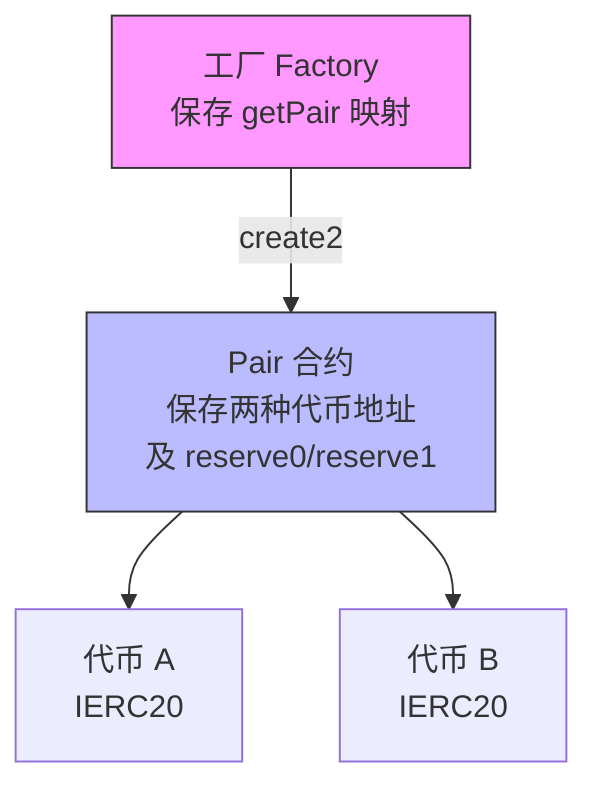
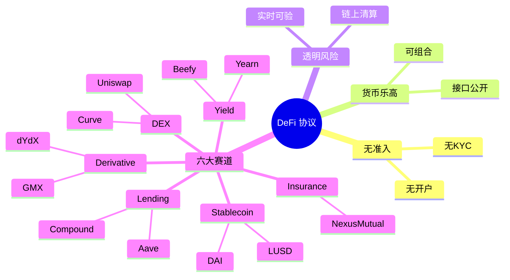

# 1、简单明了的总结erc20使用关键步骤流程和注意点

ERC20 一句话口诀：  
“先写合约→再部署→转之前 approve→留足 gas→看小数点”

---

#### 关键步骤（5 步）
1. 写合约  
   直接复用 OpenZeppelin 模板，改 3 个参数：name、symbol、总供应量（decimals 默认 18）。  

2. 编译 & 部署  
   Remix/Hardhat 一键编译 → 选网（主网/测试网）→ 用 Metamask 部署 → 记好合约地址。  

3. 验证 & 开源  
   立即在 Etherscan 上 “Verify & Publish”，方便别人查代码、加 Logo。  

4. 转出代币  660580
   先调用 `approve(spender, amount)` 给 DEX/钱包授权，再转；否则直接 `transfer` 即可。  

5. 后续管理  
   如果开了 “mint” 功能，保管好 owner 私钥；想锁仓可放弃权限或把币打黑洞。

---

#### 4 个最容易踩的坑
| 坑点                   | 正确做法                                                     |
| ---------------------- | ------------------------------------------------------------ |
| 小数位填错             | 总供应量 `amount * 10^18`（decimals=18），少写 18 个 0 直接缩水上亿倍。 |
| 忘留 ETH 当 gas        | 部署前先打 0.01 ETH 到部署地址，主网高峰期 gas 可能 > 0.005 ETH。 |
| 直接把代币打到合约地址 | ERC20 合约没有 `withdraw` 函数，币永久锁死；先小额测试。     |
| 给 DEX 授权过大        | 用 `approve(spender, exactAmount)` 或事后 `approve(0)`，防无限额度被黑。 |

记住口诀，5 分钟发币不踩坑。


# 2、简要说明基于erc721合约开发流程关键注意点和容易踩的坑

### 一句话口诀  
“先画元数据→再写URI→mint 留 gas→别用 transfer→_safeMint 防丢 NFT”

---

### 关键注意点（4 步）
1. 元数据提前定  
   `name/symbol` 好改，但 `baseURI` 一旦上链改不了；图片/JSON 先传 IPFS/Arweave，拿到固定 CID 再部署。

2. 用 `_safeMint` 而非 `_mint`  
   合约→合约空投时，`_mint` 会让收方无法感知，NFT 永久锁死；`_safeMint` 带 `onERC721Received` 校验。

3. 留 0.01 ETH 当 gas  
   主网高峰期 `setBaseURI` / `mint` 单步 gas 可破 20 gwei×200k≈0.004 ETH，多留一点免失败。

4. 禁止直接 `transfer`  
   前端/脚本务必调用 `safeTransferFrom`（或加 `data`），否则目标如果是合约同样会丢 NFT。

---

### 常见 3 坑
| 坑                   | 结果                                    | 快速规避                                         |
| -------------------- | --------------------------------------- | ------------------------------------------------ |
| baseURI 末尾忘加 `/` | tokenURI 拼接成 `ipfs://cid/1` 无法访问 | 部署前 console.log 一次完整 URL                  |
| 元数据 JSON 缺字段   | OpenSea 不显示图片                      | 必含 `image`、`name`；想动画再加 `animation_url` |
| 一次性循环 mint 过多 | 区块 gas limit 爆掉                     | 分批或让用户自己 mint，加 `maxBatchSize` 限制    |

记住：先测网 → 小额 mint → 看 OpenSea → 再上主网，5 分钟能省 5 万美金。


# 3、钱包在区块链开发中属于什么位置

钱包是“链下用户 ⇄ 链上世界”的**唯一入口**，处于开发栈的**最前端 + 密钥管理层**，角色可类比“浏览器 + 密码器”：

1. 身份生成  
   助记词→私钥→地址，开发者靠它调出测试网 ETH、签名部署合约。

2. 签名网关  
   所有 write 调用（deploy、transfer、approve）都必须过钱包签名，否则节点拒收。

3. 前端标配  
   Web3.js / ethers.js 通过 `window.ethereum` 注入的对象就是钱包 Provider；没有它，DApp 页面无法发交易。

4. 事件监听  
   钱包把链上回执、revert 原因、gas 估算一次性抛给前端，省掉自己搭节点轮询。

一句话：钱包不在链上，却是**链下代码与链上状态之间的信任跳板**；开发时把它当“用户代理 + 私钥保险柜”即可。


# 4、合约开发address(this)是什么意思

`address(this)` 就是**“当前合约自己的地址”**，Solidity 里把它当成“我的身份证”用：

1. 收币  
   合约想知道自己余额：  
   `uint bal = address(this).balance;` // 查 ETH

2. 收款  
   转 ETH 到合约：  
   `payable(address(this)).transfer(msg.value);`

3. 鉴权  
   只允许“我自己”调：  
   `require(msg.sender == address(this), "only self");`

4. 外部接口  
   把合约地址当参数传给别的合约或前端，用于 approve、delegatecall 等场景。

一句话：**`address(this)` 让合约在代码里能“看见”自己**，从而读余额、收付款、做权限校验。


# 5、Solidity中tx、msg是什么，有哪些属性，分别代表什么意思

在 Solidity 里，`tx` 和 `msg` 是**两个全局对象**，保存“当前调用”的上下文信息；记住一句话即可：

> `tx` 是**交易级**（谁发、多少钱、多少 gas），  
> `msg` 是**调用级**（谁调、调多少、调哪个函数、附带什么数据）。

---

### 1. `tx` 对象（transaction）
| 属性          | 类型      | 含义                                                         |
| ------------- | --------- | ------------------------------------------------------------ |
| `tx.origin`   | `address` | **最初触发这笔交易的外部钱包地址**（EOA）<br>⚠️ 可被钓鱼合约冒充，**除权限检查外别用**。 |
| `tx.gasprice` | `uint`    | 当前交易的 gas price（单位 wei）。                           |

> 只有这 2 个属性，且 **tx 级别不可变**，跨合约调用时值不变。

---

### 2. `msg` 对象（call / delegatecall）
| 属性         | 类型             | 含义                                                  |
| ------------ | ---------------- | ----------------------------------------------------- |
| `msg.sender` | `address`        | **直接调用者**（合约或 EOA）。<br>权限判断 99% 用它。 |
| `msg.value`  | `uint`           | 随调用附带的 ETH 数量（单位 wei）。                   |
| `msg.data`   | `bytes calldata` | 完整的 calldata（函数选择器 + 参数）。                |
| `msg.sig`    | `bytes4`         | 函数选择器（`msg.data` 前 4 字节）。                  |
| `msg.gas`    | `uint`           | **剩余 gas**（0.6.x 已弃用，改用 `gasleft()`）。      |

> 每次内部调用（`call`/`delegatecall`）都会**重新生成**一份 `msg` 值。

---

### 一张图秒记
```
EOA ──tx──> 合约A ──call──> 合约B
       ↑        ↑           ↑
     tx.origin  msg.sender  msg.sender
     tx.gasprice msg.value   msg.value
```

**口诀**：  
“权限看 `msg.sender`，收钱看 `msg.value`，防钓鱼别用 `tx.origin`。”


# 6、MetaMask中**账户**和**网络**是什么关系

一句话先答：  
**账户是“你”；网络是“你在哪条链上操作”。**  
同一个账户可以在 **所有 EVM 网络** 里“存在”，但不同网络下的 **余额、合约、代币** 彼此完全隔离。

------------------------------------------------
1. 账户（Account）  
- 由 12/24 个助记词派生出的 **唯一密钥对**（私钥 → 公钥 → 0x 地址）。  
- *地址在数学层面就确定了，**与网络无关**；所以你在 MetaMask 里看到的 “Account 1” 在以太坊、Arbitrum、BSC、Polygon 等 **任何 EVM 链** 上都是同一个 0x 地址。*  
- 真正属于用户、需要离线保管的是 **助记词/私钥**，而不是某个网络里的“账号”。

2. 网络（Network / RPC Endpoint）  
- 只是 **远程节点** 的 URL，告诉 MetaMask 把交易广播到哪条链。  
- 切换网络 ≈ 切换“数据库”：  
  – 以太坊主网 → 全球共识的 ETH 账本  
  – Polygon → Polygon 自己的 PoS 链账本  
  – 本地测试网 → 你电脑上的 Ganache/Anvil 私有账本  
- 不同网络的 **原生币、合约、状态** 互不认识；你的地址虽然一样，但 ETH 余额、NFT、授权记录都独立。

3. 它们的关系  
- 1 个账户 → 可以连接到 **任意多条网络**。  
- 1 个网络 → 可以管理 **多个账户**（助记词派生出的不同路径）。  
- MetaMask 用 “当前选中网络” 决定：  
  – 把交易发到哪条链；  
  – 查哪条链的余额；  
  – 用哪条链的浏览器链接（View on Explorer）。  
- **切换网络不会换地址**；**切换账户不会换网络**；两者正交。

------------------------------------------------
记忆口诀  
“地址链链皆有，余额网网不同；密钥捏在你手，网络只是路口。”


# 7、区块链中，账户和公钥是什么关系

在区块链里，**账户地址** 和 **公钥** 是“**一对多、再哈希**”的关系，可以分两步理解：

1. 私钥 → 公钥  
   用椭圆曲线算法（secp256k1 等）从 256 bit 私钥算出 512 bit 公钥（04 x‖y）。

2. 公钥 → 账户地址  
   对公钥再做两次哈希（Keccak-256 → 取后 20 字节 → 可选 checksum 或链 ID 前缀），得到大家看到的 0x… 地址。

因此  
- 一个私钥只对应**一个公钥**；  
- 一个公钥只对应**一个地址**；  
- 地址是公钥的“哈希摘要”，**无法逆推**公钥，直到该地址**第一次对外签名交易**（把公钥暴露在链上）才能建立双向绑定。


# 8、MetaMask中提供给别人接收转账的地址是公钥还是私钥，如果一个账户关联了多个网络(链)，怎么知道把token转到哪个网络中？

一句话答案  
你给对方的是 **地址（=公钥的哈希，不是私钥）**；  
转错网络 = 钱永久丢，**只能靠人工确认“在哪条链”转**，MetaMask 不会帮你自动路由。

------------------------------------------------
1. 给的到底是哪一串？  
- MetaMask → 点击 “Account 1” → 复制到剪贴板的那串 `0x4f3a…` 是 **地址**（公钥 → Keccak-256 → 取后 20 字节 → 16 进制）。  
- 私钥/助记词永远不会出现在界面，也**绝对不能给任何人**。

2. 多链共用同一地址  
- 因为地址只由公钥哈希产生，**所有 EVM 链（ETH、BSC、Polygon、Arbitrum…）都认这个地址**。  
- 所以 **地址本身不带链信息**；它既是以太坊地址，也是 BSC 地址，也是 Polygon 地址……

3. 怎么让发送方把币发到“对”的网络？  
- **链是“外部世界”属性**，MetaMask 无法强制。  
- 必须**人工沟通**并双重检查：  
  – 在聊天/订单里写明 “请用 **ERC-20 以太坊主网** 发送 USDT”。  
  – 把自己的地址和链一起发：  
    `0x4f3a…（仅接受 ETH-主网，请勿使用 BSC/Polygon）`  
  – 如果对方平台支持多链提币，**他得在提币页面选对链**，否则币会发到另一条链上。

4. 转错链会怎样？  
- **地址合法但网络不同** → 交易照样打包，只是：  
  – 若目标链你**掌握私钥**（同一助记词导入 MetaMask 并添加该网络），币其实还在那个地址里，只是看不见；切到对应网络即可找回。  
  – 若目标链你**没有私钥**（例如交易所提币选错链），那就永久丢失，**没人能 rollback**。

5. 小技巧防止错链  
- 在 MetaMask 给不同链建**不同账户名**（Account-ETH、Account-BSC…），虽然地址相同，但起到心理提示。  
- 使用 **ENS/EIP-3770** 格式把链 ID 写进地址：  
  `ethereum:0x4f3a…`、`bsc:0x4f3a…`，部分钱包已能识别。  
- 让对方先转 **极小测试额**，确认到账后再发全额。

------------------------------------------------
口诀  
“地址可公开，私钥藏心底；  
地址跨链通用，链名靠人提；  
转错网络币不毁，私钥不在难找回。”


# 9、区块链中有哪些网络，他们都有哪些具体应用

下面把“区块链世界”按**四类网络**拆开，给你一份 **2025 年仍在活跃、可直接体验的“网络 + 典型应用”速查表**。看完就能快速知道“哪条链能干什么”。

------------------------------------------------
一、公有链（无门槛，任何人都能进）

| 网络                        | 2025 年代表应用                                           | 一句话场景                        |
| --------------------------- | --------------------------------------------------------- | --------------------------------- |
| **Bitcoin**                 | 闪电网络（Lightning）、Stacks 侧链、BTC Layer-2 存款凭证  | 数字黄金 + 即时小额支付           |
| **Ethereum**                | Uniswap、Aave、ENS、Blast、EigenLayer、Linea/ZK-Rollup    | 全球最大 DeFi、NFT、L2 生态总枢纽 |
| **BNB Chain**               | PancakeSwap、Thena、opBNB、Greenfield 去中心化存储        | 低成本 DeFi + 链游 + 社交         |
| **Polygon PoS / zkEVM**     | Lens Protocol 社交、星巴克 Odyssey 会员、Nike .swoosh NFT | 品牌 Web3 首选落地层              |
| **Solana**                  | Jupiter 聚合器、Tensor NFT、Helium 5G、Render 渲染市场    | 高频交易 + 高并发链游/IoT         |
| **Arbitrum / Optimism**     | GMX、Velodrome、Base（Coinbase 链）、Stargate             | 以太坊 L2 龙头，交易快、费低      |
| **Avalanche**               | Trader Joe、Benqi、链游 DFK、子网定制企业链               | 企业子网 + GameFi                 |
| **Cosmos Hub & 60+  zones** | Osmosis DEX、Celestia 模块化 DA、Neutron 智能合约         | 万链互操作“互联网”                |
| **Filecoin**                | Filecoin Virtual Machine（FVM）+ 去中心化存储市场         | 链上+链下存储一体化               |

------------------------------------------------
二、联盟链（需许可，多机构共管）

| 网络                   | 2025 年代表应用                              | 一句话场景                 |
| ---------------------- | -------------------------------------------- | -------------------------- |
| **Hyperledger Fabric** | 跨境贸易金融、冷链溯源、电子合同             | 企业级“私有数据 + 可审计”  |
| **长安链 ChainMaker**  | 北京电子发票、雄安碳交易、全国公积金异地联办 | 中国政务/基建/双碳核心底座 |
| **BSN 开放联盟链**     | 江西数字乡村、深圳区块链发票、中小企业融资   | 国内开发者“低门槛上链”入口 |
| **蚂蚁链**             | 进口商品溯源、版权确权、物流面单             | 阿里生态内商业信任         |
| **腾讯至信链**         | 企鹅号版权、数字藏品“幻核”底层               | 内容+IP 确权               |
| **Corda**              | 全球信用证（Marco Polo）、保险共保           | 金融级“点对点”事务         |

------------------------------------------------
三、私有链（单机构内部）

| 网络/框架            | 2025 年代表应用                  | 一句话场景             |
| -------------------- | -------------------------------- | ---------------------- |
| **Ethereum Quorum**  | 摩根大通 JPM Coin 机构间清算     | 银行内部大额实时结算   |
| **Hyperledger Besu** | 航空公司里程清算、制药批次追踪   | 防火墙内高 TPS 审计    |
| **FISCO BCOS**       | 珠三角中小银行汇票、地产链上摇号 | 中国金融圈私有部署首选 |

------------------------------------------------
四、混合链（可切换公开/保密区）

| 网络                                | 2025 年代表应用                     | 一句话场景              |
| ----------------------------------- | ----------------------------------- | ----------------------- |
| **VeChain**                         | 沃尔玛中国生鲜溯源、LVMH 奢侈品芯片 | B2B 保密 + B2C 公开查询 |
| **Ripple (默认私有，可选公有观察)** | 桑坦德、SBI 跨境汇款                | 银行网关实时清算        |

------------------------------------------------
使用口诀  
“**公链玩资产，联盟做政务，私有跑内部，混合可切换**”。  
先按“谁能进”选大类，再按“干什么”挑网络，基本不会选错。


# 10、区块链中，一个区块包含几个默克尔树？一个区块中包含多少笔交易？

### 1、一个区块里放几棵默克尔树？

| 链                            | 每区块固定几棵树          | 树名/用途                                              |
| ----------------------------- | ------------------------- | ------------------------------------------------------ |
| **比特币**                    | 1 棵                      | 交易 Merkle 树（transactionsRoot）                     |
| **以太坊**                    | 3 棵（Paris 升级前 4 棵） | ①交易树 ②收据树 ③状态树 ④（已弃用）难度炸弹            |
| **Polygon/BSC** 等 EVM 兼容链 | 3 棵                      | 与以太坊相同                                           |
| **Fabric** 联盟链             | 0 棵                      | 用区块里逐条交易的读写集哈希校验，不强制整棵 Merkle 树 |

一句话：  
- 比特币 **1 棵**；  
- 以太坊及大多数 EVM 链 **3 棵**；  
- 其他链可增可减，没有统一数字。

---

### 2、一个区块里放多少笔交易？

| 链              | 硬性上限                     | 2025 年典型区间                             | 备注                     |
| --------------- | ---------------------------- | ------------------------------------------- | ------------------------ |
| **比特币**      | 1 M 重量单位（≈4 MB 原始块） | 2 000–4 500 笔                              | 看签名体积、SegWit 比例  |
| **以太坊**      | 30 M gas                     | 150–220 笔普通转账；<br>80–120 笔 DeFi 交互 | 复杂合约可压到 10 笔以下 |
| **BSC**         | 140 M gas                    | 700–1 200 笔                                | 出块 3 s，TPS ≈ 300      |
| **Solana**      | 无 gas 上限，<br>48 MB/shred | 2 000–3 000 笔                              | 并行打包，TPS 理论 65 k  |
| **Polygon PoS** | 30 M gas                     | 200–300 笔                                  | 2 s 出块                 |

---

### 结论速记

1. 树的数量：比特币 1，以太坊 3，其余看架构。  
2. 交易数量：比特币几千，以太坊几百，高性能链几千到上万——**没有固定值，只受“块大小/gas 上限/打包时间”三要素限制**。


# 11、Solidity智能合约开发中，数据和合约是怎么存放的

在 Solidity 中，**“数据”**和**“合约本身”**被 EVM 拆成 **3 个永久存储层 + 2 个临时层**，各自有明确的存放位置和寻址规则。记住一句话：

> **合约代码存在 Code 区，链上状态在 Storage 树，临时数据在 Memory/Calldata/Stack；部署时字节码上链，运行时通过地址→代码→状态三层定位。**

---

### 1. 合约本体（Code 区）
- **存放位置**：以太坊世界状态的 **合约地址 → codeHash** 字段指向的 **Merkle Patricia Trie** 叶子节点  
- **内容**：  
  - 部署时：完整字节码（含 constructor 逻辑）  
  - 部署后：仅保留 runtime bytecode（constructor 被丢弃）  
- **特性**：  
  - **不可修改**（除非 `SELFDESTRUCT` 再重新部署）  
  - **所有节点同步**，可通过 `EXTCODECOPY` 读取任意合约代码  
- **Solidity 对应**：  
  - `type(C).creationCode` 返回部署字节码  
  - `type(C).runtimeCode` 返回运行字节码  

---

### 2. 链上状态（Storage 树）
- **存放位置**：同一地址下的 **storageRoot** 字段指向的独立 Trie  
- **key→value**：`uint256 → uint256`，**每个合约独享 2²⁵⁶ 个槽位**  
- **布局规则（Solidity 生成）**：  
  
  1. **状态变量按声明顺序从槽 0 递增**  【一个槽 = **32 字节（256 位）** —— 这是 EVM 和 Solidity 的最小存储单元，无论变量多大，都从槽 `slot 0、1、2…` 依次排布，不足 32 字节的可以打包到同一槽。】
  2. **动态数组**：槽 `p` 存长度，数据从 `keccak256(p)` 开始连续存  
  3. **mapping**：槽 `p` 不存数据，实际地址 `keccak256(h(k) . p)`，其中 `h(k)` 是 key 的 32 字节填充  
- **示例**  
  
  ```solidity
  uint256 a;      // 槽 0
  mapping(address=>uint) b; // 槽 1 占位，真实数据在 keccak256(addr . 1)
  uint256[] c;    // 槽 2 存长度，元素在 keccak256(2) + i
  ```

---

### 3. 构造参数（Constructor 输入）
- **存放位置**：部署交易 `tx.data` 紧跟 runtime bytecode 之后  
- **EVM 读取**：`CODECOPY` 把尾部数据拷贝到 Memory，再由 constructor 解码  
- **验证**：`etherscan` 看到的“Input Data”即 **字节码 +  ABI-encoded 参数**

---

### 4. 临时数据（Memory / Calldata / Stack）
- **Memory**：函数内部 `uint[]`、`string` 等复杂类型，调用结束即回收  
- **Calldata**：外部调用的参数，只读，大数组可节省拷贝 Gas  
- **Stack**：单条指令操作数，深度 ≤ 1024  

---

### 5. 代理与可升级存储
- **逻辑合约**（Logic）代码保存在**代理地址之外**的独立地址  
- **存储仍落在代理地址的 Storage 树**，因此升级时只需更换 `codeHash` 指向，状态不动  
- **Solidity 实现**：`delegatecall` 让逻辑合约在**调用者的上下文**里读写 Storage，实现“换代码不换状态”

---

### 一张图总结

| 层级        | 存放位置                | 是否永久 | 是否合约独享 | 关键指令 / 字段     | Solidity 示例                  |
| ----------- | ----------------------- | -------- | ------------ | ------------------- | ------------------------------ |
| Code        | 地址.codeHash → Trie    | 是       | 是           | `EXTCODECOPY`       | `type(C).runtimeCode`          |
| Storage     | 地址.storageRoot → Trie | 是       | 是           | `SLOAD/SSTORE`      | `uint public x;`               |
| Constructor | 部署 tx.data 尾部       | 否       | —            | `CODECOPY`          | `constructor(uint _x) { ... }` |
| Memory      | 调用期线性字节数组      | 否       | 是           | `MLOAD/MSTORE`      | `uint[] memory arr`            |
| Calldata    | 调用期只读参数          | 否       | 是           | `CALLDATALOAD/COPY` | `function f(bytes calldata b)` |

---

### 开发速记
1. **部署一次，代码永存；变量位置由 Solidity 按槽号自动生成。**  
2. **升级合约=换代码地址，状态纹丝不动——靠 `delegatecall`。**  
3. **Gas 优化：临时数据放 Memory，大参数用 Calldata，状态写 Storage 要精打细算。**


# 12、EVM 拆成 **3 个永久存储层 + 2 个临时层**， 分别是哪3个和哪2个

EVM 的执行环境在逻辑上常被拆成 **3 个永久存储层 + 2 个临时存储层**，对应关系如下：

永久存储层（3 个）  
1. **Storage** – 合约账户的 key/value 永久状态，链上持久化，交易提交后仍保留 。  
2. **Code** – 合约字节码本身，不可变，随合约创建写入后永不改变 。  
3. **Transaction Receipts & Logs** – 每笔交易生成的日志和收据，写入区块头，永久可查（EVM 通过 `LOG0`–`LOG4` 指令写入）。

临时存储层（2 个）  
1. **Stack** – 1024 层、256 bit/层的操作数栈，函数调用结束后即消失 。  
2. **Memory** – 运行时可无限扩展的字节数组，合约执行完毕即被回收 。


# 13、mapping(address=>uint) b 在evm中是如何分配槽位的，并给出图解

在 EVM 中，`mapping(address => uint) b` 不会把任何数据存到“连续槽位”里，而是按下面两步确定某个键最终落在哪个 32 B 槽：

1. 先给 `b` 分配一个**起始槽号 p**（p 由声明顺序决定，只占用这个编号，不把数据放进去）。  
2. 对任意键 `k`（address 类型），运行时动态计算：
   ```
   slot = keccak256(bytes32(k) . bytes32(p))   // “.” 表示拼接
   ```
   得到的 256 bit 哈希值就是该键对应 value 的**唯一槽号**，直接读写这个槽即可 。

特点  
- 不同键哈希结果几乎必然分散，**不会冲突**；  
- 映射整体不连续、不打包，**每个键值对独占一整槽**；  
- 合约代码里看不到“长度”字段，也遍历不到所有键。

图解（抽象成 2 维抽屉）

```
物理存储（2²⁵⁶ 个槽）
├─ 0000…0000  ← slot 0  （给 b 留的“起始槽号 p”，实际空着）
├─ 0000…0001  ← slot 1  （下一个状态变量）
├─ ...  
└─ keccak256(k₁ . p)  ← 键 k₁ 对应的 value 存这里  
└─ keccak256(k₂ . p)  ← 键 k₂ 对应的 value 存这里  
... 哈希值跳到哪里就写到哪里，毫无顺序
```

因此 `mapping` 没有“分配一段槽”的概念，而是**“哈希即地址”**，每次访问都重新算一次 keccak256 。


# 14、uint256[] c 在evm中是如何分配槽位的，并给出图解

在 EVM 中，动态数组 `uint256[] c` 的存储分成两步：

1. 先占一个**固定槽 p**（p 由声明顺序决定），这个槽里只存**数组长度** `len`。  
2. 真正的元素从槽号：
   ```
   slot = keccak256(bytes32(p))
   ```
   开始连续排放，每个 `uint256`（即32字节） 占 1 个槽，顺序 `slot+0, slot+1, …, slot+len-1`。

图解（32 B 为一格）

```
┌──────────────┐
│  slot p      │  ← 固定位置，只存长度 len
└──────────────┘
        │
        ▼
keccak256(p)  →  ┌──────────────┐
                 │  c[0]        │
                 ├──────────────┤
                 │  c[1]        │
                 ├──────────────┤
                 │  c[2]        │
                 ├──────────────┤
                 │  …           │
                 └──────────────┘
```
长度变长时，EVM 直接在尾部追加新槽；缩短时把多余槽清零即可。


# 15、结构体在evm中是如何分配槽位的，并给出图解

在 EVM 中，结构体（`struct`）**不会单独占一段“结构体专用”存储区**，而是**把它内部的每个字段按声明顺序依次拆平（flatten）**，当成一系列普通状态变量去排槽号，**规则与顶层变量完全相同**：  
- 每个槽 32 Byte
- 字段不足 32 Byte 且类型兼容时**连续打包到同一槽**（按 tight packing 规则）  
- 动态类型（`mapping` / 动态数组 / `bytes` / `string`）只留“起始槽号”，其数据按各自规则另行存放

------------------------------------------------
示例代码
```solidity
pragma solidity ^0.8.20;
contract StructExample {
    struct S {
        uint128 a;   // 16 Byte
        uint128 b;   // 16 Byte  → 与 a 拼满 1 槽
        uint256 c;   // 32 Byte  → 新槽
        mapping(uint => uint) m; // 占 1 个“槽号”但不存数据
        uint64 d;    // 8 Byte   → 再开新槽，可跟后面字段继续拼
    }
    S public s;      // 声明顺序决定起始槽号
}
```

------------------------------------------------
槽号分配图解（假设 `s` 被排到 slot 5 开始）

```
slot 5      ┌-----------------------┐
            │  a (16 B) + b (16 B)  │  ← 同一槽拼满 32 B
            └-----------------------┘
slot 6      ┌-----------------------┐
            │  c (32 B)             │
            └-----------------------┘
slot 7      ┌-----------------------┐
            │  m 的“起始槽号”占位   │  ← 实际空着，只记录编号
            └-----------------------┘
slot 8      ┌-----------------------┐
            │  d (8 B)  …           │  ← 若后面还有小字段继续拼
            └-----------------------┘
```
- 字段 `m` 的数据以后用 `keccak256(key . slot7)` 动态计算，不在连续区  
- 如果结构体里再嵌套动态数组/映射，同样只留“长度槽”或“起始槽号”，元素/键值对按各自哈希规则散列到整个 **2²⁵⁶ 空间**

------------------------------------------------
一句话总结  
结构体 = **扁平化打包**：把成员依次塞进 32 Byte 槽，能拼就拼，**动态类型**只留“门牌号”，数据另算哈希槽。


# 16、Byte（字节）的高位是那边，给出图解

在 **EVM / Solidity** 语境里，**最高有效位 = 左侧（大端）**，**最低有效位 = 右侧（小端）**。  
一个字节 `0xAB` 写成二进制 `1000 1011` 时：

```
  高 4 位          低 4 位
┌--------┐       ┌--------┐
│  1 0 0 0  │ │  1 0 1 1  │
└--------┘       └--------┘
↑ MSB                             ↑ LSB
```

扩展到 32 B 槽：

```
Byte31 … Byte1 Byte0   ← 索引顺序（左高右低）
MSB ……………………………… LSB
```

图解（单字节放大）

```
  7   6   5   4   3   2   1   0   ← 位编号
┌---┬---┬---┬---┬---┬---┬---┬---┐
│ 1 │ 0 │ 0 │ 0 │ 1 │ 0 │ 1 │ 1 │   = 0xAB
└---┴---┴---┴---┴---┴---┴---┴---┘
↑ MSB（最高位）           ↑ LSB（最低位）
```

结论：**左侧永远是高位（MSB），右侧永远是低位（LSB）**。


# 17、solidity中call和delegatecall调用区别，给出图解

下面用一张“谁在谁房间里干活”的对比图，帮你一眼看懂 `call` 与 `delegatecall` 在 Solidity 中的核心区别（结合搜索结果描述绘制，引用来源已标注）。

--------------------------------------------------
图解：同一笔交易，两种调用的“执行房间”对比

```
                     用户 EOA
                         │
                         ▼
   ┌────────────────────────────────────────────────────────────┐
   │  合约 A（调用者）                                           │
   │  房间 A：storage 布局归 A 所有                              │
   └────────────────────────────────────────────────────────────┘
                         │
        ┌────────────────┼────────────────┐
        │                │                │
        ▼                ▼                ▼
┌─────────────────┐┌─────────────────┐┌─────────────────┐
│  ① call         ││  ② delegatecall ││  ③ call 再 call │
│  进入房间 B      ││  把代码搬进房间 A  ││  进入房间 C     │
│  = 新上下文      ││  = 房间 A 上下文  ││  = 新上下文     │
└─────────────────┘└─────────────────┘└─────────────────┘
```

细节对照表（对应图中①、②）

| 维度             | ① call               | ② delegatecall                      |
| ---------------- | -------------------- | ----------------------------------- |
| **代码执行地**   | 被调合约 B 的字节码  | 被调合约 B 的字节码                 |
| **storage 写入** | 写入 **B 的插槽**    | 写入 **A 的插槽**（因为仍在房间 A） |
| `msg.sender`     | **A 的地址**         | **用户 EOA**（保持原样）            |
| `address(this)`  | **B 的地址**         | **A 的地址**                        |
| 能否带 ETH       | ✅ 可附加 `msg.value` | ❌ 始终 `msg.value = 0`              |
| 典型用途         | 普通外部调用、转帐   | 代理合约、库函数、可升级逻辑        |

--------------------------------------------------
一句话记忆
- `call`：跑去别人房间干活，改的是别人的家具。  
- `delegatecall`：把别人拉到自家房间干活，改的是自己的家具，但「送信人」还是原来的 EOA。

掌握这张图，就能快速判断何时用 `call`、何时用 `delegatecall`，避免 storage 错位或 `msg.sender` 突变导致的漏洞。


# 18、solidity智能合约开发，abi的常见使用场景，按场景详细罗列，并给出代码和图解

下面把「Solidity 开发中 ABI 到底在哪用、怎么用」按真实场景拆成 6 个高频案例，每个都给一段最小可运行代码 + 一张“数据流/内存布局”示意图（文字版），直接可复制到 Remix/Foundry 验证。  

--------------------------------------------------
场景一览  
1. 前端→合约：用 ABI 生成 callData  
2. 合约→合约：低层 call/delegatecall 手工拼 ABI  
3. 代理合约：运行时动态 delegatecall 需要裸 ABI  
4. 离线签名 EIP-712：ABI 编码是签名哈希核心  
5. 事件解码：前端拿到 logs 后用 ABI 反序列化  
6. Multicall 批量查询：把 N 次 ABI 编码压成一次调用

--------------------------------------------------
场景 1  前端→合约：ABI 自动生成 callData  
目的：不用手写 16 进制，把“查余额”变成字节码。

代码（Hardhat 脚本）
```javascript
const erc20 = new ethers.Contract(addr, ERC20_ABI, provider);
// 自动生成 4 字节选择器 + 32 字节参数
const data = erc20.interface.encodeFunctionData("balanceOf", [user]);
// data = 0x70a08231...00000000...<user>
const raw = await provider.call({ to: addr, data });
const bal = erc20.interface.decodeFunctionResult("balanceOf", raw);
console.log(bal); // BigNumber
```
图解（数据流）
```
前端 JS
├─> ABI JSON → 选择器 0x70a08231
├─> 填充 32 字节地址 → 拼接 callData
└─> RPC eth_call → 节点返回 32 字节结果 → ABI 解码 → Number
```


--------------------------------------------------
场景 2  合约→合约：低层 call 手工拼 ABI  
目的：在合约里动态调用另一个合约，但目标地址编译期未知。

代码（Solidity）
```solidity
// 在合约内查任意 ERC20 的余额
function getBal(address token, address who) external view returns (uint bal) {
    bytes memory cd = abi.encodeWithSignature("balanceOf(address)", who);
    (, bytes memory rd) = token.staticcall(cd);
    bal = abi.decode(rd, (uint256));
}
```
图解（内存布局）
```
[0:4]  70a08231
[4:36] 0000...0000<who>
[36:68] ← 返回值 32 字节 uint
```


--------------------------------------------------
场景 3  代理合约：运行时动态 delegatecall  
目的：UpgradeableProxy 把调用原封不动转给逻辑合约，存储留在代理。

代码（极简代理）
```solidity
fallback() external {
    address impl = _implementation; // 读升级后地址
    assembly {
        calldatacopy(0, 0, calldatasize()) // 整块 calldata = ABI 编码
        let result := delegatecall(gas(), impl, 0, calldatasize(), 0, 0)
            ...
    }
}
```
图解（调用流）
```
用户→Proxy→delegatecall→Impl
calldata 完全不变，ABI 由前端对 Proxy 地址生成
Proxy storage 被改写，Impl 代码被执行
```


--------------------------------------------------
场景 4  离线签名 EIP-712：**ABI 编码是签名消息核心**  
目的：让用户在钱包里看到结构化数据，再签名；合约验签。

代码（合约侧验签）
```solidity
bytes32 constant TYPE_HASH =
    keccak256("Mail(address to,string contents)");

function hash(Mail calldata mail) internal pure returns (bytes32) {
    return keccak256(abi.encode(TYPE_HASH, mail.to,
        keccak256(bytes(mail.contents))));
}
// 与域分隔符再拼一次 → 最终 digest → ecrecover
```
图解（编码层次）
```
Mail 结构 → ABI encode → keccak256 → digest → 钱包签名 → (v,r,s)
合约端重复同样 ABI 编码 → ecrecover 比对 → 验证通过
```


--------------------------------------------------
场景 5  事件解码：前端拿到 logs 反序列化  
目的：把链上裸 logs 转成可读对象。

代码（ethers 示例）
```javascript
const receipt = await tx.wait();
const evt = receipt.events.find(e => e.topics[0] === id);
const parsed = contract.interface.parseLog(evt);
// parsed.args.name / parsed.args.amount 直接可用
```
图解（日志 vs ABI）
```
事件 Transfer(address,address,uint256)
topic0 = keccak("Transfer(address,address,uint256)")
data   = ABI 编码 (后两个参数)
前端用同样 ABI → 解析出字段
```


--------------------------------------------------
场景 6  Multicall 批量查询：N 次 ABI 打包  
目的：一次 RPC 返回多个读接口结果。

代码（合约+前端）
```solidity
function aggregate(bytes[] calldata calls) external view returns (bytes[] memory res) {
    res = new bytes[](calls.length);
    for (uint i = 0; i < calls.length; ++i) {
        (, res[i]) = address(this).staticcall(calls[i]); // calls[i] 已是 ABI
    }
}
```
前端
```javascript
const cd1 = erc20.interface.encodeFunctionData("balanceOf", [u1]);
const cd2 = erc20.interface.encodeFunctionData("decimals", []);
const [, results] = await multicall.callStatic.aggregate([cd1, cd2]);
const bal = erc20.interface.decodeFunctionResult("balanceOf", results[0]);
```
图解（批量流）
```
cd1 cd2 cd3 … → 数组 → 一次 eth_call
├─> 合约内 for-loop staticcall
└─> 返回 bytes[] → 前端逐条 decode
```


--------------------------------------------------
小结（一张表看懂 ABI 在哪用）

| 位置          | 用法                   | 关键函数/工具 | 引用 |
| ------------- | ---------------------- | ------------- | ---- |
| 前端构造 call | encodeFunctionData     | ethers.js     |      |
| 合约内低层调  | abi.encodeWithSelector | Solidity      |      |
| 代理转调      | calldatacopy           | assembly      |      |
| 签名消息      | abi.encode + TYPE_HASH | EIP-712       |      |
| 日志解析      | parseLog               | ethers.js     |      |
| 批量查询      | bytes[] ABI 数组       | Multicall     |      |

记住一句话：**ABI 就是“合约世界的 JSON 接口协议”**——哪里需要**把结构化数据变成 32 字节块**，哪里就有它。

# 19、智能合约签名是什么？有哪几种方式，给出每种方式的简单实现方式，并给出图解

一、什么是「智能合约签名」  
它不是“把合同文件拿私钥加密”，而是指：  
1. 链下：用户/节点用私钥对「一段数据（交易、消息、结构化文档）」生成数字签名（ECDSA 等）。  
2. 链上：智能合约通过 `ecrecover` 或 `isValidSignature()` 验证签名有效性，从而「无需发送交易」即可证明「某地址已授权」，完成无 Gas 或批量授权、元交易、多签、社交恢复等功能。  

---

二、主流 5 种签名方式 & 极简代码  

| 方式                             | 链上验证成本       | 核心亮点         | 一句话适用场景     |
| -------------------------------- | ------------------ | ---------------- | ------------------ |
| 1. 原生 ECDSA (personal message) | ~3000 gas          | 钱包默认弹窗     | 登录/授权/元交易   |
| 2. EIP-712 结构化                | ~3000 gas          | 人类可读、防盲签 | 代币授权、订单簿   |
| 3. ERC-1271 合约签名             | ~5k-10k gas        | 无私钥也能签     | 智能钱包/多签      |
| 4. 门限签名(TSS)                 | 链上 1 次 3000 gas | 密钥分片         | 机构托管、社交恢复 |
| 5. 环签名/零知识                 | 30w+ gas           | 匿名 1-of-N      | 匿名投票、隐私拍卖 |

（表内不标引用）

---

1. 原生 ECDSA（personal sign）  
链下（web3.js）
```javascript
const msg = "Login to dApp: 123";          // 任意字符串
const sig = await signer.signMessage(msg); // 钱包弹窗
```
链上（Solidity）
```solidity
function login(bytes32 _msgHash, uint8 v, bytes32 r, bytes32 s) external view returns (address){
    address recovered = ecrecover(_msgHash, v, r, s);
    require(recovered == msg.sender, "bad sig");
    return recovered;
}
```
图解（数据流）
```
前端→钱包→keccak256("\x19Ethereum Signed Message:\n" + len + msg)→签名→合约 ecrecover→地址比对
```

---

2. EIP-712 结构化签名  
链下（ethers）
```javascript
const domain = { name:"Demo", version:"1", chainId:1, verifyingContract:addr };
const types = { Mail: [{name:"to",type:"address"},{name:"amount",type:"uint256"}] };
const value = { to:user, amount:100 };
const sig = await signer._signTypedData(domain, types, value);
```
链上
```solidity
bytes32 constant TYPE_HASH = keccak256("Mail(address to,uint256 amount)");
function verify(address signer, Mail calldata mail, uint8 v, bytes32 r, bytes32 s) external view {
    bytes32 structHash = keccak256(abi.encode(TYPE_HASH, mail.to, mail.amount));
    bytes32 digest = keccak256(abi.encodePacked("\x19\x01", DOMAIN_SEPARATOR, structHash));
    require(ecrecover(digest, v, r, s) == signer, "bad EIP-712");
}
```
图解（编码层次）
```
DOMAIN_SEPARATOR ┐
                 ├→ "\x19\x01" + domain + structHash → digest →签名
structHash      ┘
钱包端显示：Mail(to:0x123, amount:100)  ← 人类可读
```

---

3. ERC-1271 合约签名（智能钱包）  
合约端（钱包合约）
```solidity
function isValidSignature(bytes32 hash, bytes memory sig) external view returns (bytes4 magic) {
    // 多签逻辑：检查 sig 里是否包含 3/5 把 owner 签名
    if (threshold == 3 && checkNSig(hash, sig)) magic = 0x1626ba7e; // ERC-1271 magic
}
```
外部调用者
```solidity
require(IERC1271(wallet).isValidSignature(digest, sig) == 0x1626ba7e, "1271 fail");
```
图解（调用流）
```
用户→链下收集 3 份签名→一次性传入 wallet.isValidSignature→合约内验签→返回 magic value→外部合约放行
```
无需 wallet 私钥，也能“签名”。

---

4. 门限签名(TSS) —— 链下聚合，链上只验一次  
流程（文字图）
```
1. 5 个节点各自用分片私钥对同一笔交易做部分签名
2. 链下聚合生成单一 ECDSA (r,s,v)
3. 把这份“看起来就像普通私钥签的”签名喂给合约
4. 合约照旧 ecrecover，无法感知这是门限产物
```
代码即普通 ECDSA 验证，无额外链上成本，但密钥永不完整出现。

---

5. 环签名/零知识签名  
环签名简合约（验证“群里有人签名”而不知是哪个）
```solidity
function verifyRing(bytes32 msg, bytes memory ringSig) external view returns (bool) {
    // 仅示意：实际需验证环方程 e(g, σ) == e(pk_hash, H) ...
    return RingCrypto.verify(msg, ringSig, pkSet);
}
```
图解（匿名集）
```
PK1 PK2 PK3 PK4 ← 公钥集合
 └─签名者隐藏其中──┐
                  ▼
            生成环签名 → 合约验证通过 → 身份匿名
```

---

三、一句话总结  
- 原生/EIP-712：钱包弹窗，前端最常用。  
- ERC-1271：让“合约”也能当签名者，智能钱包/多签核心。  
- TSS/环签名：链下分布式密钥或匿名场景，链上仍只跑一次 `ecrecover` 或自定义验证。  

掌握这 5 条路线，就能覆盖 99% 智能合约“签名”需求。


# 20、uniswap是什么

一句话  ：Uniswap 是以太坊上最早也最大的**去中心化交易协议**（DEX = Decentralized Exchange），它用算法代替订单簿，允许任何人无许可地交换代币、提供流动性（LP）并赚取手续费。

再展开三点  
1. **协议层面**  
   - 基于恒定乘积 AMM（V2）或集中流动性 AMM（V3/V4）的数学模型，链上合约自动定价、自动撮合。  
   - 开源、无审核、无托管，用户资产始终在自己的钱包里。  

2. **产品矩阵**  
   - 核心合约：Factory、Pool、Router、Position NFT（V3）、Hook 池（V4）。  
   - 周边：官方前端 / 移动 App、SDK、NFT 聚合市场（原 Genie）。  

3. **代币与治理**  
   - 协议代币 **UNI** 用于社区治理（费用开关、版本升级等），合约本身不抽平台费，0.3% 手续费全归流动性提供者。  

因此，"Uniswap" 既指这套链上智能合约系统，也常被用来泛指其前端和整个生态。

# 21、uniswap v2核心原理（AMM：自动做市商）

Uniswap V2 核心原理 = **恒定乘积自动做市商（Constant Product AMM）**  
用一句话先记住：**x × y = k**（k 恒定，x、y 是两种代币数量）

下面把“公式 → 交易 → 手续费 → 流动性挖矿 → 套利”全链路拆开，并给出极简代码与图解，十分钟看懂。

--------------------------------------------------
1. 恒定乘积公式（价格源）
--------------------------------------------------
```solidity
(x + Δx) × (y - Δy) = k = x·y
```
- 任何人可随时用 Δx 换出 Δy，只要保证新乘积等于旧乘积。  
- 价格即瞬时斜率 `P = dy/dx = y/x`，完全由库存决定——**无订单簿**。

--------------------------------------------------
2. 0.3% 手续费（k 缓慢变大）
--------------------------------------------------
真实公式含费：
```
(x + Δx·0.997) × (y - Δy) = k
```
- 0.3% 输入被留在池子→k 微量↑→LP 份额增值→流动性提供者赚手续费。  
- 用户实际得到的 Δy 会比无费时略少。

--------------------------------------------------
3. 流动性份额（ERC-20 代币化）
--------------------------------------------------
- 首次添加获得 `√(x·y)` 枚 LP-token。  
- 后续按 `min(dx/x, dy/y)` 比例增发。  
- 赎回时烧毁 LP-token，按比例领回 x、y。

--------------------------------------------------
4. 全流程极简合约（教学版）
--------------------------------------------------
```solidity
contract UniV2Pair {
    uint public reserveX, reserveY;
    uint public totalSupply;              // LP-token 总量
    mapping(address => uint) balanceOf;   // LP 余额

    function getAmountOut(uint amountIn, uint reserveIn, uint reserveOut)
        public pure returns (uint amountOut)
    {
        uint amountInWithFee = amountIn * 997;
        uint numerator = amountInWithFee * reserveOut;
        uint denominator = reserveIn * 1000 + amountInWithFee;
        amountOut = numerator / denominator;
    }

    function swap(uint amountXIn, uint amountYIn, address to) external {
        require(amountXIn > 0 || amountYIn > 0, "ZERO_INPUT");
        uint amountXOut = amountYIn == 0
            ? getAmountOut(amountXIn, reserveX, reserveY) : 0;
        uint amountYOut = amountXIn == 0
            ? getAmountOut(amountYIn, reserveY, reserveX) : 0;

        // 转代币给用户
        if (amountXOut > 0) IERC20(tokenX).transfer(to, amountXOut);
        if (amountYOut > 0) IERC20(tokenY).transfer(to, amountYOut);

        // 更新储备，K 变大
        uint balanceX = IERC20(tokenX).balanceOf(address(this));
        uint balanceY = IERC20(tokenY).balanceOf(address(this));
        reserveX = balanceX;
        reserveY = balanceY;
    }
}
```

--------------------------------------------------
5. 套利与价格回归
--------------------------------------------------
- 若外部市价 1 A = 120 B，而池子斜率只给出 1 A = 100 B，套利者会：
  1. 外部买 A→池中卖出 A 换 B→池子 A 增多 B 减少→斜率下降；
  2. 直到池价与市价一致，套利停止。  
- 因此 **Uniswap 价格永远向市场均价回归**，无需预言机。

--------------------------------------------------
6. 一张图看懂流程（文字版）
```
外部用户/套利机器人
        │
        ├─► 输入 Δx (扣 0.3% 费)
        │
        ▼
池子库存 (x, y)  且 x·y = k
        │
        ├─► 按公式算出 Δy
        ▼
输出 Δy 给用户，剩余 0.3% Δx 留在池→新 k' > k
        ▼
LP-token 持有者份额隐含增值（手续费复投）
```

--------------------------------------------------
7. 优缺点速记
优点：  
- 无订单簿，永远有流动性；  
- 完全去中心化、无准入；  
- 手续费归社区 LP【代表 'Liquidity Provider'（流动性提供者）】，无平台抽成。

缺点：  
- 滑点随规模线性增大，大单吃亏；  
- 被动做市，无常损失（IL）永恒存在；  
- 资本效率低——资金散布在全价格区间。

--------------------------------------------------
一句话总结  
Uniswap V2 =「恒定乘积 + 0.3% 费 + ERC-20 LP-token」三件套，靠套利者维持价格，靠手续费回馈 LP，奠定了后世所有 AMM 的基准模型。

# 22、uniswap v3核心原理

Uniswap V3 的核心原理一句话：**集中流动性 + 多级费率 + 区间订单（Range Orders）+ 资本效率倍数提升**。  
下面按“公式→Tick→手续费→NFT 份额→预言机”逐层拆解，并给出可运行代码片段与一张 Tick 图，十分钟看懂。

---

一、集中流动性（Concentrated Liquidity）  
1. 不再把资金均匀铺在 (0,∞)，而是由 LP 自选价格区间 [Pa, Pb]。  
2. 区间内采用**改良恒定乘积**：  
   ```
   (x + L/√Pb)(y + L√Pa) = L²
   ```
   其中 `L = √K` 叫“流动性数值”，在区间内恒定；区间外资金为 0。  
3. 同一池子被切成无数**Tick**（最小刻度 1 bp，指数步长 `1.0001^i`），LP 以 Tick 为单位下单边订单。

---

二、Tick 与 流动性图谱（“订单簿”化）
- 价格 `P(i) = 1.0001^i`，i 为 int24。  
- 每个 Tick 存两个变量：  
  - `liquidityGross`：进入/退出该 Tick 的流动性总量。  
  - `liquidityNet`：穿过该 Tick 时的流动性**净变化**（+/-）。  
- 当前活跃流动性 `liquidity = Σ liquidityNet`（从最低 Tick 累加到当前 Tick）。

代码：Tick 结构体（教学版）
```solidity
struct Info {
    uint128 liquidityGross;
    int128 liquidityNet;
    uint256 feeGrowthOutside0X128;
    uint256 feeGrowthOutside1X128;
}
mapping(int24 => Info) public ticks;
```

---

三、多级费率（0.05%, 0.3%, 1%）
- 同一交易对可开 3 个独立池，费率池地址不同。  
- 稳定币对选 0.05%，常规代币 0.3%，高波动/小盘 1%。  
- 手续费**按 Tick 累计**，不重复投入池子，LP 赎回时一次性领取。

---

四、区间订单（Range Orders）—— 把 LP 当限价单
- 只在单币种区间（纯上方或纯下方）提供流动性 → 资金**全部变成另一种代币**时自动退出，等同于“限价卖出”。  
- 例子：想把 USDC → ETH @ 2000，把 USDC 全部放在 (1999,2001) 区间；价格穿过 2001 后，你的头寸 100% 变成 ETH，且过程中赚取手续费。

---

五、NFT 化份额（ERC-721）
- 每个 (owner, Pa, Pb) 唯一对应一枚 **Uniswap V3 Position NFT**（TokenID）。  
- NFT 可转让、可再抵押（Aave, Alpha, Arrakis 等机枪池），流动性碎片化但可组合。

---

六、极简 TickMath & Swap（教学伪码）
```solidity
function getNextTick(int24 tick, bool zeroForOne) pure returns (int24 next) {
    // 零对一（卖 token0）→ 向左找下一个有流动性的 Tick
    next = tick - 1;
    while (liquidityGross(next) == 0) next--;
}

function swap(bool zeroForOne, int256 amountIn) external {
    int256 remaining = amountIn;
    while (remaining > 0) {
        int24 nextTick = getNextTick(slot0.tick, zeroForOne);
        uint256 stepIn = min(remaining, maxInThisTick);
        (uint256 stepOut, uint256 fee) = swapInTick(stepIn, nextTick);
        remaining -= stepIn;
        userOut += stepOut;
        slot0.tick = nextTick; // 价格滑到下一个 Tick
    }
}
```
真实合约使用 **TickMath** 库一次计算「当前 Tick 内可成交多少就成交多少」，再跨越 Tick，循环直至完成。

---

七、资本效率对比图（文字版）
```
V2 资金分布
0 -------------∞
████████████████████  均匀铺平，利用率低

V3 集中区间
0   Pa≈1500  Pb≈2500   ∞
    ████████            只在常用区间放钱 → 同等深度下资金 < 1/10
```

---

八、无常损失（IL）与手续费再平衡
- 区间越窄，IL 越大，但手续费收入越高 → LP 需在「资本效率」与「IL 风险」间权衡。  
- 手续费不再自动复投，LP 可手动提取或再投资，避免 V2 的“被动复利”掩盖真实收益。

---

九、集成 TWAP 预言机
- 每个区块记录 **tickCumulative** = Σ tick · deltaTime，链下可计算时间加权平均价。  
- 比 V2 的累计价格精度更高，且无需额外存储插槽。

---

一张思维导图（文字）
```
集中流动性 → Tick 账本 → 多级费率池
      ↓
区间订单（限价）+ NFT 头寸
      ↓
跨越 Tick 逐步成交 + 手续费按 Tick 累计
      ↓
TWAP 预言机 + 资本效率 10-100x ↑
```

---

总结一句话  
Uniswap V3 = **把流动性切成可交易的“限价单”区间**，用 Tick 账本+多级费率+NFT 头寸实现**定制化深度**，同等资金下深度提升 10-100 倍，奠定后世“主动做市型”AMM 标准。


# 23、基于以太坊区块链有哪些协议，他们都有哪些典型的落地应用

以太坊生态“协议≠应用”：协议是链上标准/模板，应用是把模板做成产品。下面把 2024 年主流协议按「赛道→协议→典型应用」三列呈现，每个都给 1 句落地场景，一眼知道干嘛用。

| 赛道         | 代表协议（标准/合约模板） | 2024 年典型落地应用               | 一句话场景                       |
| ------------ | ------------------------- | --------------------------------- | -------------------------------- |
| DEX          | Uniswap V3/V4             | Uniswap Web、Metamask Swap、1inch | 无许可代币兑换（ERC20）          |
| 借贷         | Aave V3                   | Aave App、Summer.fi、Spark        | 抵押 ETH 借 USDC 杠杆            |
| 稳定币       | Maker (DAI)               | Spark Protocol、DAI 直接支付      | 超额抵押生成去中心化稳定币       |
| LSD          | Lido                      | Lido Stake、Lybra Finance         | 存 ETH→得 stETH→再抵押生息       |
| 衍生品       | GMX V2                    | GMX 前端、MUX                     | 0滑点永续合约                    |
| 跨链         | LayerZero                 | Stargate、Radiant                 | 一键把 USDC 从 ETH 转到 Arbitrum |
| NFT/游戏     | ERC-721/1155              | OpenSea、Blur、Gods Unchained     | 买/卖 NFT 或游戏道具             |
| 账户抽象     | ERC-4337                  | Candide、Blocto、Stackup          | 手机注册钱包，Gas 代付           |
| 收益聚合     | Yearn V3                  | Yearn、Akropolis                  | 一键放 USDC 自动换最高收益池     |
| 现实世界资产 | Centrifuge                | Maker DAI 背书的 RWA 金库         | 把供应链金融应收款上链融资       |

把这些协议想象成“乐高积木”，应用就是把积木拼成用户能点的前端。以太坊的强大在于：所有积木接口公开，任何人都能拼出新应用，无需许可。


# 24、loan  lending  deposit都是什么意思，怎么区分

这三个词在 **DeFi/银行/区块链** 场景里经常出现，核心区别一句话：

> **钱是谁的？谁在用？谁承担风险？**

| 术语        | 中文      | 钱属于谁           | 钱给谁用                 | 典型场景                | 是否赚利息 | 风险方             |
| ----------- | --------- | ------------------ | ------------------------ | ----------------------- | ---------- | ------------------ |
| **deposit** | 存款/存入 | 用户 → 平台        | 平台可挪用（通常再借出） | 银行活期、DeFi 流动性池 | ✅ 赚利息   | 平台/存款人        |
| **lending** | 出借/放贷 | 用户 → 借款人      | 借款人                   | 银行放贷、DeFi P2P      | ✅ 赚利息   | 出借人（信用风险） |
| **loan**    | 贷款/借款 | 平台/出借人 → 用户 | 用户自己                 | 房贷、DeFi 抵押贷       | ❌ 付利息   | 借款人（清算风险） |

---

### 一句话记忆法
- **deposit**：把钱“放”进去，先给平台，平台再帮你生息。  
- **lending**：把钱“借”出去，别人用，你收租。  
- **loan**：把钱“拿”进来，自己用，付租给别人。

---

### 区块链例子（Aave）
1. 你 **deposit** 100 USDC → 得到 aUSDC（凭证），池子给你 2% APY。  
2. 池子把你的 100 USDC **lending** 给借款人 → 借款人付 5% 利息。  
3. 借款人提供 1 ETH 抵押，**loan** 出 80 USDC → 若 ETH 暴跌被清算。

---

### 混淆点提醒
- 中文口语常把“我去银行存一笔钱”说成“我去贷一笔钱”，**存≠贷**；英文里 **deposit** 和 **loan** 泾渭分明。  
- 在 DeFi 前端，按钮文字 **“Supply / Deposit”** 都是指你把币“存”进合约，不是你去“借”。

记住：**钱的方向**和**利息流向**相反，就不会混。


# 25、msg.data: (bytes calldata) 是如何生成的，什么时候有数据

`msg.data` 是 **当前函数调用所携带的「原始 calldata」**，类型为 `bytes calldata`。  
它由 **EVM 在交易/内部调用进入合约时自动生成**，开发者无法修改，只能只读。

---

### 1. 什么时候有数据？
| 场景                                       | 谁提供          | msg.data 内容                        | 备注                        |
| ------------------------------------------ | --------------- | ------------------------------------ | --------------------------- |
| 外部 EOA 交易                              | 钱包/前端       | 完整的 **函数选择器 + ABI 编码参数** | 最常见                      |
| 合约 → 合约 `.call()`                      | 上游合约        | 手动拼的 bytes                       | 可任意构造                  |
| 合约 → 合约 `<interface>(addr).func(args)` | Solidity 编译器 | 自动 ABI 编码                        | 与 EOA 交易格式一致         |
| 接收纯 ETH 转账（无 data）                 | EOA 或合约      | **空字节 `0x`**                      | 此时 `msg.data.length == 0` |

---

### 2. 生成过程（外部交易示例）
1. 前端把函数名、参数按 ABI 规范编码：  
   `0xa9059cbb` + `32 字节 to` + `32 字节 amount`  
2. **钱包**把这段 bytes 作为 `data` 字段发交易。  
3. EVM 把 **整段 bytes** 原封不动地塞进 `msg.data`，再跳转到目标合约。  
4. 合约里 `msg.data` 就是上面那串 68 字节（4+32+32）。

---

### 3. 快速验证（Remont 调试）
```solidity
contract Test {
    event Log(bytes d);
    function foo() external {
        emit Log(msg.data);   // 打印完整 calldata
    }
}
```
调用 `foo()` 后事件里即可看到 `0x2f8c37e5...`【**前 4 字节是 `keccak("foo()")`**，`msg.sig`: (`bytes4`) calldata的前四个字节 (function identifier)】

---

### 4. 小结一句话
> **只要合约被调用，EVM 就会把调用者发来的原始 bytes 原样放进 `msg.data`；没有调用就没有数据，空转账时它就是空串。**


# 26、msg.data生成的过程是什么

`msg.data` 并不是「合约里某条语句生成的」，而是 **EVM 在每一次 CALL* 指令执行前，由调用者给出的原始字节序列**；生成过程完全发生在 **链外或上游合约**，目标合约只能只读。可分两条路径理解：

---

### 一、外部交易（EOA → 合约）
1. 前端/web3 把函数名 + 参数按 ABI 规范编码：  
   `selector ‖ encode(args)`  
   例：转账 100 wei 到 `0x123…abc`
   ```
   0xa9059cbb
   000000000000000000000000123…abc
   0000000000000000000000000000000000000000000000000000000000000064
   ```
2. 钱包把这段 bytes 填入交易的 `data` 字段，签名后广播。
3. 矿工打包 → EVM 执行时，把 **整段 data** 原封不动地载入当前执行环境的 `calldata` 区域，并映射给 `msg.data`。
4. 合约代码里 `msg.data` 就是这 68 B，一字不差。

---

### 二、合约间调用（合约 → 合约）
1. 上游合约手动拼 bytes 或使用接口：
   ```solidity
   bytes payload = abi.encodeWithSelector(IERC20.transfer.selector, to, amount);
   (bool ok, ) = token.call(payload);
   ```
2. EVM 执行 `CALL` 指令时，把 `payload` 作为参数压入栈，进入子执行环境后同样写入被调合约的 `calldata` 区域。
3. 被调合约看到的 `msg.data` 就是上游给的那串 bytes。

---

### 三、特殊情况
- **纯 ETH 转账（无 data）**  
  交易 `data` 字段留空 → `msg.data = 0x`（长度 0）。
- **代理/回退函数**  
  调用者随便塞任何 bytes（甚至不是合法 ABI），`msg.data` 照样原样呈现，由合约自行解析或拒绝。

---

### 一句话总结
> `msg.data` 的「生成」发生在 **链外钱包或上游合约**；EVM 只做 **原样搬运**，目标合约无法篡改，只能读取。


# 27、solidity中的以太单位与时间单位

在 Solidity 里，**“以太单位”** 和 **“时间单位”** 都是**后缀关键字**——  
写在数字后面，**编译器**帮你**自动乘上**对应的 10ⁿ，省得手动写一堆 0。

---

### 一、以太单位（Ether Units）
| 关键字  | 换算关系           | 科学计数 |
| ------- | ------------------ | -------- |
| `wei`   | 1 wei              | 1        |
| `gwei`  | 1 gwei = 10⁹ wei   | 1e9      |
| `ether` | 1 ether = 10¹⁸ wei | 1e18     |

**用法示例**
```solidity
function weiUnit() external pure returns(uint) {
    assert(1 wei == 1e0);
    assert(1 wei == 1);
    return 1 wei;
}

function gweiUnit() external pure returns(uint) {
    assert(1 gwei == 1e9);
    assert(1 gwei == 1000000000);
    return 1 gwei;
}

function etherUnit() external pure returns(uint) {
    assert(1 ether == 1e18);
    assert(1 ether == 1000000000000000000);
    return 1 ether;
}
```
> 小数写法仅 0.8 版以后支持，且仅对 `ether`/`gwei` 有效；`wei` 必须整数。

---

### 二、时间单位（Time Units）
| 关键字    | 秒数     | 常用场景   |
| --------- | -------- | ---------- |
| `seconds` | 1 s      | 最细粒度   |
| `minutes` | 60 s     | 解锁、冷却 |
| `hours`   | 3600 s   | 质押周期   |
| `days`    | 86400 s  | 线性释放   |
| `weeks`   | 604800 s | 治理投票期 |

**用法示例**
```solidity
function secondsUnit() external pure returns(uint) {
    assert(1 seconds == 1);
    return 1 seconds;
}

function minutesUnit() external pure returns(uint) {
    assert(1 minutes == 60);
    assert(1 minutes == 60 seconds);
    return 1 minutes;
}

function hoursUnit() external pure returns(uint) {
    assert(1 hours == 3600);
    assert(1 hours == 60 minutes);
    return 1 hours;
}

function daysUnit() external pure returns(uint) {
    assert(1 days == 86400);
    assert(1 days == 24 hours);
    return 1 days;
}

function weeksUnit() external pure returns(uint) {
    assert(1 weeks == 604800);
    assert(1 weeks == 7 days);
    return 1 weeks;
}
```

---

### 三、注意事项
1. 这些关键字**只影响编译期字面量**，**不会**把变量变成“以太”或“时间”类型；  
   变量类型仍是 `uint`/`int`，单位只是乘数。
2. `years` 关键字已在 0.8.0 被**移除**（闰年歧义），别再写 `1 years`。
3.  gas 相关字段（`tx.gasprice`）单位是 **wei**，时间字段（`block.timestamp`）单位是 **秒**，无需再乘。

---

### 一句话速记
> 数字后面写 `ether`/`gwei`/`days`… 只是**语法糖**，编译器替你数 0，**链上仍按最小单位（wei / 秒）存。**


# 28、Event事件 Logs明细包含哪几部分，怎么解析，给出详细图例？

EVM 事件（Event Logs）是**交易收据**里的一组结构化记录，用来让合约“告知”外界：  
“谁、在什么时候、因为哪笔交易、发生了什么事”。  
每条日志由 **5 个固定字段** 组成，其中 **Topics + Data** 是开发者最关心的部分。下面给出**字段明细 → 图示 → 解析步骤**一站式说明。

https://www.wtf.academy/zh/course/solidity101/Event

---

### 一、事件日志 = 5 大字段
| 字段                | 类型      | 说明                                                  |
| ------------------- | --------- | ----------------------------------------------------- |
| **address**         | 20 B      | 发出事件的**合约地址**                                |
| **topics[]**        | 32 B × ≤4 | **索引字段**，可快速过滤；topic[0] 永远是事件签名哈希 |
| **data**            | 任意长度  | **非索引字段**，RLP 编码后顺序排列，不能按地址过滤    |
| **logIndex**        | uint      | 当前 tx 内第几条 log                                  |
| **transactionHash** | 32 B      | 所属交易哈希                                          |

---

### 二、Topics 与 Data 的分配规则（图解）

以标准 ERC-20 Transfer 事件为例：

```solidity
event Transfer(address indexed from, address indexed to, uint256 value);
```

**Topics 占用 3 个槽位**  
- topic[0] = `keccak256("Transfer(address,address,uint256)")`  
- topic[1] = from 地址（indexed）  
- topic[2] = to 地址（indexed）  

**Data 区 1 个字段**  
- data = value（uint256，**未 indexed**）

```
┌───────────────  一条 LOG 结构  ───────────────┐
│ address : 0x6B17…a701  (合约地址)            │ 20 B
├──────────────────────────────────────────────┤
│ topics[]                                     │
│  ├─[0] 0xddf2…bcc5  (事件签名哈希)           │ 32 B
│  ├─[1] 0x0000…1234  (from 地址)             │ 32 B
│  └─[2] 0x0000…abcd  (to 地址)               │ 32 B
├──────────────────────────────────────────────┤
│ data : 0x0000…00064  (value = 100)          │ 32 B
└──────────────────────────────────────────────┘
```
*图例：LOG1-LOG4 最多 4 个 topic；本例 LOG3*

---

### 三、解析流程（伪代码 + 实操）

#### 1. 获取原始日志
RPC → `eth_getTransactionReceipt`
```json
"logs": [{
  "address": "0x6B17…a701",
  "topics": [
    "0xddf252ad1be2c89b69c2b068fc378daa952ba7f163c4a11628f55a4df523b3ef",
    "0x0000…1234",
    "0x0000…abcd"
  ],
  "data": "0x0000000000000000000000000000000000000000000000000000000000000064",
  "logIndex": "0x0",
  "transactionHash": "0xabc…"
}]
```

#### 2. 准备 ABI 片段
```json
{
  "anonymous": false,
  "inputs": [
    {"indexed": true,  "name": "from",  "type": "address"},
    {"indexed": true,  "name": "to",    "type": "address"},
    {"indexed": false, "name": "value", "type": "uint256"}
  ],
  "name": "Transfer",
  "type": "event"
}
```

#### 3. 解码（ethers.js 示例）
```js
const iface = new ethers.utils.Interface(abi);
const parsed = iface.parseLog({
  topics: log.topics,
  data:    log.data
});
console.log(parsed.args);
// Result:
// from  = 0x0000…1234
// to    = 0x0000…abcd
// value = BigNumber.from(100)
```

#### 4. 快速过滤
利用 **topic[0]** 唯一标识事件，使用 `eth_getLogs` 过滤：
```js
provider.getLogs({
  fromBlock: 18000000,
  toBlock:   18000010,
  address:   tokenAddr,
  topics:    [ethers.utils.id("Transfer(address,address,uint256)")]
});
```

---

### 四、Topics vs. Data 速查
| 维度 | topics（indexed）                    | data（非 indexed）                       |
| ---- | ------------------------------------ | ---------------------------------------- |
| 容量 | 每条 log 最多 **4 个** 32 B 字       | 无上限                                   |
| 检索 | 可在 RPC 用 `topics[]` **快速过滤**  | **无法**过滤，只能事后解码               |
| 费用 | 更贵（256 bit 按 4 倍存储计费）      | 便宜（顺序 RLP 打包）                    |
| 场景 | 地址、ID、状态标志等**高频过滤字段** | 金额、字符串、数组等**大或无须过滤字段** |

---

### 五、小结
1. 一条日志 = `address` + `topics[]` + `data` + 索引信息。  
2. `topic[0]` 永远是**事件签名哈希**，后续 topic 放 indexed 参数。  
3. 非 indexed 参数按 ABI 顺序塞进 `data`，需靠 ABI 解码。  
4. 想快速链外检索 → 把字段设为 `indexed`；大或不需要检索 → 放 `data` 节省费用。

按以上结构即可在任何库（ethers、web3j、web3.py）完成“拉日志 → 解码 → 过滤”整套流程。


# 29、solidity中可以被indexed修饰的类型有哪些？

在 Solidity 中，当定义事件（event）的参数时，可以使用 `indexed` 关键字来标记某些参数，以便它们可以被高效地过滤和搜索。

### ✅ 可以被 `indexed` 修饰的类型包括：

1. **值类型（Value Types）**：
   - `uint`（所有大小的无符号整数，如 `uint8`, `uint256`）
   - `int`（所有大小的有符号整数，如 `int8`, `int256`）
   - `address`
   - `bool`
   - `bytes1` 到 `bytes32`（固定大小的字节数组）

2. **枚举类型（Enum）**：
   - 枚举值本质上是 `uint8`，因此也可以被 `indexed`。

3. **结构体（Struct）**：
   - ❌ **不能直接**使用 `indexed` 修饰结构体类型。
   - 但你可以将结构体中的字段（只要它们是上述支持的类型）单独标记为 `indexed`。

---

### ❌ 不能被 `indexed` 修饰的类型：

- `string`
- `bytes`（动态字节数组）
- 数组（如 `uint[]`）
- 映射（`mapping`）
- 合约类型（`contract`）
- 结构体整体（如上所述）

---

### 示例：

```solidity
event Transfer(address indexed from, address indexed to, uint256 value);
```

在这个例子中，`from` 和 `to` 是 `address` 类型，可以被 `indexed`，而 `value` 是 `uint256`，也可以被 `indexed`，但通常我们只对关键字段使用 `indexed`，因为每个事件**最多只能有三个** `indexed` 参数（**这是 EVM 的限制**）。

---

### 总结：

| 类型         | 是否支持 `indexed` |
| ------------ | ------------------ |
| `uint`/`int` | ✅                  |
| `address`    | ✅                  |
| `bool`       | ✅                  |
| `bytes1~32`  | ✅                  |
| `enum`       | ✅（底层是 uint）   |
| `string`     | ❌                  |
| `bytes`      | ❌                  |
| 数组         | ❌                  |
| 结构体       | ❌（字段可支持）    |

如需进一步帮助，比如如何高效使用事件日志，欢迎继续提问。


# 30、remix中，假设存在如下两个合约(sendETH和ReceiveETH)，两个合约目前ETH余额皆为0，现在vitalik想通过SendETH合约的callETH函数往ReceiveETH合约转入1ETH，他将交易的value设置为2ETH，同时交易成功执行，那么此时sendETH合约和ReceiveETH的ETH余额分别为多少？value是什么，为什么要设置value？

情景还原（Solidity 0.8+）：

```solidity
// SPDX-License-Identifier: MIT
pragma solidity ^0.8.20;

contract ReceiveETH {
    event Received(uint amount);
    receive() external payable {
        emit Received(msg.value);
    }
}

contract SendETH {
    event CallResult(bool success);

    // 用 call 把本合约的 ETH 转出去
    function callETH(address to) external payable {
        (bool s,) = to.call{value: 1 ether}("");
        emit CallResult(s);
    }
}
```

- 当前两个合约余额都是 **0 ETH**  
- Vitalik 在 Remix 的 **value 输入框** 里填 **2 ETH**，然后调用 `SendETH.callETH(ReceiveETH地址)`

---

### 1. value 是什么？
`value = 2 ETH` 是 **Vitalik 这笔交易本身携带的以太数量**（msg.value）。  
**目的**：先把 2 ETH 送进 `SendETH` 合约的“口袋”，再由合约代码决定怎么分配/转发。

---

### 2. 执行流程与余额变化

| 步骤 | 操作                                                | SendETH 余额  | ReceiveETH 余额 |
| ---- | --------------------------------------------------- | ------------- | --------------- |
| ①    | 交易携带 2 ETH 进入 `callETH`                       | 0 → **2 ETH** | 0 ETH           |
| ②    | `call{value: 1 ether}("")` 把 1 ETH 发给 ReceiveETH | 2 → **1 ETH** | 0 → **1 ETH**   |
| ③    | 函数结束，剩余 ETH 留在合约里                       | **1 ETH**     | **1 ETH**       |

---

### 3. 最终答案
- **SendETH 合约余额**：**1 ETH**  
- **ReceiveETH 合约余额**：**1 ETH**  
- **value 设置 2 ETH 的原因**：  
  需要先把足够的以太注入合约，合约里 `call{value: 1 ether}` 才有资金可转；否则合约余额为 0 时会因 **“地址余额不足”** 而 revert。

# 31、remix中，value设置的值会直接注入到当前合约的balance中么？注入流程是什么原理，怎么操作的？

结论先行
> 在 Remix 里把 **value** 填成 *N* **ETH** 并点击 **"transact"** 后，这 *N* **ETH** 会**随交易自带**（`tx.value`），**首先**被加到**当前被选合约地址的余额**里，然后才执行合约代码。  
> 也就是说：  
> **value 不是 Remix 额外“打钱”操作，而是以太坊交易本身自带的 `msg.value` 字段**；只要交易成功，合约地址的 `balance` 立即增加 *N* **ETH**，无需任何额外逻辑。

---

### 1. 注入流程（EVM 级别）

1. Vitalik 在 MetaMask/Remix 填 **value = 2 ETH**  
2. Remix 构造原始交易，把 `tx.value = 2 ether` 写进 `Transaction` 结构  
3. 交易被矿工打包，EVM 执行前 **先**做状态初始化：  
   ```
   state[tx.to].balance += tx.value          // 合约余额立刻 +2 ETH
   msg.value = tx.value                      // 合约代码里可见
   ```
4. 再按字节码跳转，执行合约的构造函数或目标函数  
5. 合约内部可通过 `address(this).balance` 或 `msg.value` 看到这笔钱

---

### 2. 一句话记忆
**“value 就是交易的自带邮费——信还没到，信封里的钱先落收信人钱包。”**

---

### 3. Remix 侧幕后动作
- Remix 只是把你在 UI 里填的数字 **原样塞进交易的 `value` 字段**，再签名广播  
- 没有额外的 `CALL`、没有二次转账、也不经过任何代理  
- 因此 **合约无需写任何代码就能“被动”收到 ETH**；  
  只有当合约 **拒绝**（无 `payable` 入口）时，交易才会 revert

---

### 4. 小实验验证
1. 部署空合约  
   ```solidity
   contract Empty {}   // 无任何 payable
   ```
2. **value 填 1 ETH → transact**  
   结果：**revert** ➜ 证明 EVM 先给余额 +1 ETH，但因代码无可执行入口，最终回滚，余额又退回 0  
3. 给合约加上
   ```solidity
   receive() external payable {}
   ```
   重复步骤 2 ➜ **交易成功**，`address(this).balance = 1 ETH`

---

### 5. 总结
- **value 就是 `tx.value`**，随交易永久写入区块  
- EVM 在**执行字节码前**已把对应 ETH 加到目标地址余额  
- Remix 仅做“填数→签名→广播”，**不额外转账**；  
  所谓“注入”其实是 **以太坊协议层** 的标准动作，而非 Remix 特殊操作


# 32、remix中进行转账，为什么要提前设置value的值，并且还需要保证value的值比转账的金额（amount）大？底层原理是什么？

在 Remix 里，“转账”永远靠 **以太坊交易的 `tx.value`** 完成；  
`amount` 只是**你代码里自定义的变量名**，它**不能**凭空把 ETH 从外部拉进合约。  
因此必须满足：

> `tx.value ≥ amount`  
> （你填的 **value** ≥ 代码要转出的 **amount**）

否则合约在 `call{value: amount}` 或 `_transfer(to, amount)` 时就会因为 **余额不足** 而 revert。

---

### 1. 底层原理（EVM 视角）

1. 交易打包前  
   ```
   state[tx.to].balance += tx.value        // 先给合约充值
   ```

2. 进入函数后  
   ```
   require(address(this).balance >= amount, " insufficient balance");
   // 如果 tx.value < amount → 这里就失败
   ```

3. 代码里真正把钱再转出去  
   ```
   to.call{value: amount}("");
   ```

---

### 2. 一句话记忆

**“value 是信封，amount 是信里要分出去的钱；信封里钱不够，分赃失败就 revert。”**

---

### 3. 常见误区纠正

| 错误想法                    | 正确理解                                                     |
| --------------------------- | ------------------------------------------------------------ |
| “amount 会自动从用户钱包扣” | **不会**。用户钱包 → 只能经过 `tx.value` → 先到合约          |
| “Remix 会帮我补差额”        | Remix 只是广播工具，差额补不了                               |
| “`msg.value` 可以重复用”    | 每次内部 `call{value: x}` 都会 **减少本合约余额**；想多次转出就得多笔交易或多 `msg.value` |

---

### 4. 最小可运行示例

```solidity
// SPDX-License-Identifier: MIT
pragma solidity ^0.8.20;

contract Wallet {
    function transferOut(address to, uint amount) external payable {
        // 这里不再从 msg.sender 拿钱，而是检查合约余额
        require(address(this).balance >= amount, "balance too low");
        (bool s,) = to.call{value: amount}("");
        require(s, "send failed");
    }
}
```

- 部署后余额 = 0  
- 若直接 `transferOut(0x123, 1 ether)` → **revert**  
- 先把 **value 填 1 ETH** 再调 → **成功**（因为 `tx.value=1 ether` 先充进来，后转出）

---

### 5. 结论

- **value** 是用户**一次性**随交易注入的 ETH  
- **amount** 只是代码里**计划支出**的数字  
- 必须 **value ≥ amount**，否则合约余额不足，EVM 会回滚交易  
- 这是以太坊协议固有的 **“先充值，后内转”** 模型，与 Remix 无关


# 33、_to.call{value: msg.value}() 的{value:msg.value}是什么意思?

`{value: msg.value}` 是 **Solidity 0.6+ 引入的“伴随调用”语法**，告诉编译器：

> 把 **当前这笔交易里附带进来的 ETH**（即 `msg.value`）**再原封不动地随这次低级 `call` 转发出去**。

---

### 1. 拆解符号

| 片段                           | 含义                                                  |
| ------------------------------ | ----------------------------------------------------- |
| `_to`                          | 被调用的目标地址                                      |
| `.call(...)`                   | 低级 `CALL` 指令，可自定义 `data`                     |
| `{value: msg.value}`           | **可选字段**，表示 **随调用再转多少 ETH**（单位 wei） |
| `abi.encodeWithSignature(...)` | 要执行的函数选择器 + 参数                             |

---

### 2. 与接口式调用的等价关系

接口写法：
```solidity
ITarget(_target).setX{value: msg.value}(_newX);
```

底层正是被编译器翻译成：
```solidity
_target.call{value: msg.value}(abi.encodeWithSignature("setX(uint256)", _newX));
```

所以 `{value: ...}` 只是 **语法糖**，让低级 `call` 也能像接口一样方便地“带钱”。

---

### 3. 常见变体

| 代码                 | 场景                                                         |
| -------------------- | ------------------------------------------------------------ |
| `{value: 0}`         | 只发消息，不带钱                                             |
| `{value: 1 ether}`   | 固定转出 1 ETH                                               |
| `{value: msg.value}` | **把用户刚打给我的 ETH 全部再转走**（最常用在代理、存款、批量分发） |

---

### 4. 一句话记忆

> `{value: msg.value}` 就是 **“把信封里的钱再递给对方”** —— 信封没变，金额没变，只是换了个收信人。


# 34、bytes data = "0xjjjjj"; abi.decode(data, (uint256))；说明一下decode函数的作用及参数意义

`abi.decode` 是 Solidity 的“反序列化”工具：  
**把一段 ABI 编码的 `bytes` 重新解析成指定类型的变量**。

---

### 1. 函数原型
```solidity
abi.decode(bytes memory encodedData, (Type1, Type2, ...)) returns (Type1, Type2, ...)
```

---

### 2. 你的例子拆解
```solidity
bytes data = "0xjjjjj";   // 任意 ABI 编码串（通常来自 call 返回值或外部输入）
uint256 value = abi.decode(data, (uint256));
```

| 参数        | 意义                                                         |
| ----------- | ------------------------------------------------------------ |
| `data`      | 已被 ABI 编码的二进制串                                      |
| `(uint256)` | **模板列表**：告诉编译器“我想把这段数据解析成 1 个 `uint256`” |
| 返回值      | 解码后的变量，可直接使用                                     |

---

### 3. 多变量例子
```solidity
(bytes memory result, uint256 x, bool flag) =
    abi.decode(data, (bytes, uint256, bool));
```
模板列表 `(bytes, uint256, bool)` 必须与编码时顺序、类型一一对应，否则 revert。

---

### 4. 常见来源
- 低级 `call` 的返回值
- **`abi.encodeWithSignature` 的反向操作**
- 链下服务按 ABI 编码后传进来的 payload

---

### 5. 一句话记忆
> `abi.decode` 就是 **“把打包好的 bytes 拆回变量”** —— 打包用 `abi.encode`，拆包用 `abi.decode`。


# 35、delegatecall使用的安全隐范有哪些？实际中应用场景有哪些

`delegatecall` 是一把“双刃剑”：它让存储与逻辑分离，却也把“执行权”和“存储权”同时交给被调合约。一旦目标合约不可信或存在漏洞，攻击者就能直接改写**当前合约**的状态变量、权限、甚至余额。下面按“安全隐患”与“真实场景”两类梳理，并给出每条隐患的**防御要点**。

---

### 一、主要安全隐患（按致命程度排序）

| 隐患                                         | 攻击过程                                         | 后果                                          | 防御要点                                                     |
| -------------------------------------------- | ------------------------------------------------ | --------------------------------------------- | ------------------------------------------------------------ |
| **1. 存储插槽错位**<br>（Storage Collision） | 代理合约与逻辑合约变量顺序/类型不一致            | 逻辑写入时踩到代理的敏感字段（如 `owner`）    | 保持**完全一致**的存储布局；升级时只追加变量                 |
| **2. 恶意逻辑注入**                          | 目标地址由外部可控，攻击者传入自己部署的恶意合约 | 直接执行任意代码，可改 `owner`、`balances` 等 | 目标地址**硬编码**或**白名单**；禁止用户传入                 |
| **3. 自毁炸弹**<br>`selfdestruct`            | 被调合约含 `selfdestruct`（或能被诱导触发）      | 代理合约被整体炸毁，资金永久锁死              | 库合约必须**无自毁**；使用 `CREATE2` 部署无状态库            |
| **4. 重入与状态混乱**                        | 恶意逻辑回调代理函数，且代理未遵循 CEI 模式      | 重复进入、双花、权限绕过                      | 遵循 **Checks-Effects-Interactions**；必要时加 `ReentrancyGuard` |
| **5. 初始化抢跑**                            | 库合约自带 `init()` 且未加访问控制               | 攻击者先初始化，把 `owner` 设为自己           | 库合约**不可初始化**；若必须初始化，用 `onlyOwner` 且仅一次  |
| **6. Gas 限制与兼容**                        | 未来 EVM 调整 `CALL` 开销或新增指令              | 逻辑层Gas突变，导致调用失败                   | 在代理层预留 **gas buffer**；避免在 `delegatecall` 内做密集循环 |

---

### 二、实际中的典型应用场景

| 场景                                  | 使用方式                                                     | 为何必须用 `delegatecall`                            |
| ------------------------------------- | ------------------------------------------------------------ | ---------------------------------------------------- |
| **1. 可升级代理（UUPS/Transparent）** | 代理合约存储变量，逻辑层通过 `delegatecall` 执行             | 升级时只需换逻辑地址，存储原地不动                   |
| **2. EIP-2535 Diamonds**              | 一个代理映射多个逻辑切面，各切面函数均 `delegatecall`        | 模块化+热插拔，单合约可突破 24 KB 上限               |
| **3. 无状态库（Library Pattern）**    | 把纯函数放在库合约，主合约通过 `delegatecall` 复用代码       | 节省部署字节码，共享逻辑但保留自身状态               |
| **4. 批量交易封装（MultiSend）**      | Gnosis Safe 的 `MultiSendCallOnly` 用 `delegatecall` 批量执行 CALL | 减少多签次数，降低 Gas（但已被黑客利用过，需白名单） |

---

### 三、安全口诀（可直接写进规范）

1. **存储对齐**：变量顺序、类型、 gap 预留完全一致  
2. **地址白名单**：目标合约地址不可由外部传入，硬编码或链下审计后升级  
3. **库无状态**：禁止 `selfdestruct`、禁止 `constructor`、禁止 `init` 外部可调用  
4. **防重入**：遵循 CEI，必要时加 `ReentrancyGuard`  
5. **最小权限**：代理层只负责转发，不托管业务逻辑  
6. **升级审计**：每次换逻辑合约前，做插槽碰撞 + 代码 diff + 形式化验证

只要守住以上六条，`delegatecall` 就能在“可升级”与“模块化”场景下安全落地；否则它就是以太坊史上**第二大攻击面**（仅次于重入）。

# 36、Uniswap V2给一个极简代码示例，并说明工厂合约、Pair合约、代币地址之间的关系

下面给出「一图 + 一表 + 代码」极简版：  
1. 最小工厂 + Pair 合约代码（能跑通 create2）  
2. 一张图说明「工厂 → Pair → 代币」三者关系  
3. 一句话总结调用流程  

---

### ① 极简 Uniswap V2 核心代码（单文件版）

```solidity
// SPDX-License-Identifier: MIT
pragma solidity ^0.8.20;

// ---------------- 工厂 ----------------
contract UniswapV2Factory {
    mapping(address => mapping(address => address)) public getPair;
    address[] public allPairs;

    function createPair(address tokenA, address tokenB) external returns (address pair) {
        require(tokenA != tokenB, 'IDENTICAL');
        (address token0, address token1) = tokenA < tokenB ? (tokenA, tokenB) : (tokenB, tokenA);
        require(token0 != address(0), 'ZERO');
        require(getPair[token0][token1] == address(0), 'EXIST');

        bytes memory bytecode = type(UniswapV2Pair).creationCode;
        bytes32 salt = keccak256(abi.encodePacked(token0, token1));
        assembly {
            pair := create2(0, add(bytecode, 32), mload(bytecode), salt)
        }

        UniswapV2Pair(pair).initialize(token0, token1);
        getPair[token0][token1] = pair;
        getPair[token1][token0] = pair;
        allPairs.push(pair);
    }
}

// ---------------- Pair ----------------
contract UniswapV2Pair {
    address public factory;
    address public token0;
    address public token1;
    uint112 private reserve0;
    uint112 private reserve1;

    function initialize(address _token0, address _token1) external {
        require(factory == address(0), 'INITED');
        factory = msg.sender;
        token0 = _token0;
        token1 = _token1;
    }

    function mint(address to) external returns (uint liquidity) {
        // 简化：直接按存量比例铸 LP
        uint balance0 = IERC20(token0).balanceOf(address(this));
        uint balance1 = IERC20(token1).balanceOf(address(this));
        uint amount0 = balance0 - reserve0;
        uint amount1 = balance1 - reserve1;
        liquidity = (amount0 * amount1) ** 0.5; // 伪公式，仅示意
        _update(balance0, balance1);
    }

    function _update(uint balance0, uint balance1) private {
        reserve0 = uint112(balance0);
        reserve1 = uint112(balance1);
    }
}

// ---------------- ERC20 接口 ----------------
interface IERC20 {
    function balanceOf(address) external view returns (uint);
}
```

---

### ② 图解三者关系（文字版 mermaid，可在线渲染）



**一句话解释**：  
工厂 ➜ 只负责“无重复地”用 `CREATE2` 生成 Pair；  
Pair ➜ 持有两种 ERC20 的存量，提供 `mint/burn/swap` 接口；  
代币 ➜ 完全是外部 ERC20，Pair 通过 `balanceOf` 感知余额变化。

---

### ③ 生命周期 3 步（对照图即可秒懂）

1. **工厂不存在该 Pair** → 任何人 `createPair(tokenA,tokenB)`  
2. 工厂内部 `CREATE2` 部署新 Pair → 记录 `getPair[A][B] = pair`  
3. 后续所有流动性/交易逻辑都发生在 **Pair 合约**，工厂只当“地址簿”。

---

### ④ 小结

- 工厂 = **地址生成器 + 注册表**  
- Pair = **流动性池 + AMM 算法载体**  
- 代币 = **普通 ERC20，被 Pair 引用**  

三者通过「CREATE2 确定性地址」解耦，**前端/脚本可先离线算地址**，再决定是否创建。


# 37、Uniswap和ERC20有什么关系？

一句话  
**Uniswap 就是“在 ERC-20 之间自动做市”的协议**——没有 ERC-20 标准，就没有 Uniswap。

---

### 1. 血统关系
- **ERC-20** 是以太坊上最通用的 **同质化代币接口**（`transfer`, `approve`, `balanceOf`...）。  
- **Uniswap** 所有版本（V1/V2/V3/V4）都只交易 **ERC-20 代币**；ETH 也被包装成 **WERC-20（WETH）** 才能进池子。  
→ 因此 Uniswap 的合约代码里 **大量 `IERC20` 接口调用**，离开 ERC-20 就无法结算流动性。

---

2. 技术依赖点

| 功能         | Uniswap 用法                                      | 依赖的 ERC-20 方法      |
| ------------ | ------------------------------------------------- | ----------------------- |
| **池子记账** | 记录两种代币余额                                  | `balanceOf`             |
| **用户充值** | 把代币转进 Pair                                   | `transferFrom`          |
| **用户取回** | 把 LP 代币或换出代币还给用户                      | `transfer`              |
| **授权模型** | 用户先 `approve` Router，再 Router `transferFrom` | `approve` / `allowance` |
| **LP 份额**  | Uniswap V2 LP 代币本身就是 **ERC-20**             | 继承 ERC-20             |

---

### 3. 标准带来的互操作性
- 任何钱包、DEX、聚合器、借贷协议 **只要认识 ERC-20**，就能 **零改造** 接入 Uniswap 流动性。  
- 新项目发币 **= 部署一个 ERC-20** → 立即可在 Uniswap 创建交易对，**无需向 Uniswap 申请上币**。

---

### 4. 小结
> Uniswap 把 ERC-20 的“转账 + 授权”机制组合成 **自动做市算法**；  
> ERC-20 的通用性又反向让 Uniswap 成为 **无需许可** 的流动性层。  
> 二者是“标准”与“应用”的黄金搭档——**标准定义资产，应用创造市场**。


# 38、ABI编解码常用的函数，及每个函数的使用方式和参数说明，给出代码案例


一、ABI 编解码函数速览  
| 函数                    | 一句话定位                             | 典型场景                     |
| ----------------------- | -------------------------------------- | ---------------------------- |
| abi.encode              | 标准 32 字节对齐编码                   | 构造哈希、与外部合约交互     |
| abi.encodePacked        | 紧凑拼接，省 gas                       | 生成签名、默克尔叶子         |
| abi.encodeWithSelector  | 在 encode 前拼 4 B 选择器              | 手工构造 call/delegatecall   |
| abi.encodeWithSignature | 把“函数签名字符串”→ selector 再 encode | 不知道 selector，只知道签名  |
| abi.encodeCall          | 编译期类型检查版 encodeWithSelector    | Foundry/Hardhat 预期调用     |
| abi.decode              | 把 bytes 解回指定类型                  | 解析 call 返回值、任意 bytes |

以下按“原型 → 作用 → 参数 → 返回值 → 代码”五段展开，所有示例均可直接复制到 Remix 0.8.x 运行。

---

1. abi.encode  
原型  
```solidity
abi.encode(...) returns (bytes memory)
```
作用  
最标准的 ABI 编码：每个参数补齐 32 字节后依次拼接。  
参数  
任意个数、任意 ABI 支持类型的表达式。  
返回值  
bytes memory——可直接丢给 keccak256 或外部合约调用。  
代码  
```solidity
function exEncode() external pure returns (bytes memory) {
    uint     a = 1;
    address  b = 0x1234567890123456789012345678901234567890;
    return abi.encode(a, b);   // 0x00…01 ＋ 0x00…1234…7890
}
```

---

2. abi.encodePacked  
原型  
```solidity
abi.encodePacked(...) returns (bytes memory)
```
作用  
紧凑打包：不补 32 字节，长度最短，节省存储与 gas。  
⚠️ 可能因拼接产生歧义（如 ("AB","C") vs ("A","BC")）。  
参数  
同 abi.encode。  
返回值  
bytes memory。  
代码  
```solidity
function exPacked() external pure returns (bytes32) {
    // 常用于链上签名
    return keccak256(abi.encodePacked("Order(", uint2str(id), ")"));
}
```

---

3. abi.encodeWithSelector  
原型  
```solidity
abi.encodeWithSelector(bytes4 selector, ...) returns (bytes memory)
```
作用  
在“参数编码”结果前面再拼 4 B 函数选择器，形成完整 calldata。  
参数  
- selector：函数选择器（bytes4）。  
- …：实参，类型、顺序必须与函数签名一致。  
返回值  
bytes memory——可直接给 low-level call。  
代码  
```solidity
function exWithSelector(address to, uint amt)
    external
    pure
    returns (bytes memory)
{
    bytes4 sel = bytes4(keccak256("transfer(address,uint256)"));
    return abi.encodeWithSelector(sel, to, amt);   // 0xa9059cbb…
}
```

---

4. abi.encodeWithSignature  
原型  
```solidity
abi.encodeWithSignature(string memory signature, ...) returns (bytes memory)
```
作用  
先对 signature 做 keccak256 取前 4 B 作为 selector，再 abi.encode 参数。  
参数  
- signature：形如 "transfer(address,uint256)"，逗号后不能有空格。  
- …：实参。  
返回值  
bytes memory。  
代码  
```solidity
function exWithSig(address to, uint amt)
    external
    pure
    returns (bytes memory)
{
    return abi.encodeWithSignature("transfer(address,uint256)", to, amt);
}
```

---

5. abi.encodeCall  
原型（≥0.8.11）  
```solidity
abi.encodeCall(function functionPointer, (…)) returns (bytes memory)
```
作用  
让编译器根据函数指针的签名对实参做**完整类型检查**，再生成与  
abi.encodeWithSelector(functionPointer.selector, …) 完全一致的结果。  
参数  
- functionPointer：合约内可见的函数指针。  
- (…)：元组形式的实参，类型必须 100 % 匹配。  
返回值  
bytes memory。  
代码  
```solidity
contract Foo {
    function add(uint x, uint y) external pure returns (uint) {
        return x + y;
    }

    function exEncodeCall() external pure returns (bytes memory) {
        return abi.encodeCall(this.add, (3, 5)); // 写错类型会编译失败
    }
}
```

---

6. abi.decode  
原型  
```solidity
abi.decode(bytes memory encodedData, (…Types…)) returns (…)
```
作用  
把一段 ABI 编码的字节串按指定类型解包。  
参数  
- encodedData：待解码的 bytes。  
- (…Types…)：目标类型列表，个数与顺序必须与编码时一致。  
返回值  
对应类型的元组。  
代码  
```solidity
function exDecode(bytes calldata data)
    external
    pure
    returns (uint x, address y)
{
    (x, y) = abi.decode(data, (uint, address));
}
```

---

7. 组合示例：low-level call 全套  
```solidity
function lowLevelTransfer(
    address token,
    address to,
    uint256 amount
) external {
    // 1. 构造 calldata
    bytes memory data =
        abi.encodeWithSignature("transfer(address,uint256)", to, amount);

    // 2. 调用
    (bool ok, bytes memory ret) = token.call(data);
    require(ok, "call failed");

    // 3. 解码返回值
    bool returned = abi.decode(ret, (bool));
    require(returned, "transfer returned false");
}
```

---

小结口诀  
“交互用 encode，哈希用 packed；  
要 selector 用 WithSelector，不知 selector 用 WithSignature；  
类型安全用 encodeCall，解析返回用 decode。”  

掌握以上 6 个函数，即可覆盖 99 % 的 Solidity ABI 编解码需求。Happy coding!


# 39、encodeWithSignature 和 encodeWithSelector中签名和selector生成的区别

一句话区别  
- `abi.encodeWithSignature` 先帮你把**字符串签名**哈希一次再取前 4 字节，得到 selector；  
- `abi.encodeWithSelector` 必须**直接给你现成的 4 字节 selector**，后面流程两者完全一样。  

下面把“谁算、怎么算、Gas、易错点”逐条拆开。

------------------------------------------------
1. ### 函数原型对比

```solidity
// 自动算 selector
abi.encodeWithSignature(
    "transfer(address,uint256)",   // 字符串
    to, amount
)

// 自己给 selector
abi.encodeWithSelector(
    0xa9059cbb,                    // 已算好的 4 字节
    to, amount
)
```

------------------------------------------------
2. ### 生成 selector 的那一步

| 步骤         | encodeWithSignature                      | encodeWithSelector |
| ------------ | ---------------------------------------- | ------------------ |
| 1. 取字符串  | `"transfer(address,uint256)"`            | 无                 |
| 2. keccak256 | `keccak256("transfer(address,uint256)")` | 你自己提前算       |
| 3. 截断      | 取前 4 字节                              | 你已经拿到 4 字节  |
| 4. 拼参数    | `abi.encodeWithSelector(上面4B, 参数)`   | 同上               |

所以  
`encodeWithSignature` 等价于  
```solidity
bytes4 sel = bytes4(keccak256("transfer(address,uint256)"));
abi.encodeWithSelector(sel, to, amount);
```

------------------------------------------------
3. ### Gas 与运行期成本

- `encodeWithSignature` 多一次 `KECCAK256` 操作码，**额外 30 gas**（调用次数大时可忽略）。  
- 编译后字节码里，字符串常量也会占一点 `deploy cost`。  

------------------------------------------------
4. ### 易错点 & 调试体验

- 空格写错 → selector 全变  
  `"transfer(address, uint256)"`  // 逗号后多了空格 ⇒ 0xbeab... ≠ 0xa9059cbb  
- 类型别名写错 → selector 全变  
  `"transfer(address,uint)"`     // uint ≠ uint256 ⇒ 不同 selector  
- `encodeWithSelector` 写错 4 字节只能肉眼查，**编译器不帮你**；  
- `encodeWithSignature` 写错字符串至少能**肉眼比对**签名，调试方便。  

------------------------------------------------
5. ### 代码级直观演示

```solidity
function diff() external pure returns (
    bytes memory a,
    bytes memory b,
    bytes4 sel
){
    // 方式一：字符串 → 自动算 selector
    a = abi.encodeWithSignature("transfer(address,uint256)", 0x123, 1000);

    // 方式二：手动给 selector
    sel = bytes4(keccak256("transfer(address,uint256)")); // 0xa9059cbb
    b = abi.encodeWithSelector(sel, 0x123, 1000);

    // a 与 b 内容逐字节相等
}
```

------------------------------------------------
6. 什么时候选哪个？

| 场景                       | 推荐                                       |
| -------------------------- | ------------------------------------------ |
| 快速原型、脚本、测试       | `encodeWithSignature`                      |
| 生产高频调用、Gas 极端敏感 | 提前算好 selector，用 `encodeWithSelector` |
| 需要编译期类型安全         | 升级到 `abi.encodeCall`（0.8.11+）         |

记住：  
**字符串签名 ≠ selector，只是“生成 selector 的原料”；**  
`encodeWithSignature` 帮你多跑一步哈希，其余和 `encodeWithSelector` 毫无区别。


# 40、hash函数与abi.encode()的关系

一句话  
**abi.encode() 把“人可读”的 Solidity 数据变成机器可读的 bytes；hash 函数（keccak256 等）再把那些 bytes 压成 32 字节指纹。**  
二者是**前后工序**：先 encode 得字节串，再 hash 得摘要——没有 encode 的格式保证，hash 结果就失去跨平台一致性。

--------------------------------------------------------------------
1. 角色定位
| 角色                           | 输入               | 输出                  | 任务                  |
| ------------------------------ | ------------------ | --------------------- | --------------------- |
| abi.encode(...)                | 任意 Solidity 类型 | bytes memory          | 按 ABI 规则**序列化** |
| keccak256 / sha256 / ripemd160 | bytes（任意长）    | bytes32（或 bytes20） | 做**摘要**            |

--------------------------------------------------------------------
2. 为什么必须先 encode 再 hash？
- 哈希指令只认 `bytes`；`uint`、`address`、`string` 等高级类型必须转成统一字节格式。  
- ABI 编码保证**大端、32 字节对齐、顺序、长度**与链外工具一致，从而任何人都能复现同一字节串 → 同一哈希。  
- 直接手写字符串拼接容易因大小写、空格、补零差异导致**哈希漂移**。

--------------------------------------------------------------------
3. 标准流水线（以 EIP-712 为例）

```solidity
// 1. 结构化数据
struct Order {
    address maker;
    uint256 price;
}

// 2. 序列化
bytes memory encoded = abi.encode(
    keccak256("Order(address maker,uint256 price)"),
    order.maker,
    order.price
);

// 3. 再哈希 → 最终消息
bytes32 message = keccak256(encoded);
```

--------------------------------------------------------------------
4. 不写 encode 直接拼字符串会怎样？
```solidity
// ❌ 数字转字符串会丢前导 0，长度不一致 → 哈希碰撞/不可复现
bytes32 bad = keccak256(bytes(string.concat(
    "0x123", "1000"
)));
```
**结果：链下无法保证同一字节串，签名验算必失败。**

--------------------------------------------------------------------
5. 常用“encode → hash”组合模板

```solidity
// 唯一订单 ID
bytes32 orderId = keccak256(abi.encode(maker, amount, nonce));

// 默克尔叶子（紧凑省 gas）
bytes32 leaf = keccak256(abi.encodePacked(account, amount));

// 伪随机
bytes32 rand = keccak256(abi.encode(block.timestamp, msg.sender));
```

--------------------------------------------------------------------
6. encodePacked 与 encode 的选用
- **abi.encode** → 32 字节对齐，**可解码**，**无碰撞风险** → 用于签名、EIP-712。  
- **abi.encodePacked** → 紧凑拼接，**省 gas**，**可能碰撞** → 仅用于默克尔叶子、链上随机等可接受紧凑场景。

--------------------------------------------------------------------
7. 一张图记关系
```
结构化数据  ──abi.encode()──►  标准字节串  ──keccak256──►  32 字节哈希
     ↑                                                              │
     └------------------abi.decode()------------------------------┘
```
decode 能把同一字节串还原回结构，但哈希不可逆。

--------------------------------------------------------------------
口诀  
**“先序列化，再摘要化；想可逆用 encode，想省 gas 用 packed；哈希只认 bytes，不认人。”**


# 41、solidity是强类型语言么？实际开发中，类型转换问题，给出常用的详细总结

一句话结论  
Solidity 是 **静态 + 强类型** 语言：  
- 任何运算符/赋值/传参，**类型必须完全一致或显式转换**；  
- 隐式转换只发生在“**无信息丢失**”的少数场景（`uint8` → `uint256`、`address payable` → `address` 等）；  
- 其余情况必须手写显式转换，且转换方式按“**值类型、引用类型、字面量常量**”三条线各有规则。  
下面把日常开发 90% 的转换场景、语法、Gas 差异、坑点全部汇总，复制即可用。

------------------------------------------------
一、强类型体现在哪

1. 函数重载解析靠精确类型  
```solidity
function f(uint8  x) pure {}
function f(uint256 x) pure {}
// f(1)   // 报错：literal 既匹配 uint8 又匹配 uint256，必须 f(uint8(1)) 或 f(256)
```

2. 比较/算术运算符两侧类型必须相同  
```solidity
uint128 a = 1;
uint256 b = 2;
bool ok = a == b; // 报错，需显式转换
```

3. 传参、返回值严格匹配  
```solidity
function foo(uint64 x) pure returns(uint64){}
foo(1 ether); // 报错，1 ether 是 uint256
```

------------------------------------------------
二、隐式转换（完全安全，无需括号）

| 从              | 到                 | 备注            |
| --------------- | ------------------ | --------------- |
| uint8/16/32…248 | uint256            | 零扩展，无损失  |
| int128          | int256             | 符号扩展        |
| address payable | address            | 丢 payable 属性 |
| 枚举            | 底层整数（uint8…） | 值不变          |
| 常数字面量 0    | 任何 enum/address  | 唯一特例        |

------------------------------------------------
三、显式转换（必须括号 cast）——日常高频表

1. 整型截断 / 扩展  
```solidity
uint256 big = type(uint256).max;
uint64  small = uint64(big);     // 截断，低位保留
uint256 back = uint256(small);   // 零扩展
```

2. 有符号 ↔ 无符号  
```solidity
int256  negative = -1;
uint256 positive = uint256(negative); // 0xfff...ff (~ 2^256-1)
```

3. 地址相关  
```solidity
address        addr = payableWallet; // 隐式丢 payable
address payable pay = payable(addr);  // 显式加 payable
```

4. 字节数组裁剪 / 拼接  
```solidity
bytes32 b32 = keccak256("abc");
bytes memory mem = abi.encodePacked(b32); // 32→动态数组
bytes4 sig = bytes4(b32);                 // 取前 4 字节
```

5. 枚举 ↔ 整数  
```solidity
enum Color { Red, Green, Blue }
Color c = Color(uint8(2));   // Blue
uint8 n = uint8(c);          // 2
```

6. 自定义结构体 —— **不能强制 cast**！  
只能逐字段复制或使用 `abi.decode(abi.encode(...), (TargetStruct))` 迂回。

------------------------------------------------
四、引用类型转换矩阵（memory ↔ calldata ↔ storage）

| 转换方向            | 语法                                        | 规则                     |
| ------------------- | ------------------------------------------- | ------------------------ |
| calldata → memory   | `uint[] memory a = b`                       | 自动拷贝，允许           |
| memory → storage    | 必须逐元素 copy，或 `push`/`pop`            | 不允许直接 cast          |
| storage → memory    | `uint[] memory a = g_storage`               | 自动拷贝                 |
| bytes ↔ string      | `string s = string(b); bytes b2 = bytes(s)` | 只改“解释器”，底层不拷贝 |
| 固定字节数组 ↔ 动态 | 必须 `abi.encodePacked` 或循环              | 无直接 cast              |

------------------------------------------------
五、字面量常量（literal）陷阱

1. 默认类型  
- 整数：`uint8` ~ `uint256` 自动选**最小够用**；一旦超过 `uint256` 则报错。  
- 字符串：`string memory`；`"abc"` 不是 `bytes32`，需 `bytes32("abc")` 右对齐补 0。

2. 显式后缀  
```solidity
uint256 a = 1 gwei;   // 1e9 wei
uint256 b = 1 ether;  // 1e18 wei
uint256 c = 1 days;   // 86400 秒
```

3. 科学计数法  
```solidity
uint256 d = 1e18;     // uint256，合法
uint128 e = 1e19;     // 报错，超 uint128 范围
```

------------------------------------------------
六、转换 Gas 差异

- 整型截断 (`uint256→uint64`)：**3 gas**（按 EVM 规约定价）  
- 零扩展 (`uint64→uint256`)：**0 gas**  
- ` payable(addr)`：纯语法，**0 gas**  
- `abi.encodePacked`：每 32 字节 **12 gas + memory expansion**  
- `abi.decode`：同 encode，**约 18~30 gas** 每槽  

------------------------------------------------
七、实际开发“万能”模板

1. 安全向下截断（防溢出）  
```solidity
function toUint64(uint256 x) internal pure returns (uint64) {
    require(x <= type(uint64).max, "overflow");
    return uint64(x);
}
```

2. 地址数组从 memory 转 storage  
```solidity
function save(address[] calldata src) external {
    delete storedList;                 // 先清空
    for (uint i; i < src.length; ++i) {
        storedList.push(src[i]);       // 逐元素 copy
    }
}
```

3. bytes32 ↔ string 用于前端 key  
```solidity
function b32ToStr(bytes32 _b32) internal pure returns (string memory) {
    return string(abi.encodePacked(_b32));
}
```

------------------------------------------------
八、常见编译错误速查

| 错误信息                                                     | 原因                 | 修复                             |
| ------------------------------------------------------------ | -------------------- | -------------------------------- |
| `Explicit type conversion not allowed`                       | 结构体/映射直接 cast | 逐字段 copy 或 abi.encode/decode |
| `Type int_const 123 is not implicitly convertible to expected type uint8` | 字面量超范围         | `uint8(123)`                     |
| `Invalid conversion from address to address payable`         | 未显式 payable       | `payable(addr)`                  |
| `Member push is not available in bytes32`                    | 把固定字节当动态用   | 先转 `bytes memory`              |

------------------------------------------------
口诀  
“**无损失可隐式，其余全括号；枚举结构不互转，存储内存别硬拗；字面量常加后缀，截断之前先 overflow！**”


# 42、transfer(address recipient, uint amount)的函数选择器是什么？

把函数原型**去空格、去参数名、uint 补全为 uint256**：

```
transfer(address,uint256)
```

计算：

```
keccak256("transfer(address,uint256)") =
0xa9059cbb2ab09eb219583f4a59a5d0623ade346d962bcd4e46b11da047c9549b
```

取前 4 字节 → **函数选择器**

```
0xa9059cbb
```


# 43、uint 为什么会补全为 uint256？可以不补全么？

一句话  
在**函数签名层面** `uint` 只是 `uint256` 的 **alias（别名）**，  
但计算 **函数选择器时必须把别名展开成原始类型名** `uint256`，  
否则得到的 4 字节会和大家约定好的值不一致，导致调用失败。  
所以 **“补全”不是可选的，而是 ABI 规范强制**。

------------------------------------------------
底层规则（ABI 规范 §2.2）

| 简写   | 展开      | 是否等效     |
| ------ | --------- | ------------ |
| `uint` | `uint256` | ✅ 二进制等效 |
| `int`  | `int256`  | ✅ 二进制等效 |
| `byte` | `bytes1`  | ✅ 二进制等效 |

**关键**：  
ABI JSON 里会把 `uint` 直接存成 `uint256`，  
但生成函数选择器时**字符串层面**也必须写 `uint256`，  
否则 `keccak256("transfer(address,uint)")` 会给出 **0xbeabacc8**  
而官方接口用的是 **0xa9059cbb**（对应 `uint256`），两者不匹配。

------------------------------------------------
### 可以不补全吗？

- 在**合约源码**里随便写 `uint`，编译器内部自动当成 `uint256`，**编译通过**；  
- 在**函数签名字符串**里（用于 `encodeWithSignature`、EIP-712 类型定义、文档）**必须写 `uint256`**，否则选择器对不上，**外部调用会回滚**。

------------------------------------------------
示例验证

```solidity
// 源码里写 uint 完全没问题
function transfer(address to, uint amount) external {}

// 但算 selector 时必须写 uint256
bytes4 sel = bytes4(keccak256("transfer(address,uint256)")); // 0xa9059cbb ✅

// 如果偷懒写 uint
bytes4 wrong = bytes4(keccak256("transfer(address,uint)"));  // 0xbeabacc8 ❌
```

------------------------------------------------
### 结论  

代码里图省事写 `uint` 没任何问题；  
**凡是放到字符串里的函数签名、EIP-712 类型、NatSpec @param 类型**，一律展开成 `uint256`/`int256`，否则选择器对不上，**调用会失败**。


# 44、try-catch可以捕获什么异常？

一句话  
Solidity 的 `try-catch` **只能捕获**外部调用（`external call`）**返回的异常**（revert、panic、自定义 error），**不能捕获**：
- 本合约内部函数 revert
- 本合约 `require/assert` 失败
- 编译期/部署期错误
- 底层 EVM 异常（gas 不足、无效指令等）

------------------------------------------------
### 可捕获的 3 类场景（均需通过**外部调用**触发）

| 场景                                  | 示例                                       | catch 能否拿到                                       |
| ------------------------------------- | ------------------------------------------ | ---------------------------------------------------- |
| 1. 被调合约 revert 字符串             | `c.transfer()` 内部 `require(false,"bad")` | ✅ `catch Error(string memory reason)`                |
| 2. 被调合约 panic（除零、下标越界等） | `c.div(1,0)`                               | ✅ `catch Panic(uint errorCode)`                      |
| 3. 被调合约自定义 error               | `c.withdraw()` 内部 `revert NotOwner();`   | ✅ `catch (bytes lowLevelData)` 或 `catch Error(...)` |

------------------------------------------------
### 不能捕获的 4 类场景

| 场景                                  | 示例                            | 结果                         |
| ------------------------------------- | ------------------------------- | ---------------------------- |
| ① 本合约内部 revert                   | `require(false)` 写在同一个合约 | ❌ 直接回滚，try-catch 不生效 |
| ② 本合约内部 panic                    | `uint x = 1/0;` 在同一合约      | ❌ 同上                       |
| ③ 低层 EVM 异常                       | gas 不足、栈溢出                | ❌ 整个事务回滚               |
| ④ 静态调用（staticcall）中 state 修改 | 被调函数尝试改状态              | ❌ 底层回滚，catch 收不到     |

------------------------------------------------
代码速验

```solidity
contract Callee {
    function doRevert() external pure { revert("bad"); }
    function doPanic()  external pure { uint x = 1/0; }
    error NotOwner();
    function doCustom() external pure { revert NotOwner(); }
}

contract Tester {
    event LogError(string);
    event LogPanic(uint);
    event LogLow(bytes);

    function test() external {
        Callee c = new Callee();
        try c.doRevert() {
            // 成功分支
        } catch Error(string memory reason) {
            emit LogError(reason);      // "bad"
        }

        try c.doPanic() {
        } catch Panic(uint code) {
            emit LogPanic(code);        // 0x12 (PanicCode.DIVISION_BY_ZERO)
        }

        try c.doCustom() {
        } catch (bytes memory low) {
            emit LogLow(low);           // 0x9c3b581f  （NotOwner() 的 selector）
        }
    }
}
```

------------------------------------------------
口诀  
“**try-catch 只抓外，不抓内；抓 revert、panic、自定义，抓不到 gas 和内部**。”


# 45、defi协议是什么？有什么作用？

下面用“一句话定义 + 三大核心功能 + 六大赛道 + 一张脑图”把 **DeFi 协议** 彻底说清。

---

### 一句话定义  
DeFi 协议 = 部署在链上的**开源货币乐高**，靠智能合约自动完成“存、贷、兑、投、保、衍生”等银行业务，**无需银行、7×24、可组合、可分叉**。

---

### 三大核心作用（为什么非用不可？）

1. **无准入的金融服务**  
   只要有私钥，就能存取、借贷、交易、做市，**没有 KYC、没有开户门槛**。

2. **可组合的货币乐高**  
   每个协议公开接口，**像积木一样互相调用**：  
   把抵押品 ➜ 借贷 ➜ 杠杆 ➜ 流动性挖矿 ➜ 收益聚合，**一键完成**。

3. **链上清算 & 透明风险**  
   利率、价格、抵押率全部**链上实时可验**，**清算机器人自动执行**，没有暗箱坏账。

---

### 六大主流赛道 & 代表协议

| 赛道                      | 作用                      | 代表协议                     |
| ------------------------- | ------------------------- | ---------------------------- |
| **DEX** 去中心化交易所    | 币币互换、无订单簿（AMM） | Uniswap、Curve、PancakeSwap  |
| **Lending** 货币市场      | 超额抵押借贷、浮动利率    | Aave、Compound、JustLend     |
| **Stablecoin** 链上稳定币 | 去中心化美元、锚定资产    | Maker（DAI）、LUSD、FRAX     |
| **Yield** 收益聚合        | 自动复投、最大化 APY      | Yearn、Beefy、Convex         |
| **Derivative** 衍生品     | 永续合约、期权、合成资产  | dYdX、GMX、Synthetix、Pendle |
| **Insurance** 保险        | 智能合约被黑、脱锚风险    | Nexus Mutual、InsurAce       |

---

### 一张脑图（Mermaid）



---

### 30 秒看懂运行流程（以“抵押 ETH 借 DAI”为例）

1. 用户把 ETH 存入 **Aave**（Lending 协议）  
2. 合约实时检查抵押率 > 130%（例）  
3. 用户立即在 **Maker** 铸造 **DAI**（Stablecoin 协议）  
4. 若 ETH 暴跌，**清算机器人**自动拍卖抵押品，**保证系统不亏**  
5. 全程公开、**无需任何银行审批**。

---

### 一句话收工  
DeFi 协议就是把**华尔街整套金融流水线**拆成开源 Lego，**任何人都能拼、能改、能盈利**，**代码即牌照，区块即清算层**。


# 46、ERC20中，totalSupply()的返回值是根据什么标准设置的？

在 ERC-20 中，`totalSupply()` 的返回值**没有“外部标准”强制规定如何设置**，而是完全由**合约自身的铸造（mint）与销毁（burn）逻辑**决定。  
换句话说：

> **totalSupply = 历史累计铸造量 − 历史累计销毁量**  
> 这个累加器写在合约内部，链上任何人都能验算。

---

### 1. 代码层面长什么样？

OpenZeppelin 模板里就是一条简单累加/累减：

```solidity
contract MyToken is ERC20 {
    function mint(address to, uint256 amount) external onlyOwner {
        _mint(to, amount);   // totalSupply() 自动 +amount
    }
    function burn(uint256 amount) external {
        _burn(msg.sender, amount); // totalSupply() 自动 -amount
    }
}
```

- `_mint` → `totalSupply += amount`  
- `_burn` → `totalSupply -= amount`  

因此 **totalSupply 是实时计数器**，不是配置值，也不是外部喂价。

---

### 2. 初始值怎么来？

| 模式           | 设置方式                    | 举例                         |
| -------------- | --------------------------- | ---------------------------- |
| **一次性铸造** | 构造函数里 `_mint` 全部总量 | 1 亿枚一次铸完，随后不再增发 |
| **渐进铸造**   | 线性释放、挖矿、质押奖励    | 每周通胀 2%，总量动态上涨    |
| **销毁通缩**   | 随时 burn、回购销毁         | 每笔转账 1% 销毁，总量递减   |

> 没有“必须上限 2100 万”或“必须年化 5%”的强制标准，**项目方自定规则，链上公开可查**。

---

### 3. 常见“总量规则”参考（非强制）

| 规则         | 代表      | 说明                                  |
| ------------ | --------- | ------------------------------------- |
| **固定上限** | UNI、AAVE | 构造函数一次性 mint，再无增发         |
| **线性通胀** | COMP      | 每天 `mint` 0.5 COMP 给借贷市场       |
| **通缩模型** | SHIB、FET | 持续 burn，总量减少                   |
| **弹性供应** | AMPL      | Rebase 后 `totalSupply` 每 24h 变一次 |

---

### 4. 一句话总结
> **totalSupply() 没有外部标准，它是合约内部“铸-毁”计数器；**  
> **初始多少、增不增发、缩不销毁，完全由项目方在链上编码决定，任何人可验算。**


# 47、合约接收FT，一般是怎么实现onERC721Received方法的，给出具体实现案例？

下面给出一段**最小但完整**的 `onERC721Received` 实现示例，可直接复制到 Remix 编译部署。  
功能：接收 NFT → 校验魔法值 → 触发业务 → 返回 `0x150b7a02`。

---

### 1. 最小实现（仅接收并记录）
```solidity
// SPDX-License-Identifier: MIT
pragma solidity ^0.8.19;

import "@openzeppelin/contracts/token/ERC721/IERC721Receiver.sol";

contract NFTReceiver is IERC721Receiver {
    event NFTReceived(address operator, address from, uint256 tokenId, bytes data);

    /**
     * @dev 接收 NFT 回调
     * 必须返回 0x150b7a02 才能通过 ERC-721 安全检查
     */
    function onERC721Received(
        address operator,
        address from,
        uint256 tokenId,
        bytes calldata data
    ) external override returns (bytes4) {
        emit NFTReceived(operator, from, tokenId, data);
        // 业务逻辑可写在此处，例如质押、记录、触发奖励等
        return this.onERC721Received.selector; // 0x150b7a02
    }
}
```
部署后，任何合约通过 `safeTransferFrom` 把 NFT 转入该地址时，都会自动触发 `onERC721Received`，**若返回值不是 0x150b7a02，交易回滚**。

---

### 2. 带业务逻辑的完整案例（NFT 质押 + 附带 data 解析）
```solidity
// SPDX-License-Identifier: MIT
pragma solidity ^0.8.19;

import "@openzeppelin/contracts/token/ERC721/IERC721Receiver.sol";
import "@openzeppelin/contracts/token/ERC721/IERC721.sol";

contract NFTStaking is IERC721Receiver {
    struct Stake {
        address owner;
        uint256 startTime;
    }
    mapping(uint256 => Stake) public stakes; // tokenId -> Stake

    event NFTStaked(address owner, uint256 tokenId, uint256 duration);
    event NFTUnstaked(address owner, uint256 tokenId);

    /**
     * @dev 接收 NFT 并解析附加数据（duration）
     * data 编码：abi.encode(uint256 duration)
     */
    function onERC721Received(
        address operator,
        address from,
        uint256 tokenId,
        bytes calldata data
    ) external override returns (bytes4) {
        // 1. 解析附加数据
        uint256 duration = abi.decode(data, (uint256));

        // 2. 记录质押
        stakes[tokenId] = Stake({owner: from, startTime: block.timestamp});
        emit NFTStaked(from, tokenId, duration);

        // 3. 返回魔法值
        return this.onERC721Received.selector;
    }

    /**
     * @dev 用户取回 NFT（示例）
     */
    function unstake(address nftContract, uint256 tokenId) external {
        Stake memory s = stakes[tokenId];
        require(s.owner == msg.sender, "not owner");

        delete stakes[tokenId];
        IERC721(nftContract).transferFrom(address(this), msg.sender, tokenId);
        emit NFTUnstaked(msg.sender, tokenId);
    }
}
```
使用方式（前端或脚本）：
```javascript
import abi from "./NFTStaking.json";
const duration = 30 * 24 * 3600; // 30 天秒
const data = ethers.utils.defaultAbiCoder.encode(["uint256"], [duration]);
await nftContract["safeTransferFrom(address,address,uint256,bytes)"](
    owner, stakingAddress, tokenId, data
);
```
链上事件：
```
NFTStaked(owner, tokenId, duration)
```

---

### 3. 关键要点回顾

- **函数签名固定**：
  ```solidity
  function onERC721Received(address,address,uint256,bytes calldata) external returns (bytes4);
  ```
- **必须返回魔法值**：`0x150b7a02`（即 `this.onERC721Received.selector`）。  
- **data 字段**：可附加任意结构化数据，链上 `abi.decode` 后用于业务逻辑（质押时长、订单号、跨链目标地址等）。  
- **安全意义**：防止 NFT 被误发到“黑洞”合约，确保接收方**主动声明**自己具备处理能力 。


