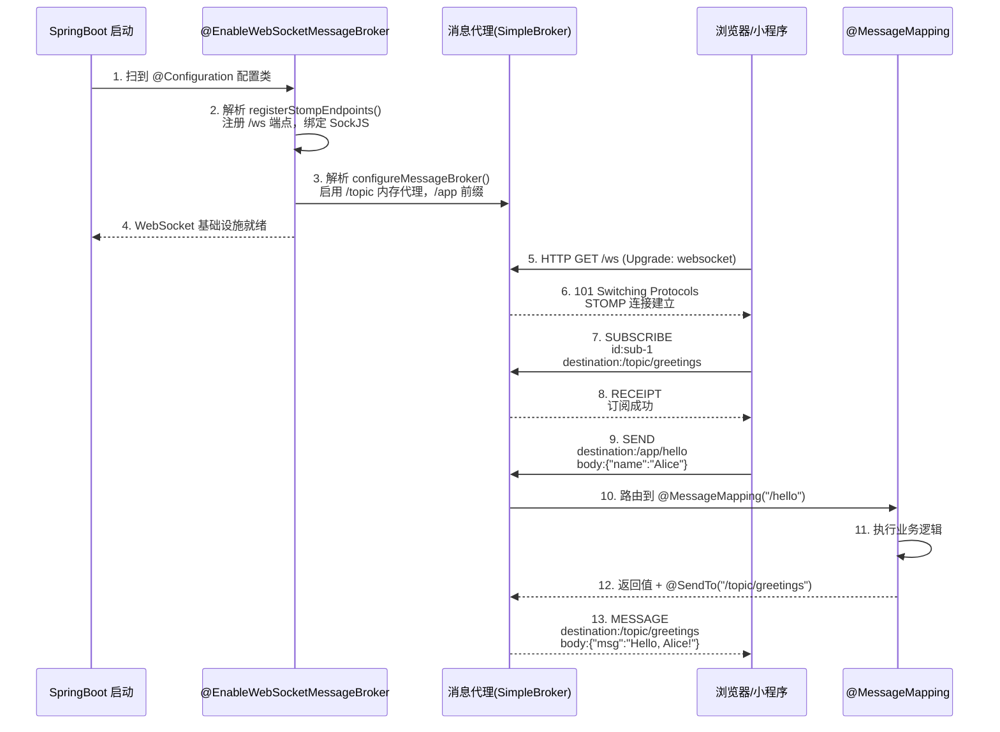

### 一、什么是webscoket

> WebSocket 是一种在单个 TCP 连接上进行全双工通信的网络协议。它使得客户端和服务器之间能够进行实时、双向的数据传输，克服了传统 HTTP 协议只能由客户端发起请求、服务器被动响应的局限性。

### 1. 设计目的与背景

- 传统的 HTTP 协议是无状态的请求 - 响应模型，适用于大多数 Web 页面的请求和加载场景。
- 对于实时性要求较高的应用（如在线聊天、实时游戏、股票行情推送等），频繁的 HTTP 请求会带来较高的开销，并且`难以实现服务器`主动`向客户端`推送数据。
- WebSocket 协议应运而生，它`在 HTTP 的基础上`进行了扩展，通过`一次 HTTP 握手`建立`持久连接`，之后可以在该连接上进行双向通信，大大降低了实时应用的延迟并提高了效率。

### 2. 工作原理

- **握手阶段**：`客户端`通过 HTTP 协议向服务器发送一个带有`特定头部信息`的请求，请求升级协议到 WebSocket。例如：

> 特定头部信息：
>
> 	Connection: Upgrade  // 链接 升级
> 	Upgrade: websocket   // 升级到websocket

```http
GET /socket HTTP/1.1
Host: example.com
Connection: Upgrade
Upgrade: websocket
Sec - WebSocket - Key: dGhlIHNhbXBsZSBub25jZQ==
Sec - WebSocket - Version: 13
```

服务器收到请求后，如果支持 WebSocket 协议，会返回一个 HTTP 101 Switching Protocols 响应，表示协议升级成功，握手完成。

```http
HTTP/1.1 101 Switching Protocols
Upgrade: websocket
Connection: Upgrade
Sec - WebSocket - Accept: s3pPLMBiTxaQ9kYGzzhZRbK+xOo=
```

> （握手过程核心）
>
> Sec - WebSocket - Key  计算得到  Sec - WebSocket - Accept：
>
> Sec - WebSocket - Key: dGhlIHNhbXBsZSBub25jZQ==    得到  Sec - WebSocket - Accept: s3pPLMBiTxaQ9kYGzzhZRbK+xOo=
>
> 

- **数据传输阶段**：握手成功后，`客户端和服务器`之间建立起一个`全双工的 TCP 连接`，双方可以随时向对方发送数据帧。WebSocket 的数据帧格式紧凑，包含操作码（表示数据类型，如文本、二进制等）、掩码、数据长度等信息。例如，客户端向服务器发送文本消息：

```plaintext
0x81 0x05 0x68 0x65 0x6c 0x6c 0x6f
```

这里`0x81`表示这是一个文本消息帧，`0x05`表示数据长度为 5 字节，后面的`0x68 0x65 0x6c 0x6c 0x6f`是 “hello” 的 ASCII 编码。

#### 什么是全双工通信协议

> 全双工（Full Duplex）通信协议是**通信双方在同一时间内可以双向同时传输数据**的协议，就像现实中的电话通话：你说话的同时也能听到对方说话，双方的数据流是双向且并行的。

与之相对的是**半双工**和**单工**通信，通过对比能更清晰理解全双工的核心特征：

| 通信模式   | 核心特征                                 | 生活例子                 | 典型协议 / 技术                  |
| ---------- | ---------------------------------------- | ------------------------ | -------------------------------- |
| **单工**   | 只能单向传输（一方发，一方收）           | 收音机、电视广播         | 传统广播、红外遥控               |
| **半双工** | 可以双向传输，但同一时间只能单向（轮流） | 对讲机（按说话键才能发） | 早期的 CSMA/CD、蓝牙（部分模式） |
| **全双工** | 双向同时传输，互不干扰                   | 电话、视频通话           | WebSocket、TCP、以太网（现代）   |

#### 全双工协议的具体体现

1. **服务器主动推数据**：无需客户端先发起请求，服务器可随时向客户端发送实时数据（如聊天消息、订单通知、股票行情）；
2. **客户端同时发数据**：客户端在接收服务器数据的同时，也能向服务器发送新的消息，两者互不阻塞；
3. **持久连接**：一旦 WebSocket 握手成功，连接会一直保持（除非主动关闭或网络中断），双方可通过这个连接持续双向传输数据，避免了 HTTP 协议每次请求都要建立连接的开销。

#### 对比 HTTP 协议（半双工特性）

HTTP 1.1 虽然支持**长连接（Keep-Alive）**，但本质仍是**半双工**：

- 客户端必须先发送 HTTP 请求，服务器才能响应数据，服务器无法主动向客户端推送数据；
- 即使长连接保持，数据传输也必须遵循 “请求 - 响应” 的单向顺序（客户端发请求→服务器回响应→客户端再发下一个请求），无法同时双向传输。

### 3. 应用场景

- **实时通信类应用**：如在线聊天应用（如微信网页版聊天）、即时通讯工具等，用户能够实时接收和发送消息，实现高效的沟通。
- **实时数据推送**：股票交易平台实时推送股票价格、交易信息；新闻资讯平台实时推送最新新闻；物联网（IoT）设备监控系统实时推送设备状态和传感器数据等。
- **在线协作**：在线文档协作（如 Google Docs）、多人在线游戏等场景下，多个用户需要实时同步数据，WebSocket 能够满足这种实时协作的需求。


## 二、Spring Boot 集成 WebSocket 流程与极简代码案例

### 1、整体流程

1. **后端步骤**：
   - 引入 WebSocket 依赖
   - 编写 WebSocket 配置类（开启 WebSocket 支持，注册端点）
   - 编写消息处理类（处理客户端连接、消息接收、连接关闭）
2. **前端步骤**：
   - 通过原生 WebSocket API 连接后端端点
   - 监听连接成功、消息接收、连接关闭事件
   - 发送消息到后端

### 2、后端代码（Spring Boot）

#### 1. 引入依赖（pom.xml）

```xml
<!-- Spring Boot Web 依赖（基础） -->
<dependency>
    <groupId>org.springframework.boot</groupId>
    <artifactId>spring-boot-starter-web</artifactId>
</dependency>
<!-- Spring Boot WebSocket 依赖 -->
<dependency>
    <groupId>org.springframework.boot</groupId>
    <artifactId>spring-boot-starter-websocket</artifactId>
</dependency>
```

#### 2. WebSocket 配置类（开启支持并注册端点）

```java
import org.springframework.context.annotation.Bean;
import org.springframework.context.annotation.Configuration;
import org.springframework.web.socket.config.annotation.EnableWebSocket;
import org.springframework.web.socket.config.annotation.WebSocketConfigurer;
import org.springframework.web.socket.config.annotation.WebSocketHandlerRegistry;
import org.springframework.web.socket.handler.TextWebSocketHandler;

@Configuration
@EnableWebSocket // 开启 WebSocket 支持
public class WebSocketConfig implements WebSocketConfigurer {

    private final TextWebSocketHandler webSocketHandler;

    // 注入自定义的消息处理器（构造器注入）
    public WebSocketConfig(TextWebSocketHandler webSocketHandler) {
        this.webSocketHandler = webSocketHandler();
    }

    @Override
    public void registerWebSocketHandlers(WebSocketHandlerRegistry registry) {
        // 注册 WebSocket 端点：/ws
        // setAllowedOrigins("*") 允许跨域（生产环境建议指定具体域名）
        registry.addHandler(webSocketHandler, "/ws")
                .setAllowedOrigins("*");
    }

    // 注册自定义的消息处理器 Bean
    public TextWebSocketHandler webSocketHandler() {
        return new CustomWebSocketHandler();
    }
}
```

#### 3. 自定义消息处理器（核心：处理连接、消息、关闭）

```java
import org.springframework.web.socket.TextMessage;
import org.springframework.web.socket.WebSocketSession;
import org.springframework.web.socket.handler.TextWebSocketHandler;

/**
 * 自定义 WebSocket 消息处理器，处理文本消息
 */
public class CustomWebSocketHandler extends TextWebSocketHandler {

    /**
     * 客户端连接成功时触发
     */
    @Override
    public void afterConnectionEstablished(WebSocketSession session) throws Exception {
        System.out.println("客户端连接成功：" + session.getId());
        // 向客户端发送欢迎消息
        session.sendMessage(new TextMessage("欢迎连接 WebSocket 服务器！"));
    }

    /**
     * 接收客户端发送的消息时触发
     */
    @Override
    protected void handleTextMessage(WebSocketSession session, TextMessage message) throws Exception {
        String clientMsg = message.getPayload();
        System.out.println("收到客户端消息：" + clientMsg);
        // 向客户端回复消息
        session.sendMessage(new TextMessage("服务器收到消息：" + clientMsg));
    }

    /**
     * 客户端连接关闭时触发
     */
    @Override
    public void afterConnectionClosed(WebSocketSession session, org.springframework.web.socket.CloseStatus status) throws Exception {
        System.out.println("客户端连接关闭：" + session.getId());
    }
}
```

### 3、前端代码（HTML + 原生 JS）

创建一个 `index.html` 文件，直接用浏览器打开即可（无需部署，原生 WebSocket 即可连接后端）：

```html
<!DOCTYPE html>
<html lang="zh-CN">
<head>
    <meta charset="UTF-8">
    <title>WebSocket 测试</title>
</head>
<body>
<h3>WebSocket 实时通信</h3>
<input type="text" id="msgInput" placeholder="请输入消息">
<button onclick="sendMsg()">发送消息</button>
<div id="msgBox" style="margin-top: 20px; width: 500px; height: 300px; border: 1px solid #ccc; padding: 10px; overflow-y: auto;"></div>

<script>
    // 1. 连接后端 WebSocket 端点（注意：后端地址改为自己的服务地址，端口默认8080）
    const ws = new WebSocket('ws://localhost:8080/ws');

    // 2. 连接成功时的回调
    ws.onopen = function (event) {
        console.log("与服务器连接成功！");
        appendMsg("系统：已连接服务器");
    };

    // 3. 接收服务器发送的消息
    ws.onmessage = function (event) {
        appendMsg("服务器：" + event.data);
    };

    // 4. 连接关闭时的回调
    ws.onclose = function (event) {
        console.log("与服务器连接关闭！");
        appendMsg("系统：连接已关闭");
    };

    // 5. 发送消息到服务器
    function sendMsg() {
        const input = document.getElementById('msgInput');
        const msg = input.value.trim();
        if (msg) {
            ws.send(msg);
            appendMsg("我：" + msg);
            input.value = ""; // 清空输入框
        }
    }

    // 辅助函数：将消息添加到页面
    function appendMsg(content) {
        const msgBox = document.getElementById('msgBox');
        msgBox.innerHTML += content + '<br/>';
        // 滚动到底部
        msgBox.scrollTop = msgBox.scrollHeight;
    }
</script>
</body>
</html>
```

### 4、测试步骤

1. **启动 Spring Boot 应用**：默认端口 8080。
2. **打开前端 HTML 文件**：直接用浏览器打开 `index.html`。
3. **测试通信**：
   - 页面加载后，会自动连接后端，显示 “系统：已连接服务器” 和服务器的欢迎消息。
   - 在输入框中输入消息，点击 “发送消息”，可看到服务器的回复消息。
   - 关闭页面时，后端控制台会打印 “客户端连接关闭”。

### 5、关键说明

1. **跨域问题**：后端配置中 `setAllowedOrigins("*")` 是为了方便测试，生产环境需替换为具体的前端域名（如 `setAllowedOrigins("https://www.example.com")`）。
2. **消息类型**：上述案例是文本消息，若需传输二进制数据，可重写 `handleBinaryMessage` 方法。
3. **会话管理**：若需要维护多个客户端会话（如群聊），可在 `CustomWebSocketHandler` 中定义一个集合来存储所有 `WebSocketSession`，实现消息广播。
4. **异常处理**：可重写 `handleTransportError` 方法处理通信过程中的异常。


## 三、注册 WebSocket 端点，端点是什么？

> WebSocket 的**端点（Endpoint）并不是后端服务本身**，而是后端服务中**暴露的、供客户端建立 WebSocket 连接的具体网络地址（URL 路径）**，是客户端与后端 WebSocket 服务交互的**入口**。

可以这样理解：

- 后端服务是一个完整的应用（比如你的 Spring Boot 应用），它可能提供 REST API、静态资源、WebSocket 服务等多种功能；
- WebSocket 端点是这个服务中**专门用于 WebSocket 协议握手和通信的 “路径标识”**，`客户端`只有通过这个路径，才能与后端建立 WebSocket 连接，而非普通的 HTTP 连接。

### 1、结合案例说明

在之前的 Spring Boot 代码中，我们注册的端点是`/ws`：

```java
registry.addHandler(webSocketHandler, "/ws") // 端点路径为/ws
        .setAllowedOrigins("*");
```

此时，客户端的连接地址是`ws://localhost:8080/ws`（若为 HTTPS 则是`wss://localhost:8080/ws`），其中：

- `ws://`/`wss://`：WebSocket 协议的标识（对应 HTTP/HTTPS）；
- `localhost:8080`：后端服务的域名和端口（即你的 Spring Boot 服务地址）；
- `/ws`：**WebSocket 的端点路径**（核心，标识这是 WebSocket 连接的入口）。

### 2、关键区别与补充

#### 1、**端点 ≠ 后端服务**

一个后端服务可以暴露**多个 WebSocket 端点**，用于区分不同的业务场景（比如`/ws/chat`用于群聊、`/ws/notification`用于消息通知）。每个端点可以绑定不同的处理器，处理各自的业务逻辑：

```java
// 多个端点配置
registry.addHandler(chatHandler, "/ws/chat");
registry.addHandler(notificationHandler, "/ws/notification");
```

此时，客户端需根据业务需求，连接对应的端点（`ws://localhost:8080/ws/chat`或`ws://localhost:8080/ws/notification`）。

#### 2、**端点的作用**

- **协议握手**：客户端首先发送一个**HTTP 升级请求**到该端点（请求头包含`Upgrade: websocket`），后端通过该端点识别并完成 HTTP 到 WebSocket 的协议升级；
- **连接路由**：后端根据不同的端点路径，将连接路由到对应的处理器（如`chatHandler`处理`/ws/chat`的连接，`notificationHandler`处理`/ws/notification`的连接）；
- **通信通道**：一旦握手成功，后续的全双工通信就会在这个端点对应的连接上进行。

#### 3、**端点的访问形式**

端点路径是相对路径，必须结合后端服务的域名 / IP 和端口，才能形成完整的 WebSocket 连接地址（即`ws://[服务地址]:[端口]/[端点路径]`）。


## 四、可以不配置消息处理Handler么？

> 在 Spring Boot 中集成 WebSocket 时，**必须配置消息处理器（Handler）并绑定到端点**，如果不配置（或配置错误），客户端将**无法成功建立 WebSocket 连接**。

### 1、不配置会有什么问题？

#### 1. 客户端层面的表现

以原生 WebSocket 前端代码为例，会出现两种典型错误：

- **情况 1：完全未注册 Handler**若只开启 `@EnableWebSocket`，但未在 `WebSocketHandlerRegistry` 中调用 `addHandler(...)` 绑定 Handler，客户端连接时会触发 `ws.onerror` 和 `ws.onclose`，控制台报错类似：

  ```plaintext
  WebSocket connection to 'ws://localhost:8080/ws' failed: Error during WebSocket handshake: Unexpected response code: 404
  ```

  

  原因是后端的 `/ws` 端点没有绑定处理器，服务器无法识别该路径的 WebSocket 请求，直接返回 HTTP 404（路径不存在）。

- **情况 2：注册了端点但 Handler 为 null / 未实例化**若代码中 Handler 未被 Spring 管理（如未加 `@Bean`、未注入），会抛出**空指针异常**，服务器返回 HTTP 500 错误，客户端连接报错：

  ```plaintext
  WebSocket connection to 'ws://localhost:8080/ws' failed: Error during WebSocket handshake: Unexpected response code: 500
  ```

  

#### 2. 服务端层面的表现

- 控制台会输出异常日志（如 404 对应的 `No handler found for path [/ws]`，或 500 对应的 `NullPointerException`）；
- 没有任何客户端连接的日志（如之前案例中的 “客户端连接成功：xxx”），因为连接在握手阶段就被终止。

### 2、底层原因：Handler 是 WebSocket 通信的核心载体

Spring WebSocket 的架构中，**`WebSocketHandler`（消息处理器）是处理所有 WebSocket 事件的唯一入口**，它的作用包括：

1. **处理协议握手**：服务器接收到客户端的 WebSocket 升级请求后，由 Handler 对应的底层组件完成 HTTP 到 WebSocket 的协议转换；
2. **处理连接生命周期事件**：客户端连接建立（`afterConnectionEstablished`）、连接关闭（`afterConnectionClosed`）、通信异常（`handleTransportError`）等，都依赖 Handler 的回调方法；
3. **处理数据传输**：客户端发送的文本 / 二进制消息，必须通过 Handler 的 `handleTextMessage`/`handleBinaryMessage` 方法接收和处理，服务器向客户端发送消息也需要通过 Handler 持有的 `WebSocketSession` 完成。

简单来说，**端点是 WebSocket 连接的 “入口路径”，而 Handler 是处理这个入口所有逻辑的 “处理器”**。没有 Handler，端点就只是一个空路径，服务器无法处理任何 WebSocket 相关的请求和事件。

### 3、补充：Spring 是否有默认 Handler？

**Spring WebSocket 没有提供默认的 `WebSocketHandler` 实现**，因为不同业务场景的处理逻辑完全不同（如聊天、通知、实时监控），必须由开发者自定义 Handler（或使用 Spring 提供的抽象实现，如 `TextWebSocketHandler`、`BinaryWebSocketHandler`）。

即使是最简单的场景，也需要至少继承 `TextWebSocketHandler` 并重写核心方法（如之前案例中的 `CustomWebSocketHandler`），否则无法完成任何通信。

### 4、总结

如果不配置消息处理 Handler：

1. 客户端无法与后端完成 WebSocket 握手，连接直接失败（404/500 错误）；
2. 服务器无法处理任何 WebSocket 事件（连接、消息、关闭）；
3. 整个 WebSocket 通信链路完全无法建立。

**Handler 是 Spring WebSocket 不可或缺的核心组件**，端点必须与 Handler 绑定才能生效。


## 五、Market 工程 WebSocket 端点配置与处理器添加分析

### 1、WebSocket 端点配置（WebSocketConfig.java）

#### 1、**核心注解与继承**

通过 `@Configuration` 和 `@EnableWebSocketMessageBroker` 注解声明这是一个 WebSocket 配置类，并启用 STOMP 协议支持：

```java
@Configuration
@EnableWebSocketMessageBroker // 开启 STOMP 消息代理
public class WebSocketConfig extends AbstractWebSocketMessageBrokerConfigurer {
    // 配置逻辑...
}
```

#### 2、**端点注册（`registerStompEndpoints` 方法）**

明确声明 WebSocket 握手入口端点，并支持跨域和 SockJS 降级支持：

```java
@Override
public void registerStompEndpoints(StompEndpointRegistry registry) {
    // 暴露端点 /market-ws，允许跨域，支持 SockJS 降级（兼容旧浏览器）
    registry.addEndpoint("/market-ws")
            .setAllowedOrigins("*") // 允许所有域名跨域
            .withSockJS(); // 启用 SockJS 模拟 WebSocket
}
```

- 客户端通过 `new SockJS('/market-ws')` 或 `ws://ip:port/market-ws` 连接此端点。

#### 3、**消息代理配置（`configureMessageBroker` 方法）**

定义消息路由规则，指定客户端可订阅的广播路径前缀：

```java
@Override
public void configureMessageBroker(MessageBrokerRegistry config) {
    config.enableSimpleBroker("/topic"); // 启用内存代理，支持 /topic 前缀的广播
    config.setApplicationDestinationPrefixes("/app"); // 客户端发消息到服务器的前缀
}
```

### 2、WebSocket 处理器添加（`WebsocketMarketHandler`）

1. **处理器角色**`WebsocketMarketHandler` 实现 `MarketHandler` 接口，负责将行情数据（如 K 线）通过 WebSocket 推送给客户端，内部依赖 `SimpMessagingTemplate` 发送消息：

   ```java
   @Component
   public class WebsocketMarketHandler implements MarketHandler {
       @Autowired
       private SimpMessagingTemplate messagingTemplate; // 注入消息发送工具
   
       @Override
       public void handleKLine(String symbol, KLine kLine) {
           // 向 /topic/market/kline/{symbol} 路径推送 K 线数据
           messagingTemplate.convertAndSend("/topic/market/kline/" + symbol, kLine);
       }
   }
   ```

2. **处理器注册到责任链**在 `ProcessorConfig` 中，`WebsocketMarketHandler` 被注入并添加到每个交易对的处理器链中，与其他处理器（如 MongoDB 存储、Netty 推送）形成责任链：

   ```java
   @Configuration
   public class ProcessorConfig {
       @Bean
       public CoinProcessorFactory processorFactory(
               WebsocketMarketHandler wsHandler, // 注入 WebSocket 处理器【单例】
               // 其他依赖...
       ) {
           // 为每个交易对创建处理器
           for (ExchangeCoin coin : coins) {
               CoinProcessor processor = new DefaultCoinProcessor(...);
               processor.addHandler(wsHandler); // 添加到责任链
               // 注册到工厂...
           }
       }
   }
   ```

> 在 Spring Boot（Spring Framework）里:  **所有通过 `@Component`/`@Service`/`@Repository`/`@Controller`/`@Configuration` 以及 `@Bean` 方法注册到 Spring 容器的对象，默认 Scope 是 `singleton`，即容器里只有一份实例。**

### 3、总结

1. **端点配置流程**
   - 通过 `WebSocketConfig` 注册端点 `/market-ws`，允许跨域和 SockJS 降级。
   - 启用 `/topic` 前缀的内存代理，作为客户端订阅的广播路径。
2. **处理器工作流程**
   - `WebsocketMarketHandler` 作为消息推送处理器，通过 `SimpMessagingTemplate` 向 `/topic` 路径发送数据。
   - 处理器被注册到 `CoinProcessor` 责任链，与其他处理器协同工作，实现 “接收数据 → 处理 → 推送” 的完整链路。

客户端通过订阅 `/topic/market/xxx` 路径，即可实时接收 `WebsocketMarketHandler` 推送的行情数据。


## 六、@EnableWebSocketMessageBroker  与 @EnableWebSocket 有什么区别

### 1、`@EnableWebSocketMessageBroker` 与 `@EnableWebSocket` 的核心区别

| 维度             | `@EnableWebSocket`                           | `@EnableWebSocketMessageBroker`                              |
| ---------------- | -------------------------------------------- | ------------------------------------------------------------ |
| **核心功能**     | 仅启用基础 WebSocket 支持，需手动处理消息    | 启用 **STOMP 协议** 支持，集成消息代理（Broker）             |
| **协议层**       | 基于原生 WebSocket 协议（无高级消息机制）    | 基于 **STOMP 协议**（在 WebSocket 上封装消息格式）           |
| **消息路由**     | 无内置路由，需自定义 `WebSocketHandler` 处理 | 支持消息代理（如 `/topic` 广播、`/queue` 点对点）            |
| **开发复杂度**   | 需手动实现消息解析、路由、会话管理           | 借助 Spring 提供的模板（如 `SimpMessagingTemplate`）简化开发 |
| **典型使用场景** | 简单的点对点实时通信（如聊天）               | 复杂的消息订阅 / 发布场景（如行情推送、通知）                |

### 2、详细说明

#### 1、**`@EnableWebSocket`：基础 WebSocket 支持**

- 作用：告知 Spring 启用 WebSocket 功能，允许注册 WebSocket 端点并绑定自定义的 `WebSocketHandler`。

- 特点：

  - 仅提供底层 WebSocket 连接管理，不涉及消息协议规范。
  - 需手动处理消息的编解码、路由逻辑（例如通过 `TextWebSocketHandler` 重写 `handleTextMessage` 方法）。

- 示例配置：

  ```java
  @Configuration
  @EnableWebSocket
  public class WebSocketConfig implements WebSocketConfigurer {
      @Override
      public void registerWebSocketHandlers(WebSocketHandlerRegistry registry) {
          // 注册端点
        	//   并
        	//绑定自定义处理器
          registry.addHandler(new MyWebSocketHandler(), "/ws").setAllowedOrigins("*");
      }
  }
  ```

  

#### 2、**`@EnableWebSocketMessageBroker`：带消息代理的 STOMP 支持**

- 作用：在基础 WebSocket 之上，启用 **STOMP（简单文本定向消息协议）**，并集成消息代理（Broker）用于消息路由。

- 特点：

  - 支持消息订阅 / 发布模式（如客户端订阅 `/topic/xxx` 接收广播）。
  - 提供 `SimpMessagingTemplate` 工具类，简化消息发送（无需手动处理连接和编码）。
  - 可配置内存代理（`enableSimpleBroker`）或外部代理（如 RabbitMQ、ActiveMQ）。

- 示例配置（对应代码库中的 `WebSocketConfig`）：

  ```java
  @Configuration
  @EnableWebSocketMessageBroker
  public class WebSocketConfig extends AbstractWebSocketMessageBrokerConfigurer {
      @Override
      public void configureMessageBroker(MessageBrokerRegistry config) {
          config.enableSimpleBroker("/topic"); // 启用内存代理
          config.setApplicationDestinationPrefixes("/app"); // 客户端发消息前缀
      }
      
      @Override
      public void registerStompEndpoints(StompEndpointRegistry registry) {
          registry.addEndpoint("/market-ws").withSockJS(); // STOMP 端点
      }
  }
  ```

### 3、总结

- `@EnableWebSocket` 是 **“裸奔” 的 WebSocket**，适合简单场景，需手动处理消息细节；
- `@EnableWebSocketMessageBroker` 是 **“带消息系统的 WebSocket”**，通过 STOMP 和代理简化复杂的订阅 / 发布逻辑，适合行情推送等场景（如代码库中的实时 K 线、成交数据推送）。

## 七、STOMP 协议 和 消息代理（Broker）什么作用？

### 1、为什么需要 STOMP 协议？

原生的 WebSocket 协议只是一个**底层的双向通信协议**，它只定义了数据传输的格式（帧），但没有规定：

- 客户端如何**订阅某个主题**（如 “股票行情”）；
- 客户端如何**向服务器发送指定类型的消息**（如 “发送聊天消息”）；
- 服务器如何**向指定群体推送消息**（如 “给所有订阅者广播行情”）。

简单说，原生 WebSocket 是 “裸的通道”，没有**消息语义和路由规则**。而**STOMP（Simple Text Oriented Messaging Protocol，简单文本定向消息协议）** 是一个**应用层的消息协议**，它在 WebSocket 之上定义了一套**标准化的消息格式和交互规则**，解决了上述问题。

#### STOMP 的核心作用：

1. **定义消息格式**：客户端和服务器之间的消息有固定格式（如`SEND`表示发送消息、`SUBSCRIBE`表示订阅、`MESSAGE`表示推送消息）。
2. **提供消息路由**：消息可以携带**目的地（Destination）**（如`/topic/chat`、`/queue/p2p`），服务器根据目的地将消息转发给对应接收者。
3. **标准化交互**：无论客户端（浏览器、移动端）还是服务器，都遵循统一的协议，无需自定义通信规则。

### 2、消息代理（Broker）是什么？

**消息代理（Message Broker）** 是一个**专门处理消息路由、存储、转发的中间件**，它的核心职责是：

- 管理客户端的**订阅关系**（如谁订阅了`/topic/chat`）；
- 接收服务器或客户端发送的消息，根据**目的地（Destination）** 将消息推送给所有订阅者；
- 支持不同的消息模式（如**广播模式（Publish/Subscribe，发布 / 订阅）**、**点对点模式（Point-to-Point，P2P）**）。

### 3、消息代理的两种类型（在 Spring WebSocket 中）：

#### 1、**内置内存代理（Simple Broker）**

- 由 Spring 框架**内置实现**，运行在应用进程内，无需外部中间件；
- 支持基本的广播（`/topic`前缀）和点对点（`/queue`前缀）消息；
- 优点：轻量、无需部署额外服务，适合开发 / 测试环境或单机部署；
- 缺点：不支持集群（多应用实例间无法共享订阅关系）、无持久化，不适合生产环境高并发场景。

#### 2、**外部代理（Stomp Broker Relay）**

- 集成外部的专业消息中间件（如**RabbitMQ、ActiveMQ、Redis**），这些中间件原生支持 STOMP 协议；
- 优点：支持集群部署、消息持久化、高并发，适合生产环境；
- 缺点：需要额外部署和配置中间件。

### 4、案例：Spring 中 “启用 STOMP + 集成消息代理” 

在 Spring Boot 中，通过`@EnableWebSocketMessageBroker`注解`开启这一功能`，本质是**将 STOMP 协议与消息代理结合，为 WebSocket 提供标准化的消息交互能力**，具体流程如下：

#### 1. 核心配置（回顾）

```java
@Configuration
@EnableWebSocketMessageBroker // 核心注解：启用STOMP+消息代理
public class WebSocketConfig implements WebSocketMessageBrokerConfigurer {

    @Override
    public void configureMessageBroker(MessageBrokerRegistry config) {
        // 1. 启用内置内存代理，支持/topic（广播）和/queue（点对点）前缀的消息
        config.enableSimpleBroker("/topic", "/queue");
        // 或：启用外部代理（如RabbitMQ）
        // config.enableStompBrokerRelay("/topic", "/queue")
        //        .setRelayHost("localhost")
        //        .setRelayPort(61613) // RabbitMQ的STOMP端口
        //        .setClientLogin("guest")
        //        .setClientPasscode("guest");

        // 2. 定义客户端发送消息到服务器的前缀（如/app）
        config.setApplicationDestinationPrefixes("/app");
    }

    @Override
    public void registerStompEndpoints(StompEndpointRegistry registry) {
        // 3. 注册WebSocket端点（客户端连接的入口）
        registry.addEndpoint("/ws-stomp")
                .setAllowedOrigins("*")
                .withSockJS(); // 兼容不支持WebSocket的浏览器
    }
}
```

#### 2. 客户端与服务器的交互流程（基于 STOMP + 消息代理）

```plaintext
客户端（浏览器）                Spring服务器                消息代理（Broker）
    |                             |                          |
    | 1. 连接WebSocket端点/ws-stomp |                          |
    | --------------------------> |                          |
    | 2. 发送STOMP连接帧（CONNECT） |                          |
    | --------------------------> |                          |
    | 3. 订阅/topic/chat（SUBSCRIBE）|                          |
    | --------------------------> |                          |
    |                             | 4. 把订阅关系交给Broker    |
    |                             | ------------------------> |
    | 5. 发送消息到/app/chat/send  |                          |
    | --------------------------> |                          |
    |                             | 6. 处理消息（@MessageMapping）|
    |                             | 7. 转发消息到/topic/chat   |
    |                             | ------------------------> |
    |                             |                          | 8. 推送给所有订阅者
    |                             | 9. 转发消息给客户端        |
    | 10. 接收消息（MESSAGE）      | <------------------------ |
    | <------------------------- |                          |
```

#### 3. 关键角色分工

| 组件                   | 职责                                                         |
| ---------------------- | ------------------------------------------------------------ |
| **STOMP 协议**         | 定义客户端与服务器的消息格式（如`SUBSCRIBE`/`SEND`/`MESSAGE`）和目的地（`/topic/chat`）。 |
| **Spring WebSocket**   | 处理 WebSocket 连接、解析 STOMP 消息、调用业务逻辑（`@MessageMapping`）、转发消息到消息代理。 |
| **消息代理（Broker）** | 管理订阅关系、接收消息、向所有订阅者广播消息（核心：消息路由）。 |

### 5、核心总结

**启用 STOMP 协议支持 + 集成消息代理**，本质是：

1. 用**STOMP 协议**为原生 WebSocket 添加**标准化的消息语义和路由规则**，让客户端和服务器能按 “订阅 - 发布” 的模式交互；
2. 用**消息代理（Broker）** 接管**消息的存储、转发和订阅关系管理**，解放服务器的压力，同时支持集群和高并发。

这一组合让 WebSocket 从 “简单的双向通信通道” 升级为 “功能完善的消息系统”，能够轻松实现**实时聊天、行情推送、系统通知**等复杂场景。


## 八、路径问题：enableSimpleBroker()设置前缀，后缀路径需要与前端约定？

是的，**`enableSimpleBroker()` 配置的前缀是 “核心边界”**，前缀之后的路径部分仅需要**前后端提前约定好语义和格式**即可，Spring 框架不会对前缀后的路径做强制限制。但要保证消息能正常收发，还需要遵循一些基础规则，以下是详细说明：

### 1、核心结论：前缀是 “规则”，后缀是 “约定”

| 部分                                                         | 角色与约束                                                   | 示例                                                    |
| ------------------------------------------------------------ | ------------------------------------------------------------ | ------------------------------------------------------- |
| `enableSimpleBroker()` 配置的前缀（如`/topic`、`/ws-broadcast`） | **框架级约束**：1. 必须是路径的起始部分，否则消息代理无法识别；2. 只能是配置过的前缀，不能使用未配置的前缀。 | 配置了`/topic`，则路径必须以`/topic`开头                |
| 前缀后的路径（如`/chatroom`、`/market/kline/BTC_USDT`）      | **业务级约定**：1. 前后端协商好语义（如`/market/kline`表示行情 K 线）；2. 前后端保持路径格式一致（包括动态参数、层级、大小写）；3. 框架不限制后缀的格式和层级。 | 约定`/topic/market/kline/{symbol}`表示某币种的 K 线数据 |

简单来说：

- **前缀由后端通过`enableSimpleBroker()`“定死”**，是消息代理能处理的 “白名单”；
- **后缀由前后端协商约定**，只要格式一致，想怎么划分都可以（比如按业务模块、数据类型、用户分组等）。

### 2、具体示例：前缀约束 + 后缀约定

#### 1. 后端配置（确定前缀）

```java
@Override
public void configureMessageBroker(MessageBrokerRegistry config) {
    // 仅配置两个前缀：/topic（广播）、/ws-p2p（点对点）
    config.enableSimpleBroker("/topic", "/ws-p2p");
    config.setApplicationDestinationPrefixes("/app");
}
```

#### 2. 前后端约定后缀路径（语义化划分）

| 业务场景      | 前后端约定的完整路径           | 后缀路径的语义约定                        |
| ------------- | ------------------------------ | ----------------------------------------- |
| 全局聊天广播  | `/topic/chat/global`           | `chat/global`表示全局聊天频道             |
| 币种 K 线推送 | `/topic/market/kline/BTC_USDT` | `market/kline/{symbol}`表示某币种 K 线    |
| 用户订单通知  | `/ws-p2p/user/1001/order`      | `user/{userId}/order`表示某用户的订单通知 |

#### 3. 前后端实现（遵循约定）

- **后端推送消息**：严格按照约定的完整路径发送

  ```java
  // 推送全局聊天消息
  messagingTemplate.convertAndSend("/topic/chat/global", "新的全局聊天消息");
  // 推送BTC_USDT的K线数据
  messagingTemplate.convertAndSend("/topic/market/kline/BTC_USDT", klineData);
  // 推送用户1001的订单通知
  messagingTemplate.convertAndSend("/ws-p2p/user/1001/order", orderData);
  ```

  

- **前端订阅消息**：严格按照约定的完整路径订阅

  ```javascript
  // 订阅全局聊天
  stompClient.subscribe('/topic/chat/global', (msg) => {
      console.log("全局聊天：", msg.body);
  });
  // 订阅BTC_USDT的K线
  const symbol = "BTC_USDT";
  stompClient.subscribe(`/topic/market/kline/${symbol}`, (msg) => {
      console.log(`${symbol} K线：`, JSON.parse(msg.body));
  });
  // 订阅用户1001的订单通知
  const userId = "1001";
  stompClient.subscribe(`/ws-p2p/user/${userId}/order`, (msg) => {
      console.log("订单通知：", msg.body);
  });
  ```

### 3、需要注意的 “约定规则”（避免踩坑）

虽然后缀是约定，但为了保证系统的可维护性和消息正常收发，建议遵循以下**约定规范**：

1. **路径格式统一**
   - 路径使用`/`分隔层级，小写字母为主（避免大小写不一致导致的问题）；
   - 动态参数使用`{参数名}`或直接拼接（如`/market/kline/BTC_USDT`），前后端约定好参数的含义和格式。
2. **语义化划分层级**
   - 按 “业务模块 / 数据类型 / 具体资源” 的层级划分（如`/topic/market/kline/BTC_USDT`：业务模块`market` → 数据类型`kline` → 具体资源`BTC_USDT`）；
   - 避免无意义的层级（如`/topic/a/b/c/d`，无语义的层级会增加维护成本）。
3. **避免冲突**
   - 不同业务场景的路径不要重叠（如不要同时使用`/topic/chat`和`/topic/chatroom`表示同一功能，易混淆）；
   - 若有多个环境（测试、生产），不要通过修改后缀区分环境，建议通过**不同的前缀**或**不同的端点**区分（如测试环境用`/test-topic`，生产环境用`/topic`）。
4. **通配符的约定**
   - 若使用 STOMP 的通配符（`*`/`**`），前后端需约定通配符的使用范围（如`/topic/market/**`表示所有市场相关消息，避免滥用通配符接收无关消息）。

### 4、特殊场景：前缀后路径的动态性

前缀后的路径支持**完全动态**，比如：

- 基于用户输入的参数（如用户选择了某个币种，就订阅该币种的 K 线路径）；
- 基于业务逻辑的动态生成（如用户加入了某个房间，就订阅该房间的聊天路径）。

这种动态性完全由前后端约定的逻辑决定，框架不会干预，只要最终的完整路径以`enableSimpleBroker()`配置的前缀开头即可。

### 5、总结

`enableSimpleBroker()`设置的前缀是**框架层面的硬性约束**，是消息能被代理路由的前提；而前缀后的路径部分，**只需要前后端提前约定好语义、格式和动态参数规则**，就能保证消息正常收发。

这种设计既保证了框架的规范性，又给业务开发留下了足够的灵活性，是 Spring WebSocket STOMP 实现的核心灵活性体现。


## 九、前缀是确定死的字符么？

### 结论先行

`enableSimpleBroker()` 配置的前缀**不是 “写死在框架里的固定字符”**，而是**由后端开发者在配置中自定义的、一旦配置完成后对当前应用而言 “固定不变” 的字符 / 路径段**。

简单说：**前缀是开发者 “定死” 的，而非框架 “死的字符”**，你可以自由选择任意合法的路径字符串作为前缀（如`/topic`、`/ws-broadcast`、`/abc123`），框架只认你配置的前缀，不限制具体字符。

### 1、前缀的 “可配置性”：不是框架固定的字符

Spring 框架没有强制要求必须使用`/topic`、`/queue`等字符作为前缀，这些只是**行业约定俗成的语义规范**（`/topic`表示广播、`/queue`表示点对点）。你可以完全自定义前缀，比如：

```java
// 配置完全自定义的前缀：/ws-broadcast、/user-notice、/abc（甚至单层级/数字）
config.enableSimpleBroker("/ws-broadcast", "/user-notice", "/abc");
```

上述配置中，消息代理只会处理以`/ws-broadcast`、`/user-notice`、`/abc`开头的路径，框架不会因为你没使用`/topic`而报错。

### 2、前缀的 “固定性”：配置后对应用而言是 “死的”

一旦你在`enableSimpleBroker()`中配置了前缀，**应用运行期间无法动态修改**（除非重启应用并修改配置），从这个角度看，前缀是 “确定死的”：

1. **运行时不可变**：Spring 的`消息代理`在`应用启动时`就会`加载配置`的`前缀`，运行期间无法通过代码动态添加 / 删除前缀；
2. **必须严格匹配**：客户端订阅路径、服务器推送路径必须以配置的前缀开头，否则消息代理无法识别和路由消息。

#### 反例（错误配置，会导致消息无法收发）：(无法收发的核心原因：因为消息代理找不到这个路径)

```java
// 后端配置的前缀：/ws-broadcast
config.enableSimpleBroker("/ws-broadcast");

// 后端推送路径：以/topic开头（未配置的前缀），消息代理会忽略此消息
messagingTemplate.convertAndSend("/topic/chat", "消息");

// 客户端订阅路径：以/topic开头，同样收不到消息
stompClient.subscribe('/topic/chat', callback);
```

### 3、前缀的 “格式规则”：合法的路径字符串即可

前缀需要遵循**STOMP 协议的路径格式**（本质是 HTTP 风格的路径格式），具体规则：

1. **必须以`/`开头**：如`/topic`（合法）、`topic`（不合法，框架会报错）；
2. **可以是多层级路径**：如`/ws/broadcast`、`/market/data`（支持多层级，语义更丰富）；
3. **仅包含合法字符**：字母、数字、`_`、`-`、`/`（避免特殊字符如`?`、`&`、`#`，这些会被 STOMP 协议解析为参数，导致路径识别错误）。

#### 示例（多层级前缀，合法且语义更清晰）：

```java
// 配置多层级前缀：/ws/broadcast（WebSocket广播）、/ws/p2p（WebSocket点对点）
config.enableSimpleBroker("/ws/broadcast", "/ws/p2p");

// 后端推送路径：/ws/broadcast/chat（匹配多层级前缀）
messagingTemplate.convertAndSend("/ws/broadcast/chat", "聊天消息");

// 客户端订阅路径：/ws/broadcast/chat（匹配前缀，能收到消息）
stompClient.subscribe('/ws/broadcast/chat', callback);
```

### 4、总结：前缀的 “死” 与 “活”

| 维度             | 说明                                                         |
| ---------------- | ------------------------------------------------------------ |
| **框架层面**     | 前缀是 “活的”：可自定义任意合法的路径字符串，无固定字符限制  |
| **应用配置层面** | 前缀是 “死的”：配置后应用运行期间不可变，必须严格匹配才能收发消息 |
| **语义层面**     | 前缀是 “约定的”：建议使用`/topic`（广播）、`/queue`（点对点）等行业约定，提升代码可读性 |

简单来说，你可以把前缀理解为**后端开发者定义的 “消息路径白名单前缀”**：白名单由你自由定义（活），但定义后必须严格遵守（死），框架只处理白名单内的路径。


## 十、使用@EnableWebSocketMessageBroker接入 WebSocket 的完整流程图

下面给出一张“从项目启动到客户端收到第一条 WebSocket/STOMP 消息”的**完整时序流程图**，并配合关键步骤说明，帮助你看清 `@EnableWebSocketMessageBroker` 到底在何时、如何介入。

------------------------------------------------
Mermaid 时序图（横向时间轴）



------------------------------------------------
关键步骤解读（对照上图编号）

### 1-4. **启动阶段**  

Spring Boot 扫描到带 `@EnableWebSocketMessageBroker` 的配置类 → 实例化 `WebSocketMessageBrokerConfigurationSupport` → 注册 **STOMP 端点** (`/ws`) 与 **内存代理** (`/topic`、`/app`)，此时服务器已可接受 WebSocket 握手 。

- 内存代理怎么理解：

  “内存代理”是 Spring 对 STOMP 协议里 **“消息代理（Message Broker）”** 的一种**极简实现**，它**不依赖任何外部中间件**（RabbitMQ、Redis、Kafka 都不要），而是直接在**当前 JVM 堆内存**里维护几张 `Map` + `Queue`，完成“订阅关系保存”和“消息转发”两件事。核心就三句话：

  1. **订阅关系保存在 `ConcurrentHashMap<String, Set<Session>>`——Key 是目的地（如 `/topic/chat`），Value 是 WebSocket 会话集合。**
  2. 生产者发送消息时，Spring 把消息体封装成 `Message`，交给内存代理；代理根据目的地找到所有会话，**同步遍历** `Set<Session>`，挨个 `session.sendMessage(...)`。
  3. 重启即丢，无持久化、无集群复制，单节点压测可轻松到 **10 万 TPS** 级别，但**只适用于开发、测试或单实例小并发场景**。

  与“外部代理”对比一眼看懂

  | 特性     | 内存代理(SimpleBroker) | 外部代理(RabbitMQ/Redis) |
  | :------- | :--------------------- | :----------------------- |
  | 依赖     | 0 依赖                 | 需独立部署中间件         |
  | 持久化   | 无                     | 有                       |
  | 集群广播 | 不支持                 | 支持                     |
  | 重启消息 | 丢失                   | 可保留                   |
  | 配置     | 一行代码即可           | 需额外插件、交换机绑定   |
  | 适用场景 | 开发/测试/单实例       | 生产多实例、高可用       |

  ------

  代码里长什么样

  ```java
  @Override
  public void configureMessageBroker(MessageBrokerRegistry registry) {
      // 启用内存代理，前缀 /topic 走内存，/user 走内存
      registry.enableSimpleBroker("/topic", "/user");
      // 应用前缀，/app 开头的消息会路由到 @MessageMapping
      registry.setApplicationDestinationPrefixes("/app");
  }
  ```

  `enableSimpleBroker(...)` 这一行就是开启“内存代理”——Spring 会new 一个 `SimpleBrokerMessageHandler`，它实现了 `MessageHandler` 接口，但背后只是纯内存操作，没有任何网络或磁盘 IO。

  ------

  总结 ：“内存代理” = **把订阅关系和消息都放 JVM 里，重启即没，开发调试最快；**

  ​                              **生产若要重启不丢消息或多实例广播，就换 RabbitMQ/Redis 等外部代理。**

---

### 5-8. **连接 & 订阅阶段**  

浏览器先走 HTTP Upgrade 升级为 WebSocket，再发送 STOMP 帧 `SUBSCRIBE` 到 `/topic/greetings`；`SimpleBroker` 把该会话加入订阅表，返回 `RECEIPT` 表示成功 。

### 9-13. **收发消息阶段**  

客户端发送 `SEND /app/hello` 帧 → Spring 根据 `/app` 前缀把消息路由到 `@MessageMapping("/hello")` 方法 → 方法返回值被 `@SendTo("/topic/greetings")` 包装成 `MESSAGE` 帧 → `SimpleBroker` 广播给所有订阅会话 → 浏览器收到实时数据 。

------------------------------------------------
一句话总结  
`@EnableWebSocketMessageBroker` 帮你把“STOMP 端点注册 + 内存代理初始化”全部自动化；之后客户端只需 **连端点 → 订阅主题 → 发送 `/app/**` 消息 → 服务端 `@MessageMapping` 处理 → `@SendTo` 广播**，即可完成全双工实时通信。


