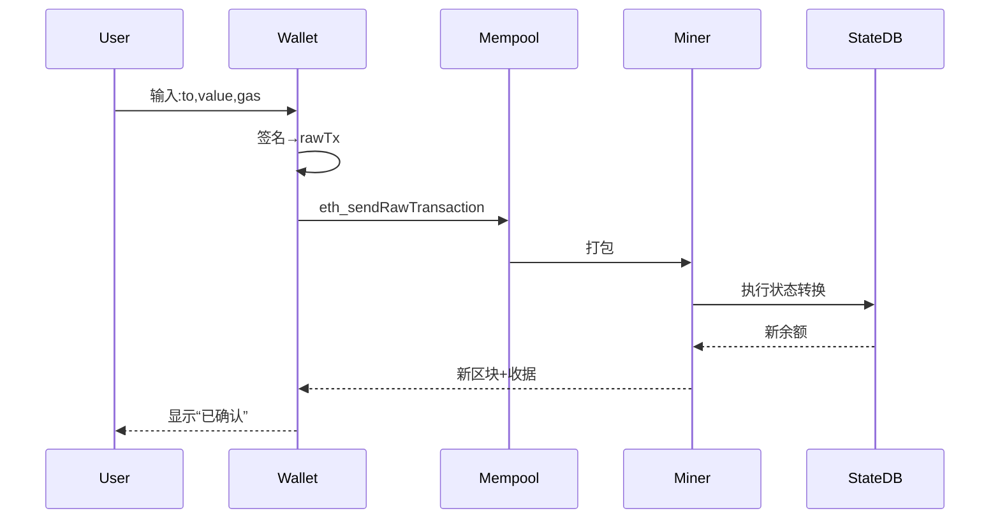
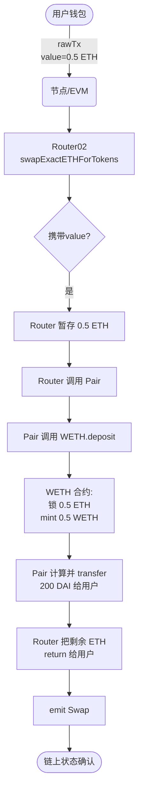
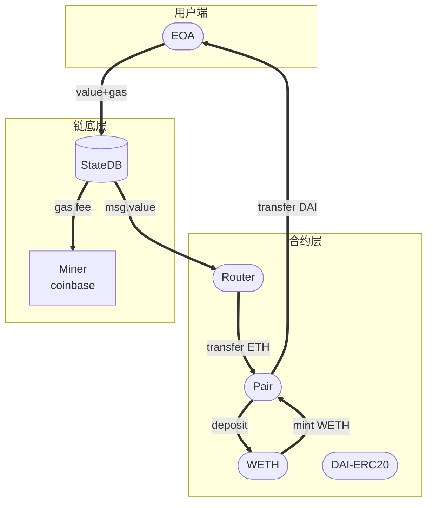
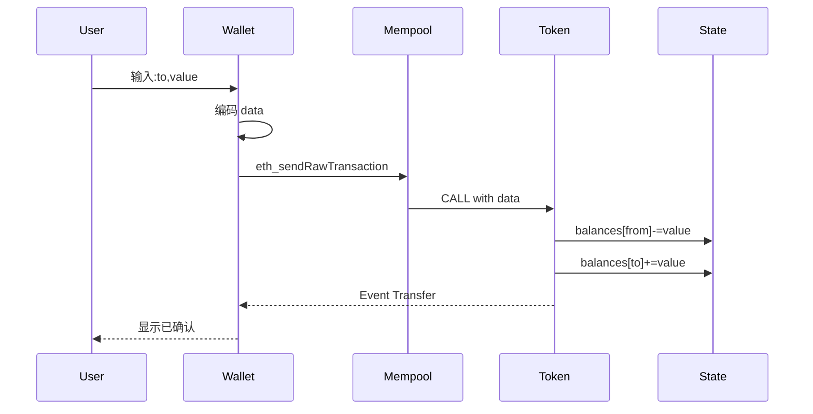
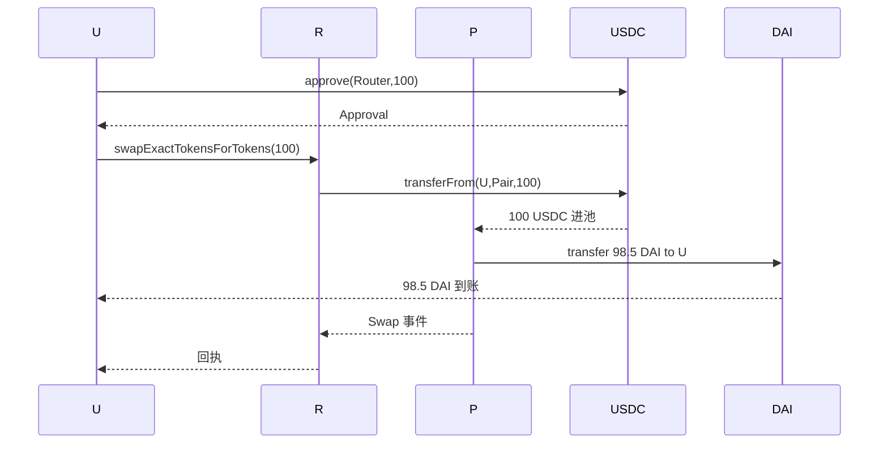
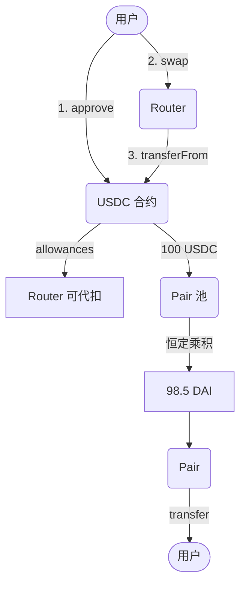
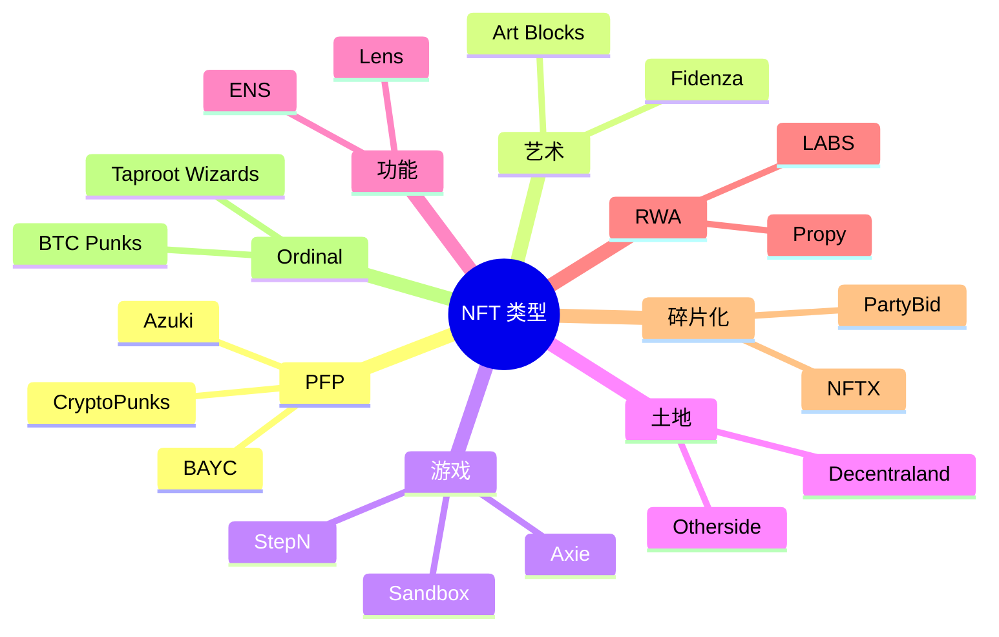
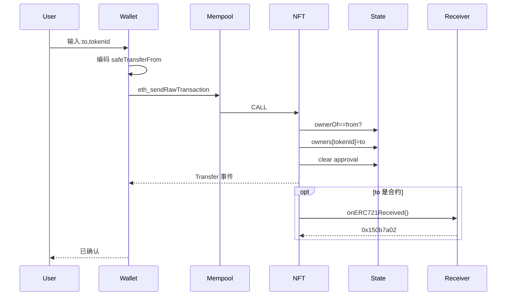
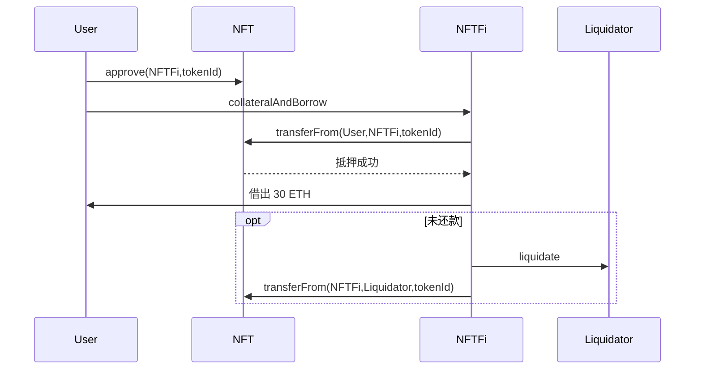
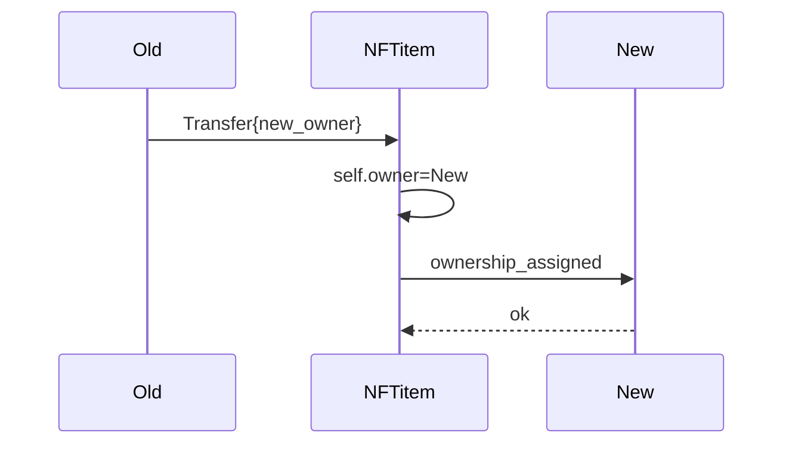

# 							转账流程

# 1、web3中，钱包的作用是什么？可以用来展示哪些资产？他们为什么能在钱包中展示？请按照资产类型分类说明，最好给出每种资产在钱包中显示的图例

钱包在 Web3 里不是“存币”的抽屉，而是**私钥容器 + 链前端的浏览器**。  
一句话：它帮你**持有密钥、签名交易、索引链上数据、展示人类可读界面**。  
能否看到某种资产，取决于 3 步闭环：

1. 链上有标准数据结构（余额、元数据 URI）  
2. 钱包按标准解析并拉取元数据  
3. 前端把图标、数量、价格渲染出来

下面按资产类型拆开说明，并给出常见图例（用 Emoji 占位，实际产品里对应图标/缩略图）。

---

### 一、原生币（Coin）
| 例子               | 展示字段               | 数据来源                     | 钱包 UI 图例 |
| ------------------ | ---------------------- | ---------------------------- | ------------ |
| BTC、ETH、SOL、BNB | 数量＋法币估值＋涨跌幅 | 节点 `getBalance` + 价格 API | ⛓️ + ￥       |

- 为什么能展示  
  节点直接返回 `address ➜ u256` 余额，无需合约解析。  
- 注意  
  UTXO 链（BTC）需把多条 UTXO 加总；账户链（ETH/SOL）单状态即可。

---

### 二、同质化代币（ERC-20 / SPL / BEP-20 …）
| 例子                 | 展示字段                 | 数据来源                                          | 钱包 UI 图例  |
| -------------------- | ------------------------ | ------------------------------------------------- | ------------- |
| USDT、USDC、DAI、UNI | 数量＋符号＋小数位＋图标 | 合约 `balanceOf` + `decimals`/`symbol` + 图标 CDN | 💰 + 项目 logo |

- 为什么能展示  
  钱包调用链上合约方法即可拿到链上余额和元数据；图标一般由钱包团队或 Tokenlist 社区维护（如 Uniswap Tokenlist、Solana List）。  
- 自动发现  
  有的钱包（MetaMask Extension、Phantom）会额外监听 `Transfer` 事件，一旦地址首次收到某代币就自动出现。

---

### 三、NFT（ERC-721 / ERC-1155 / SPL-NFT / Bitcoin Ordinal）
| 例子                  | 展示字段                        | 数据来源                     | 钱包 UI 图例 |
| --------------------- | ------------------------------- | ---------------------------- | ------------ |
| BAYC、Azuki、游戏装备 | 封面图＋名称＋TokenID＋合约地址 | `tokenURI` ➜ JSON ➜ 图片 URL | 🖼️            |

- 为什么能展示  
  1. 钱包先调 `balanceOf(owner)` 或 `tokenOfOwnerByIndex` 拿到 TokenID 列表  
  2. 再调 `tokenURI(tokenID)` 取链下 JSON（含图片、描述）  
  3. 缓存并渲染卡片  
- 图例差异  
  - 静态图：JPG/PNG 缩略图  
  - 动态：GIF/MP4 自动播放  
  - 音频/3D：显示波形或交互模型

---

### 四、LP Token / 质押凭证 / 债券代币
| 例子                    | 展示字段                 | 数据来源                        | 钱包 UI 图例  |
| ----------------------- | ------------------------ | ------------------------------- | ------------- |
| UNI-V2、Curve LP、stETH | 数量＋标的资产＋实时估值 | 同 ERC-20，但需额外读取底层储备 | 🍙 + 池子 logo |

- 为什么能展示  
  它们本质仍是 ERC-20，钱包可直接读余额；为了给出“LP 值多少钱”，钱包会再调 `getReserves` 或链下价格服务做换算。  
- 可视化  
  多数钱包会拆成两行：  
  100 UNI-V2 ≙ 1.23 ETH + 2 456 USDC

---

### 五、跨链包装资产（Wrapped / Bridged）
| 例子                       | 展示字段                   | 数据来源          | 钱包 UI 图例    |
| -------------------------- | -------------------------- | ----------------- | --------------- |
| WBTC、WETH、multichainUSDC | 数量＋“桥”标签＋原生链图标 | 合约 + 桥后端 API | 🔗 + 原资产 logo |

- 为什么能展示  
  合约端仍是 ERC-20；钱包为了提醒用户“这是桥资产”，会在角落加一条小横幅“Arbitrum Bridge”或“WBTC-DAO”。  
- 风险可视化  
  有的钱包（Rabby）会红色高亮“已脱锚”或“合约权限过大”。

---

### 六、ENS / 域名类（ERC-721 扩展）
| 例子                    | 展示字段           | 数据来源                  | 钱包 UI 图例 |
| ----------------------- | ------------------ | ------------------------- | ------------ |
| vitalik.eth、.bnb、.sol | 域名＋到期日＋头像 | NFT 元数据 + 链上到期读数 | 🆔            |

- 为什么能展示  
  域名即 NFT，只不过钱包把它拎出来放在“身份”栏，并反向解析成“发送时可直接填 vitalik.eth”。

---

### 七、POAP / 徽章 / SBT（Soul-bound Token）
| 例子               | 展示字段                       | 数据来源                    | 钱包 UI 图例 |
| ------------------ | ------------------------------ | --------------------------- | ------------ |
| 会议门票、链上成就 | 徽章图＋活动名称＋不可转让标签 | 同 NFT，但前端加 🚫 转移按钮 | 🎖️            |

- 为什么能展示  
  合约接口同 ERC-721，但 `transferFrom` 被禁用；钱包通过 ABI 检测到“Soul-bound”标志后，把发送按钮灰掉。

---

### 八、链上票据 / 期权 / 收益代币（更小众）
| 例子                            | 展示字段           | 数据来源              | 钱包 UI 图例 |
| ------------------------------- | ------------------ | --------------------- | ------------ |
| aUSDC (AAVE 存款凭证)、pendlePT | 数量＋到期日＋年化 | 专用解析器或 Subgraph | 📜            |

- 为什么能展示  
  钱包团队会写专属 Adapter，去 Subgraph 拉“底层资产 + 到期 + 收益率”再渲染。  
  普通钱包只当 ERC-20 显示数量，高级钱包（Zapper、Debank）才做可视化。

---

### 一张“钱包资产大屏”长什么样？（Mock-up）

```
┌── 总资产 ≙ $12 345 ─────────────────────────┐
│                                              │
│ ⛓️  原生币                                                      │
│   ETH  3.1415  ($9 600)                                      │
│                                                               │
│ 💰 代币                                                       │
│   USDC  1 000  ($1 000)                                       │
│   UNI    200   ($1 200)                                      │
│                                                               │
│ 🖼️ NFTs  （3）                                                 │
│   [猫图] BAYC #3045                                           │
│   [像素] CryptoPunk #8888                                     │
│                                                               │
│ 🍙 LP / 质押                                                   │
│   UNI-V2  45.6  ≙ 0.3 ETH + 612 USDC                         │
│                                                               │
│ 🔗 桥资产                                                      │
│   WBTC  0.05  ($2 100)  ⚠️ 多签托管                           │
│                                                               │
│ 🆔 域名                                                        │
│   vitalik.eth  到期 2027-04-11                                │
└──────────────────────────────────────────────┘
```

---

### 总结一句话

钱包能看到哪种资产，**不取决于钱包，而取决于链上是否按“公开标准”暴露余额与元数据**；  
钱包只是“钥匙 + 浏览器”，把冷冰冰的 `uint256` 翻译成人类看得懂的图标、金额和故事。


# 2、web3中的转账类型有哪些？请详细分类说明

在 Web3 环境中，"转账"不再只是传统意义上的"把钱从 A 地址打到 B 地址"，而是涵盖了各种链上状态变更（balance、NFT、合约存储、跨链凭证等）的广义交易。业界通常按"交易载体 → 资产类型 → 业务场景"三个层次来分类。下面给出一张"脑图式"清单，方便快速查阅，也便于开发者对号入座。

---

### 一、按交易载体（Transaction Carrier）分类
1. **EOA → EOA 签名转账**  
   - 典型：MetaMask 里直接输入地址和数量，点击 Send  
   - 链上标识：to 字段为普通地址，data 字段留空或仅 0x  
   - 费用：21000 gas（ETH 系）

2. **EOA → 合约 触发转账**  
   - 包括：调用 ERC-20/721/1155、DEX Router、质押、借贷等  
   - 链上标识：to 字段为合约地址，data 字段带 4 字节方法选择器 + 参数  
   - 费用：>= 21000，视计算量而定

3. **合约内部转账（Internal Transfer）**  
   - 触发方式：一个合约调用另一个合约，或合约自增/自减 balance  
   - 用户感知：区块浏览器常把这类归为"Internal Txn"  
   - 注意：不会单独生成一笔交易哈希，而是挂在父交易事件里

4. **无签名交易（Unsigned / Inherent）**  
   - 场景：Substrate 链的出块奖励、Slash、治理补发等  
   - 特点：不需要私钥签名，由链自身逻辑写入状态  
   - 安全：节点需内置验证规则，否则易被滥用

---

### 二、按资产类型（What）分类
1. **原生币转账**  
   - BTC、ETH、BNB、SOL、DOT …  
   - 直接改链上 balance 字段，不依赖合约

2. **同质化代币（ERC-20 族）**  
   - USDT、USDC、DAI、UNI …  
   - 本质是"改账本"：balanceOf[_from] −= value; balanceOf[_to] += value

3. **非同质化代币（ERC-721 / ERC-1155）**  
   - NFT 艺术品、游戏装备、域名（ENS）  
   - 转账即更换 ownerOf[tokenId]

4. **半同质化 / 多实例资产（ERC-1155）**  
   - 同一合约内既有 FT 也有 NFT，适合游戏道具  
   - 一次交易可批量转多种 id & value

5. **LP Token / 质押凭证 / 债券代币**  
   - 属于 ERC-20 的特例，但业务含义是"资金池份额"  
   - 转账即转移流动性所有权

6. **跨链资产（Wrapped、Pegged、Bridge 凭证）**  
   - WBTC、WETH、multichainUSDC、LayerZero OFT …  
   - 链上表现为 ERC-20，但背后有跨链桥合约或轻客户端背书

---

### 三、按业务场景（Why & How）分类
1. **普通 P2P 支付**  
   - 最基础场景，钱包扫码/拷贝地址即可

2. **DeFi 组合式转账**  
   - swap、add/remove liquidity、borrow、repay、stake、claim rewards  
   - 往往一次交易内包含多笔"内部转账"与事件

3. **批量转账 / 空投**  
   - Disperse.app、MerkleDistributor、ERC-20 的 transferMulti  
   - 节省手续费与区块空间，常见项目方发奖励

4. **跨链转账**  
   - 通过 Lock-Mint 或 Burn-Mint 模式完成  
   - 用户先源链 Lock，再在目标链获得对应资产；反向亦然  
   - 代表：WBTC、Multichain、cBridge、LayerZero、ThorChain

5. **NFT 交易市场的"转账+费用"**  
   - OpenSea、Blur：一次交易里既有 ERC-721 的 transferFrom，也有 ETH 的收款与版税拆分

6. **元宇宙 / GameFi 内流转**  
   - 链游金币、装备、土地，通常用 ERC-1155+ERC-20 混合经济  
   - 道具转账常伴随游戏客户端的链下状态同步

7. **DAO 金库 & 工资发放**  
   - 使用 Sablier、Superfluid 实现"流支付"（Stream Money）  
   - 链上按秒更新余额，但 Gas 仍批量结算

8. **隐私转账**  
   - Tornado Cash、Aztec、ZK.money  
   - 通过零知识证明打破链路可追溯性，但仍会改变 Merkle Tree 状态

9. **Gas 代付 / 元交易（Meta-Tx）**  
   - ERC-2771、EIP-4337 Account Abstraction  
   - 用户签名"转账意图"，由 Relayer 打包并代付 Gas，链上再向 Relayer 报销

---

### 四、小结速查表
| 维度 | 常见关键词                                          | 举例                                                     |
| ---- | --------------------------------------------------- | -------------------------------------------------------- |
| 载体 | EOA→EOA、合约调用、Internal、Inherent               | MetaMask 直接转 ETH；调用 Uniswap Router；Substrate 奖励 |
| 资产 | Coin、ERC-20、NFT、LP、跨链凭证                     | ETH；USDT；BAYC；UNI-V2；WBTC                            |
| 场景 | P2P、DeFi、批量、跨链、NFT 市场、流支付、隐私、代付 | 空投；cBridge；OpenSea 成交；Superfluid；Tornado         |

掌握"载体 → 资产 → 场景"这张三维表，基本就能覆盖 Web3 世界里的全部转账类型，也能帮助开发者在调试区块浏览器、编写合约或设计产品时迅速定位需求。


# 3、现有的原生币有哪些？

截至 2025-10 月公开信息，主流公链的“原生币（Coin）”可按下表速查。  
（*仅列市值/活跃度 Top20 左右，排名不分先后；稳定币、ERC-20 属于派生资产，不在此列。*）

| 公链 / 网络       | 原生币符号 | 主要用途（摘要）               |
| ----------------- | ---------- | ------------------------------ |
| Bitcoin           | BTC        | 转账、价值存储、支付矿工费     |
| Ethereum          | ETH        | 支付 Gas、PoS 质押、原生流动性 |
| BNB Chain         | BNB        | 支付 Gas、链上治理、质押       |
| Solana            | SOL        | 出块奖励、Gas、PoS 委托        |
| Ripple            | XRP        | 跨境支付手续费、桥接资产       |
| Cardano           | ADA        | 手续费、质押、治理投票         |
| Avalanche         | AVAX       | 子网费用、质押、安全保证金     |
| Polkadot          | DOT        | 插槽竞拍、治理、Staking        |
| Tron              | TRX        | 能量/带宽费、合约触发          |
| Toncoin           | TON        | 手续费、分片链质押             |
| Terra 2.0         | LUNA       | 网络质押、稳定币机制抵押       |
| Akash             | AKT        | 去中心化云计算资源撮合         |
| Algorand          | ALGO       | 交易费、参与密钥注册           |
| Cosmos Hub        | ATOM       | 跨链安全、治理、质押           |
| Near              | NEAR       | 手续费、状态租赁、质押         |
| Polygon PoS       | MATIC      | 侧链 Gas、质押、治理           |
| Filecoin          | FIL        | 存储挖矿、消息 Gas、惩罚抵押   |
| Internet Computer | ICP        | 计算资源“Cycles”兑换、治理     |
| Kaspa             | KAS        | 高速 PoW 出块、转账手续费      |
| Dogecoin          | DOGE       | 支付小费、转账、合并挖矿       |

> 新生态也在持续推出原生币，例如 Jupiter 生态即将发布稳定币 JupUSD，但它属于“原生稳定币”而非底层 Gas Coin，故未列入上表 。


# 4、原生币转账的业务流程是什么？币是怎么流转的？怎么与合约交互的？合约中有哪些地址参与？请详细说明给出每个阶段的流程图

下面把“原生币转账”拆成三条主线，逐段给出：

A. 纯原生币（如 BTC、ETH）在“地址-地址”之间的流转；  
B. 原生币作为 Gas 或支付手段，与智能合约交互的全过程；  
C. 合约里到底有哪些“隐形地址”在参与，它们各自扮演什么角色。  

每段都先给文字流程，再配一张 Mermaid 流程图，开发者可以直接粘到 [Mermaid Live Editor](https://mermaid.live) 看效果。所有图示均以 EVM 系为例，但 UTXO 系差异会在文字里点明。

------------------------------------------------
### 一、纯原生币转账的业务流程（以 EOA → EOA 为例）

1. 用户发起  
   - 钱包组装一笔 `Transaction`：  
     `{from, to, value, gasLimit, gasPrice, nonce, chainId}`  
   - 用私钥生成 ECDSA 签名 → 得到 `rawTx`

2. 广播与排序  
   - 节点把 `rawTx` 放入本地 `txpool`（内存池）  
   - 矿工/验证者按 `priority fee + nonce` 排序，打包进区块

3. 共识 & 落库  
   - 区块通过 PoW/PoS 共识  
   - 世界状态更新：  
     `StateDB[from].balance -= value + gasUsed*gasPrice`  
     `StateDB[to].balance += value`  
     `StateDB[coinbase].balance += gasUsed*gasPrice`  
   - 生成交易收据 `Receipt{status:1, logs:[]}`  
   - 原生币总量不变，只是 `balance` 字段重新分配

4. 回调通知（可选）  
   - 钱包监听 `txhash` → 6 个确认后 UI 变绿



> 注：BTC 系没有“状态树”，而是 UTXO 模型——上述第 3 步换成“消耗旧 UTXO，生成新 UTXO”，逻辑等价 。

------------------------------------------------
### 二、原生币与合约交互的完整生命周期（以“用户调用 swapExactETHForTokens”为例）

阶段 0 准备  
- 用户钱包里已有 ETH（原生币）  
- 目标 DEX（如 Uniswap V2 Router02）已部署，地址固定

阶段 1 前端编码  
- 前端通过 ethers.js 构造：  
  `router.populateTransaction.swapExactETHForTokens(..., {value: ethIn})`  
  这里 `{value: ethIn}` 是关键——它把原生币随交易一起“携带”

阶段 2 交易广播  
- 交易 `to = Router02`；`data = 选中的函数选择器 + 参数`；`value = ethIn > 0`  
- 节点验签后进入 mempool

阶段 3 EVM 执行（单笔 tx 内可嵌套多次调用）  
① 首先把 `msg.value` 存入 Router 的“临时余额”  
② Router 再把 ETH 转入对应的 `Pair(WETH-Token)` 合约  
③ Pair 合约把 ETH 转成 WETH（调用 `WETH.deposit{value}()`）  
④ 按恒定乘积公式计算能换出的 `TokenAmountOut`  
⑤ 把 `Token` 从 Pair 直接 `transfer` 到用户地址  
⑥ 如果有剩余 ETH（滑点保护），再 `transfer` 回用户  
⑦ Router  emit `Swap` 事件，结束

阶段 4 收据 & 事件  
- 用户收到两样东西：  
  – 交易收据（status=1，gasUsed）  
  – 日志数组（Transfer+Swap 事件）

阶段 5 余额变化一览  
| 地址               | 变化                                |
| ------------------ | ----------------------------------- |
| 用户 EOA           | ETH 减少，Token 增加                |
| Router02           | 中转，最终余额 0                    |
| Pair               | WETH 增加，Token 减少               |
| WETH 合约          | ETH 锁仓，等值 WETH 铸造给 Pair     |
| 0x0...dEaD（可选） | 若协议有销毁，这里会多一笔 transfer |



> 关键点：原生币“进入”合约的唯一途径就是 `msg.value`；合约若要“持有”ETH，要么自己实现 `receive()`，要么转成 WETH 。

------------------------------------------------
### 三、合约里到底有哪些“地址”在参与？

下面把常见角色一次列清，并给出他们在原生币流里的“收/支”情况。

1. 用户 EOA  
   - 支出：ETH（value + gas）  
   - 收入：找零 ETH、换得代币、NFT 或退款

2. Router/代理合约（可升级）  
   - 收支特点：几乎“过路财神”，`balance` 在交易前后保持 0  
   - 例外：若忘记写 `refund` 逻辑会意外锁死 ETH

3. Pair/Pool 合约  
   - 收入：原生币（或 WETH）（买卖盘一方）  
   - 支出：另一种资产（买卖盘另一方）  
   - 常驻余额：双边储备 + 手续费累积

4. WETH 合约（“包装器”）  
   - 唯一把“原生币 ←→ ERC-20” 1:1 映射的地址  
   - 收到 ETH → 铸造 WETH；收到 WETH → 销毁并返还 ETH  
   - 无 owner，完全去中心化

5. 多签/金库/保险库（如 bitLending 的借贷多签）  
   - 收入：抵押品 + 保险费  
   - 支出：贷款本金 + 赔付  
   - 作用：把比特币主网缺乏智能合约的问题，用“脚本 + 多签”补齐 

6. 矿工/验证者地址（`coinbase`）  
   - 收入：每块 `blockReward + gasUsed*baseFee`  
   - 支出：无——这就是链的“印钞机”

7. 0x000...000（“黑洞”）  
   - 有人误把 `transfer(0, amount)` 打到零地址，即永久销毁  
   - 也有项目故意把手续费转到这里做通缩

------------------------------------------------
### 四、一张“总览图”把原生币、合约、地址全部串起来



- 实线：原生币真正移动（balance 变更）  
- 虚线：仅为合约调用关系

------------------------------------------------
### 五、小结（给开发者的 checklist）

1. 原生币“进”合约只能靠 `msg.value`；合约要“留”ETH 必须实现 `receive()` 或转 WETH。  
2. 任何中转合约务必在尾部做 `if (address(this).balance > 0) payable(msg.sender).transfer(...)`，否则 ETH 会被锁死。  
3. 读余额时用 `address.balance` 而不是 `ERC20.balanceOf`；前者是节点状态，后者是合约存储。  
4. 区块浏览器里的 “Internal Txn” 就是合约之间再分配原生币的痕迹，调试必看。  
5. 若做跨链（WBTC、LumiBit 等），主网部分仍是“锁定多签 + 铸币”，流程与上文一致，只是多签地址取代了 Router 。

把以上文字+流程图对照源码（UniswapV2Router02.sol、WETH9.sol）看一遍，就能完全复原“原生币到底怎么在地址和合约之间跑”的完整闭环。


# 5、同质化代币有哪些？

同质化代币（Fungible Token，FT）是指**每个单位完全等价、可互换、可分割**的代币，与具有唯一编号的 NFT 正好相反。下面按“技术标准 ➜ 典型用例 ➜ 代表资产”三层结构，把当前主流的同质化代币一次性列清，方便快速查阅。

---

### 一、技术标准总览
| 标准           | 所在链                  | 特点                          | 常见用途                 |
| -------------- | ----------------------- | ----------------------------- | ------------------------ |
| ERC-20         | 以太坊 & EVM 兼容链     | 最早、最通用                  | 稳定币、治理币、衍生凭证 |
| BEP-20         | BNB Chain               | 字节码与 ERC-20 兼容          | 同左，更低 Gas           |
| SPL            | Solana                  | 原生 Rust 合约，秒级确认      | DeFi、链游金币           |
| TRC-20         | Tron                    | 与 ERC-20 接口一致            | 交易所 USDT 主要发行地   |
| BRC-20         | Bitcoin（Ordinal 协议） | 靠铭文当“账本”，非图灵完备    | 实验性代币，$ORDI 等     |
| OP-20 / ARB-20 | Layer-2                 | 仍兼容 ERC-20，只是桥接后版本 | 同上，L2 生态内流通      |

---

### 二、按“用例场景”分类速查表

1. **稳定币**  
   - USDC、USDT、BUSD、DAI、TUSD、USDP、GUSD、LUSD、MIM、alUSD  
   → 1:1 锚定美元，链上结算的“数字现金”

2. **治理 / 投票权代币**  
   - UNI、AAVE、MKR、COMP、APE、CRV、SUSHI、ENS、GRT、YFI  
   → 提案、参数修改、 treasury 支出需用它们投票

3. **交易所平台币**  
   - BNB、OKB、HT、GT、KCS、CRO、LEO  
   → 抵扣手续费、Launchpad 认购、链上 Gas

4. **质押衍生凭证（Liquid Staking）**  
   - stETH、rETH、cbETH、ankrETH、BETH、frxETH  
   → 锁仓 ETH 换凭证，可继续 DeFi 组合

5. **流动性池份额（LP Token）**  
   - UNI-V2、UNI-V3-POS、Curve-LP、BAL-LP、SLP  
   → 代表你在池子里的“所有权比例”，随时赎回底层资产

6. **算法稳定 / 弹性币**  
   - AMPL、UST（已脱锚）、FEI、BAC、ESD  
   → 无抵押/部分抵押，靠 Rebase 或债券维持价格

7. **游戏 / 社交效用币**  
   - MANA、SAND、AXS、GMT、GALA、IMX、FLOW  
   → 游戏内购买、升级、对战消耗

8. **跨链桥包装资产**  
   - WBTC、WETH、multichainUSDC、anyETH、lzUSDT  
   → 把链 A 的原生币 1:1 映射到链 B，保持流动性

9. **现实世界资产代币化（RWA）**  
   - PAXG（黄金）、XAUT（黄金）、USYC（短期美债 ETF）、OUSG（美债）  
   → 1 枚代币对应 1 份真实资产或 ETF 份额

10. **比特币铭文实验（BRC-20）**  
    - ORDI、SATS、PIZA、PEPE  
    → 靠 Ordinal 铭文记“余额”，链上无合约，仅“索引器”共识

---

### 三、快速记忆口诀
> **“稳治所流，算游跨现”**  
> 稳=稳定币｜治=治理｜所=交易所平台｜流=LP & 衍生 ｜算=算法弹性 ｜游=游戏 ｜跨=跨链包装 ｜现=现实世界资产

---

### 四、一句话总结
同质化代币 = **链上“数字现金属”**，只要合约遵循同一套标准（ERC-20 族、SPL、BEP-20 等），单位之间无差别、可任意切分，是 DeFi、支付、治理、质押、RWA 等场景的血液。


# 6、同质化代币转账的业务流程是什么？币是怎么流转的？怎么与合约交互的？合约中有哪些地址参与？请详细说明给出每个阶段的流程图

下面以“以太坊 ERC-20 同质化代币”为例，把一次完整转账拆成 4 条主线：

A. 纯 EOA ➜ EOA 的流转  
B. 合约内部再分配（approve ➜ transferFrom）  
C. 与 DeFi 协议交互（Router ➜ Pair）  
D. 各阶段到底有哪些地址参与  

每段先给文字说明，再配一张 Mermaid 流程图，开发者可直接粘到 [Mermaid Live Editor](https://mermaid.live) 看效果。所有图示均以 EVM 为例，但 SPL、BEP-20 逻辑等价。

---

### 一、EOA 直接转 EOA（最简单 21000 gas）

1. 钱包组装交易  
   `to = 代币合约地址`  
   `data = 0xa9059cbb + 收件人地址 + 金额`  
   用户私钥签名后广播

2. 节点验签 ➜ 进 mempool ➜ 矿工打包

3. EVM 执行  
   ① 加载 `from` storage：balances[from] -= value  
   ② 加载 `to` storage：balances[to] += value  
   ③ emit Transfer(from, to, value)  
   ④ 若 `from != tx.origin` 需先 approve（见下章）

4. 回执  
   status=1，gasUsed≈46 000（比 21 k 多因为 SSTORE 要 20 k）



---

### 二、approve ➜ transferFrom 两步走（DEX、聚合器常用）

场景：用户想把 100 USDC 卖给 Uniswap，但不想自己 tx，而是让 Router 代扣。

阶段 1 approve（只改 allowance，不改余额）  
① 用户对 USDC 合约发 `approve(Router, 100e6)`  
② 合约 storage：allowances[owner][Router] = 100e6  
③  emit Approval(owner, Router, 100e6)

阶段 2 transferFrom（由 Router 触发）  
① Router 内部调用 `USDC.transferFrom(user, Pair, 100e6)`  
② 合约检查 `allowances[user][Router] >= 100e6`  
③ 余额变动同第一章，但扣的是 user 的 balance  
④ allowances 同步 -= amount  
⑤  emit Transfer(user, Pair, 100e6)

```mermaid
flowchart TD
    A([用户]) -->|1. approve(Router,100)| B(USDC 合约)
    B --> B1[allowances+=100]
    B1 --> C[Approval 事件]
    D([Router]) -->|2. transferFrom(user,Pair,100)| B
    B --> E{allowance>=100?}
    E -->|是| F[balances[user]-=100]
    F --> G[balances[Pair]+=100]
    G --> H[allowances[user][Router]-=100]
    H --> I[Transfer 事件]
```

---

### 三、与 DeFi 协议交互（以“Router 用 transferFrom 把代币换给 Pair”为例）

背景：用户想“用 100 USDC 换 DAI”，前端把两步合成一次交易：

1. 用户在同一笔 tx 里先 `approve` 再 `swapExactTokensForTokens`  
2. Router 内部流程  
   ① `transferFrom(user, Pair, 100 USDC)`  // 第二章逻辑  
   ② 恒定乘积计算后能换出 98.5 DAI  
   ③ Pair 直接 `transfer` 98.5 DAI 到用户  
3. 事件顺序  
   Transfer(user, Pair, 100 USDC)  
   Swap(...)  
   Transfer(Pair, user, 98.5 DAI)



---

### 四、合约里到底有哪些地址在参与？

| 地址              | 在转账中的角色 | 收支/状态变化                    |
| ----------------- | -------------- | -------------------------------- |
| 用户 EOA          | 发起方         | balance −= value；gas −          |
| 收件人 EOA        | 接收方         | balance += value                 |
| 代币合约          | 账本           | balances 映射重写；emit Transfer |
| Router/第三方合约 | spender        | allowances[owner][Router] 被消耗 |
| Pair 池           | 流动性端       | 代币储备实时增减，决定价格       |
| 矿工              | 验证者         | gasUsed * gasPrice 进入 coinbase |

---

### 五、一张“总览图”把 approve + transferFrom + Pool 串起来



- 实线：合约调用顺序  
- 虚线：代币实际流转（balance 映射变化）

---

### 六、小结（给开发者的 checklist）

1. 同质化代币的“转账”本质是一次合约存储写：balances[_from] −= value；balances[_to] += value  
2. 任何人都可以触发 transferFrom，只要事先拿到 approve； allowances 是单独槽位，与余额无关  
3. Router、聚合器、GameFi 都是“ spender”角色，务必在业务末尾把未用完的 allowance 归零或留上限，避免重复扣款  
4. 调试时看两条日志：  
   - Transfer(from, to, value) —— 余额变化  
   - Approval(owner, spender, newAllowance) —— 授权变化  
5. 若做跨链桥，流程完全一致，只是“Pair”换成“桥合约”，最终再 emit Deposit/Mint 事件 


# 7、非同质化货币有哪些？

非同质化代币（NFT）并不是“一种”货币，而是**每一枚都唯一、不可互换的数字凭证**。  
下面把当前主流、且被钱包/市场广泛收录的 NFT **按“用例维度”**分类列举，并给出最具代表性的项目，方便你一眼定位。

---

### 一、PFP / 头像类（Profile Picture）
| 代表项目             | 总量 | 特点                       | 上线链 |
| -------------------- | ---- | -------------------------- | ------ |
| CryptoPunks          | 10 k | 24×24 像素，ERC-20 前身    | 以太坊 |
| Bored Ape Yacht Club | 10 k | 商业授权 + 会员俱乐部      | 以太坊 |
| Azuki                | 10 k | 动漫风，后续有 Bobu 碎片化 | 以太坊 |
| CloneX               | 20 k | 3D 模型可进元宇宙          | 以太坊 |

> 功能：社交头像、身份炫耀、会员通行证。

---

### 二、数字艺术 / 生成艺术
| 代表项目               | 类别       | 特点                           |
| ---------------------- | ---------- | ------------------------------ |
| Art Blocks Curated     | 生成艺术   | 脚本链上存储，每次铸造随机输出 |
| Fidenza by Tyler Hobbs | 生成艺术   | 地板价最高 1 k ETH 级别        |
| The Merge by Pak       | 碎片化 NFT | 2021 年 12 月拍卖 9 180 万美元 |

> 功能：链上真伪证明、拍卖收藏、版税自动分润。

---

### 三、GameFi / 链游资产
| 代表项目      | 资产类型   | 玩法                        |
| ------------- | ---------- | --------------------------- |
| Axie Infinity | 宠物、土地 | 对战赚币，已发行 400 万 NFT |
| The Sandbox   | 地块、装备 | 用户自建游戏，地块可租赁    |
| StepN         | 跑鞋       | 运动即赚，鞋子可繁殖、升级  |

> 功能：游戏内效用、二级市场套利、Play-to-Earn。

---

### 四、虚拟世界 / 元宇宙土地
| 代表项目          | 总量    | 特色                         |
| ----------------- | ------- | ---------------------------- |
| Decentraland LAND | 90 k 块 | DAO 投票决定线路             |
| Otherside         | 100 k   | Yuga Labs 出品，与 BAYC 互通 |
| Worldwide Webb    | 像素风  | 公寓可摆放 NFT 宠物          |

> 功能：虚拟地产开发、广告位出租、线上活动门票。

---

### 五、功能型 / 身份与域名
| 代表项目                    | 功能     | 备注                   |
| --------------------------- | -------- | ---------------------- |
| Ethereum Name Service (ENS) | 地址映射 | vitalik.eth 即 NFT     |
| Unstoppable Domains         | 多链域名 | .crypto / .nft         |
| Lens Profile                | 社交图谱 | 发帖、关注关系写入 NFT |

> 功能：Web3 用户名、跨平台身份、不可转移会员证（SBT）。

---

### 六、RWA / 实体资产上链
| 代表项目   | 锚定资产 | 亮点                               |
| ---------- | -------- | ---------------------------------- |
| Propy Home | 美国房产 | 2022 年佛罗里达法院承认 NFT 房产证 |
| LABS       | 分时度假 | 把酒店收益权拆成 NFT               |
| LumiShare  | 黄金钻石 | 1 NFT = 1 克实物金条               |

> 功能：链上产权登记、碎片化投资、跨境结算。

---

### 七、碎片化 / 流动性协议
| 代表项目 | 机制                    | 用途                     |
| -------- | ----------------------- | ------------------------ |
| NFTX     | 把 NFT 变成 ERC-20 指数 | 随时兑换，流动性挖矿     |
| Unicly   | 多 NFT 打包 uToken      | 拆分后可在 DEX 交易      |
| PartyBid | 多人凑钱团购            | 买不到整只 BAYC 也能拼单 |

> 功能：解决“NFT 流动性差”痛点，让高价 NFT 可拆可贷。

---

### 八、比特币 Ordinal / BRC-20 NFT
| 代表项目        | 说明                        | 状态                   |
| --------------- | --------------------------- | ---------------------- |
| Bitcoin Punks   | 把 CryptoPunks 字节刻在聪上 | 实验阶段               |
| Ordinal Birds   | 10 k 像素鸟                 | 交易量已破 1 000 BTC   |
| Taproot Wizards | 手绘巫师                    | 区块大小接近 4 MB 上限 |

> 功能：用比特币网络本身存图片，无智能合约，仅靠“顺序号”共识。

---

### 一张速查脑图（Mermaid）



---

### 一句话总结
NFT 不是“币”，而是**链上地契**；从像素头像、游戏宠物到房地产、黄金、域名，**万物皆可 NFT**，核心只有一件事——**给你“不可替代”的所有权凭证**。


# 8、NFT转账的业务流程是什么？币是怎么流转的？怎么与合约交互的？合约中有哪些地址参与？请详细说明给出每个阶段的流程图

下面以 **以太坊 ERC-721** 为例，把一次 NFT 转账拆成 4 条主线：

A. 纯 EOA ➜ EOA（用户自己转自己或朋友）  
B. 先授权 ➜ 第三方代转（marketplace、拍卖、租赁）  
C. 与 DeFi 协议交互（NFT-Fi 抵押、租赁、碎片化）  
D. 各阶段到底有哪些地址参与  

每段先给文字说明，再配一张 Mermaid 流程图，开发者可直接粘到 [Mermaid Live Editor](https://mermaid.live) 看效果。所有图示均以 EVM 为例，但 TON、BSC、Solana 逻辑等价。

---

### 一、EOA 直接转 EOA（最安全：safeTransferFrom）

1. 钱包组装交易  
   `to = NFT 合约地址`  
   `data = safeTransferFrom(from, to, tokenId)`  
   用户私钥签名后广播

2. 节点验签 ➜ 进 mempool ➜ 矿工打包

3. EVM 执行  
   ① 加载 `ownerOf(tokenId)` 必须 == from  
   ② 检查 `isApprovedOrOwner(msg.sender, tokenId)`  
   ③ 改写 `owners[tokenId] = to`  
   ④ 清零 `tokenApprovals[tokenId] = 0`（单授权清零）  
   ⑤ emit Transfer(from, to, tokenId)  
   ⑥ 如果 to 是合约，则调用 `onERC721Received` 并期望返回 `0x150b7a02`，否则回滚

4. 回执  
   status=1，gasUsed≈52 k（含 receiver 回调）



---

### 二、approve ➜ 第三方代转（OpenSea 典型）

场景：用户把 BAYC #3045 挂单，需要先把 NFT 授权给 OpenSea 的 `Seaport` 合约，让它后续代扣。

阶段 1 单授权（approve）  
① 用户对 NFT 合约发 `approve(Seaport, 3045)`  
② 存储 `tokenApprovals[3045] = Seaport`  
③ emit Approval(owner, Seaport, 3045)

阶段 2 代转（transferFrom 由 Seaport 触发）  
① 买家下单，Seaport 调用 `NFT.transferFrom(seller, buyer, 3045)`  
② 检查 `tokenApprovals[3045] == Seaport`  
③ 同第一章 ③-⑤ 改写 owners & 清零 approval  
④ 同时 Seaport 内部再把 ETH 转给卖家（不在 NFT 合约层）

```mermaid
flowchart TD
    A([Owner]) -->|1. approve| B(NFT 合约)
    B --> B1[tokenApprovals[3045]=Seaport]
    B1 --> C[Approval 事件]
    D([Seaport]) -->|2. transferFrom| B
    B --> E{approval==Seaport?}
    E -->|是| F[owners[3045]=buyer]
    F --> G[clear approval]
    G --> H[Transfer 事件]
```

---

### 三、与 NFT-Fi 协议交互（抵押借贷 / 租赁）

背景：用户把 NFT 抵押给 NFT-Fi 合约，借出 30 ETH，流程=授权 ➜ 抵押 ➜ 计息 ➜ 赎回

1. 授权：approve(NFT-Fi, tokenId)  
2. 抵押：NFT-Fi 调用 `transferFrom(owner, NFT-Fi, tokenId)`  // 同上  
3. 合约内部再 mint 一张 `debtNFT` 给借款人（代表赎回权）  
4. 若借款人未按时还款，**清算机器人**调用 `liquidate` ➜ 把原 NFT 拍卖，**transferFrom(NFT-Fi, liquidator, tokenId)**



---

### 四、各阶段地址角色一览

| 地址           | 在转账中的角色 | 状态/余额变化                    |
| -------------- | -------------- | -------------------------------- |
| 用户 EOA       | owner/发起方   | owners[tokenId] 从它移出         |
| 收件人 EOA     | 新 owner       | owners[tokenId] 指向它           |
| NFT 合约       | 唯一账本       | 更新 owners & tokenApprovals     |
| 第三方 spender | 被授权方       | tokenApprovals[tokenId] 被消耗   |
| 清算人 / 买家  | 最终接收方     | 同收件人                         |
| 矿工           | 验证者         | gasUsed * gasPrice 进入 coinbase |

---

### 五、TON 链差异速览（对照理解）

TON 没有“一次性 approve”，而是**所有权直接转移给中间合约**，再靠**消息体**通知新 owner：

1. 旧 owner 向 NFT-item 合约发 `Transfer` 消息  
2. NFT-item 立即把 ownership 改到新 owner，同时**向新 owner 钱包**推送 `ownership_assigned` 消息  
3. 新 owner 钱包收到消息即知道“你有新 NFT 了”



---

### 六、总结口诀（给开发者）

> **“NFT 转账不走 balance，只改 owners；先授权，后代扣； safe 带回调，普通直转不校验。”**  
> 调试看 **Transfer** 事件 & **Approval** 变化，链上浏览器一眼定位。


